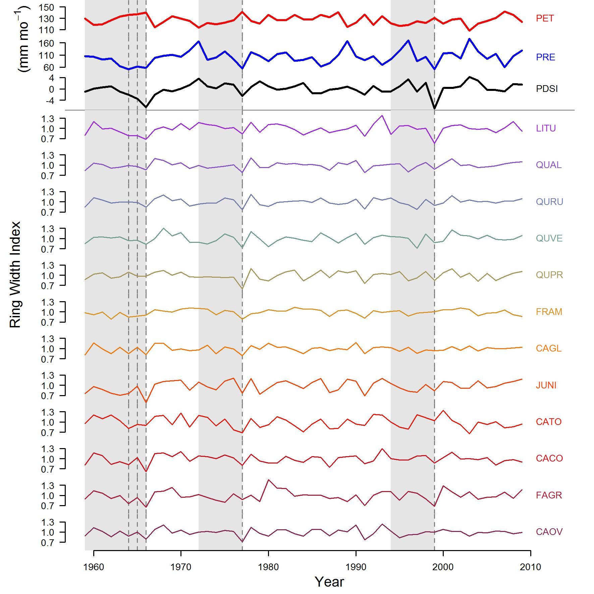

# Methods
## Study site
Research was conducted at the Smithsonian Conservation Biology Institute (SCBI) in Virginia, USA, with cores taken from trees on the 25.6 ha ForestGEO (Global Earth Observatory) study plot [@andersonteixeira_ctfs-forestgeo:_2015]. SCBI (38°53'36.6"N, 78° 08'43.4"W) [@gonzalezakre_patterns_2016] is located in the central Appalachian Mountains at the northern edge of Shenandoah National Park.  Elevations range from 273-338m above sea level [@gonzalezakre_patterns_2016] with a topographic relief of 65m [@bourg_initial_2013]. Dominant species include *Liriodendron tulipifera*,  oaks (*Quercus* spp.), and hickories (*Carya* spp.).

## Data Collection
We analyzed tree-ring data from the twelve species contributing most to woody aboveground net primary productivity (ANPP_stem) (Table 1), which together comprise 97% of whole-ecosystem ANPP_stem. Cores were collected in 2010-2011 or 2016-2017 from a breast height of 1.3m using a 5mm increment borer. In 2010-2011, cores were collected from randomly selected live trees were selected at random from each species in 2010-2011, with at least 30 of those trees having a diameter at breast height (DBH) of at least 10cm [@bourg_initial_2013]. In 2016-2017, cores were collected from all dead trees found in the annual mortality census [@gonzalezakre_patterns_2016]. Cores were sanded, measured, and cross-dated using standard procedures, as detailed in [@helcoski_growing_2019].

|**Species**|**n_cores.canopy**|**n_cores.subcanopy**|**included**
|----------|-------------|---------------|-----------|
*Carya cordiformis*|2|11|yes
*Carya glabra*|9|22|yes
*Carya ovalis*|9|14|yes
*Carya tomentosa*|0|13|sub-canopy only
*Fagus grandifolia*|7|73|yes
*Fraxinus americana*|20|42|yes
*Fraxinus nigra*|1|11| sub-canopy only
*Juglans nigra*|22|9|yes
*Liriodendron tulipifera*|38|60|yes
*Quercus alba*|38|23|yes
*Quercus prinus*|27|32|yes
*Quercus rubra*|43|26|yes
*Quercus velutina*|54|23|yes


``` {r sample, echo=FALSE}
#numbers for the table above come from this table
# library(RCurl)
# library(dplyr)
# species <- read.csv(text=getURL("https://raw.githubusercontent.com/SCBI-ForestGEO/McGregor_climate-sensitivity-variation/master/data/core_list_for_neil.csv?token=AJNRBELCYZY576ARLE7BXNK5BEF3O"))
# 
# test <- species %>%
#   group_by(sp, crown.position) %>%
#   summarize(count=n())

```

Using CRU data **with Valentine's quilts for each grouping**, it was found that all climate variables tested were significant by tree position when using a linear mixed model (**this was done early-on, included here because unsure if will keep for full analysis**).

To determine focus drought years, we used the pointRes package [@R-pointRes] in R (version 3.5.2) to determine resilience metrics. Specifically, we calculated pointer years (main drought years) if >50% of the cored trees experienced <30% growth in a year compared to the previous 5 years. The top 6 pointer years were compared with PDSI (Palmer Drought Severity Index) values for the region, obtained from NOAA. Based on this comparison, we then took the top three pointer years of 1964-1966 (resistance metric averaged due to a single, prolonged drought), 1977, and 1999.

{width=500px}

### Biophysical traits
Canopy classes were observed in the field during the growing season of 2018 following the crown position protocol from [@jennings_assessing_1999], whereby positions were ranked as dominant, codominant, intermediate, or suppressed. In determining pointer years, these labels were condensed to canopy (including dominant and codominant) and subcanopy (intermediate and suppressed). The full set of canopy classes were used for all other analyses.

```{r, Table-cores-position, eval=TRUE, echo=FALSE, message=FALSE}
library(RCurl)
library(dplyr)
library(tidyr)
library(data.table)
library(knitr)
library(kableExtra)

species <- read.csv(text=getURL("https://raw.githubusercontent.com/SCBI-ForestGEO/McGregor_climate-sensitivity-variation/master/data/core_list_for_neil.csv?token=AJNRBEIAVYFAN2CJB3Y3UAS5D5BNG"), stringsAsFactors = FALSE)

table <- species[, c(1:3,6,17)]

positions <- read.csv(text=getURL("https://raw.githubusercontent.com/SCBI-ForestGEO/SCBI-ForestGEO-Data/master/tree_dimensions/tree_crowns/cored_dendroband_crown_position_data/dendro_cored_full.csv"))

table$position_all <- positions$crown.position[match(table$tag, positions$tag)]
table$position_all <- gsub("D", "dominant", table$position_all)
table$position_all <- gsub("C", "co-dominant", table$position_all)
table$position_all <- gsub("I", "intermediate", table$position_all)
table$position_all <- gsub("S", "suppressed", table$position_all)

table1 <- table %>%
  group_by(sp) %>%
  summarize(n_cores=n())

table2 <- table %>%
  group_by(sp, position_all) %>%
  summarize(count=n())

table2 <- spread(table2, key=position_all, value=count)
setnames(table2, old="<NA>", new="prior dead")

table2$n_cores <- table1$n_cores[match(table2$sp, table1$sp)]
table2 <- table2[, c(1,7,3,2,4:6)]
table2 <- table2[!table2$sp %in% c("frni", "pist"), ]

kable(table2) %>%
  kable_styling(bootstrap_options = "striped", full_width = F)
```

Elevation for the trees was extracted from a USGS DEM in ArcMap. Distance to water was calculated as the shortest distance in meters between each individual tree and the major streams running through the ForestGEO plot.

Height data for trees was collected from several researchers at SCBI from 2012 to 2019, with methods including manual [@stovall_assessing_2018, NEON], digital rangefinders [@andersonteixeira_ctfs-forestgeo:_2015], and automatic LiDAR [@stovall_terrestrial_2018]. Rangefinders either used the tangent method (Impulse 200LR, TruPulse 360R) or the sine method (Nikon ForestryPro) for calculating heights. The associated errors for using either method were acknowledged [@larjavaara_measuring_2013]. Log-log, species-specific regression equations were developed, which were used to calculate heights of the study trees. For species that didn't have enough height measurements, heights were calculated from equations derived from all species in the study.

Equations required the DBH in each individual drought year. As part of the ForestGEO five-year census, there are DBH(diameter at breast height) measurements for all stems. Using the data from 2008 and a dataset of bark thickness for the plot collected from previous studies, we devised an equation to retroactively calculate DBH for all trees,

`diam_nobark_1999 = dbh2008 - 2*(bark.depth2008) - 2*(sum(ring.width1999:ring.width2008))`

First, we generated log-log regression equations for bark thickness based on DBH, and then determined mean bark thickness per species. Ring widths were determined from the processed cores, and once the diameter without bark was calculated for a certain year, we added the mean bark thickness from the regression equations.

### Leaf Hydraulic Traits
Hydraulic traits were collected from SCBI and are summarized in Table 1. Ring porosity qualifications were obtained from [@andersonteixeira_size-related_2015].


Need to say the methodology for all traits used (**Nobby making short list**)
1. PLA
2. LMA
3. Chlorophyll
4. Wood density
5. TLP
6. P50 = psi_0.5_kl50
7. P80 = psi_0.5_kl80

```{r, traits-overview, eval=TRUE, echo=FALSE, message=FALSE}
library(knitr)
library(kableExtra)

trees_all <- read.csv("tables_figures/trees_all.csv", stringsAsFactors = FALSE)

trees_all <- trees_all[!duplicated(trees_all$sp), ]
  

traits_table <- data.frame(
  "Trait" = c("Ring Porosity", "Percent Leaf Area", "Leaf Mass Area", "Chlorophyll", "Wood density", "TLP", "P50", "P80"),
  "Unit" = c("ring, semi-ring, diffuse", "%", "g/m2", "m2/g", "g/cm3", "MPa", "MPa", "MPa"))
traits_table$abb <- c("rp", "PLA", "LMA", "Chl", "WD", "TLP", "p50", "p80")

traits_table$mean <- NA
traits_table$min <- NA
traits_table$max <- NA

for (i in seq(along=traits_table$abb[2:8])){
  trait <- traits_table$abb[2:8][i]
  
  sub <- trees_all[grepl(trait, colnames(trees_all))]
  traits_table$mean[2:8][i] <- ifelse(grepl(trait, colnames(sub)), 
                              mean(sub[, 1], na.rm=TRUE), 
                              traits_table$mean)
  
  traits_table$min[2:8][i] <- ifelse(grepl(trait, colnames(sub)), 
                              min(sub[, 1], na.rm=TRUE), 
                              traits_table$min)
  
  traits_table$max[2:8][i] <- ifelse(grepl(trait, colnames(sub)), 
                              max(sub[, 1], na.rm=TRUE), 
                              traits_table$max)
}

traits_table[, c("mean", "min", "max")] <- 
  sapply(traits_table[, c("mean", "min", "max")], function(x)
  round(x, 2)
)
traits_table$abb <- NULL

kable(traits_table) %>%
  kable_styling(bootstrap_options = "striped", full_width = F)

```


After the data was collected, linear mixed models were run with the resistance value of each tree for each pointer year (determined from the pointRes package) as the response variable. Traits and other geographic data were used as independent variables.

## Model runs
Traits' importance in predicting drought tolerance was calculated from mixed-effects models and the lowest AICc [@R-lme4, @R-AICcmodavg]. Specifically, we first determined the most important biophysical traits before including them in the model with the leaf hydraulic traits [**need to say why?**]