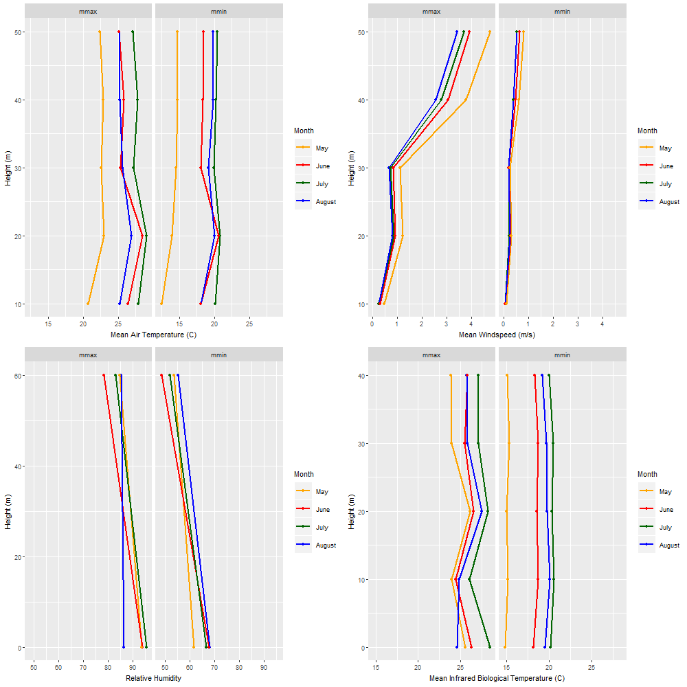
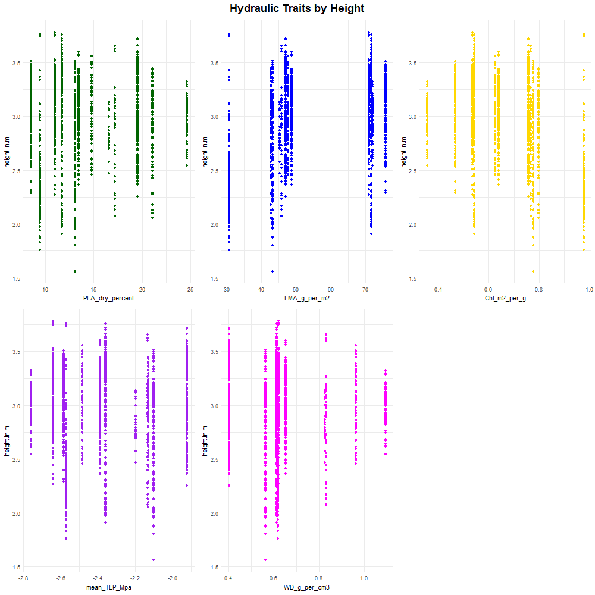

# Results

### tree and trait distribution within the biophysical setting

**Figure 2. Vertical profiles in microclimate, crown positions, and traits.**[combines the two following figures]

{width=500px} 

{width=500px}

[consider an analysis of trait distribution in relation to topography??]

### droughts(?)
description of the 3 droughts in terms of timing, duration, severity, proportion of trees showing pointer year..?. See

Proportion of all trees showing growth deficit for that year (meeting our threshold)
1966: 28.18% (20.88% if doing all trees 1964-1966)
1977:31.23%
1999: 26.21%

Proportion of species-canopy classes (e.g. fagr_canopy, quve_subcanopy) that have >50% of their trees showing a pointer year
1966: 22.73%
1977: 22.73%
1999: 13.64%


### 1- tree size and exposure
We evaluated the predictions outlined in the introduction
P1.0. Drought resistance decreased with DBH at time of drought.
P1.1. Drought resistance decreased with height at time of drought.
P1.2. Trees currently in a dominant crown position suffered more during drought. Intermediate and suppressed trees also suffered more (in model with height)
P1.3. Resistance was independent of elevation and distance from stream.

[**HYPOTHESIS TESTING TABLE**]

### 2- traits


```
## Warning in checkConv(attr(opt, "derivs"), opt$par, ctrl =
## control$checkConv, : Model failed to converge with max|grad| = 1.04978 (tol
## = 0.002, component 1)
```

```
## Warning in checkConv(attr(opt, "derivs"), opt$par, ctrl =
## control$checkConv, : Model failed to converge with max|grad| = 0.00505122
## (tol = 0.002, component 1)
```
<table class="table" style="width: auto !important; float: left; margin-right: 10px;">
<caption>(\#tab:make-tables)Biophysical Model</caption>
 <thead>
  <tr>
   <th style="text-align:center;"> coefficients </th>
   <th style="text-align:left;"> value </th>
  </tr>
 </thead>
<tbody>
  <tr>
   <td style="text-align:center;"> (Intercept) </td>
   <td style="text-align:left;"> 1.2216127 </td>
  </tr>
  <tr>
   <td style="text-align:center;"> position_alldominant </td>
   <td style="text-align:left;"> -0.0439116 </td>
  </tr>
  <tr>
   <td style="text-align:center;"> position_allintermediate </td>
   <td style="text-align:left;"> -0.0422884 </td>
  </tr>
  <tr>
   <td style="text-align:center;"> position_allsuppressed </td>
   <td style="text-align:left;"> -0.0525058 </td>
  </tr>
  <tr>
   <td style="text-align:center;"> height.ln.m </td>
   <td style="text-align:left;"> -0.0918930 </td>
  </tr>
  <tr>
   <td style="text-align:center;"> year1977 </td>
   <td style="text-align:left;"> -0.0883842 </td>
  </tr>
  <tr>
   <td style="text-align:center;"> year1999 </td>
   <td style="text-align:left;"> -0.0727707 </td>
  </tr>
  <tr>
   <td style="text-align:center;"> r^2 </td>
   <td style="text-align:left;"> 0.1056121 </td>
  </tr>
</tbody>
</table>

<table class="table" style="width: auto !important; margin-right: 0; margin-left: auto">
<caption>(\#tab:make-tables)Full Model</caption>
 <thead>
  <tr>
   <th style="text-align:center;"> coefficients </th>
   <th style="text-align:left;"> value </th>
  </tr>
 </thead>
<tbody>
  <tr>
   <td style="text-align:center;"> (Intercept) </td>
   <td style="text-align:left;"> 0.7565928 </td>
  </tr>
  <tr>
   <td style="text-align:center;"> rpring </td>
   <td style="text-align:left;"> 0.1274127 </td>
  </tr>
  <tr>
   <td style="text-align:center;"> rpsemi-ring </td>
   <td style="text-align:left;"> 0.2918817 </td>
  </tr>
  <tr>
   <td style="text-align:center;"> PLA_dry_percent </td>
   <td style="text-align:left;"> -0.0098403 </td>
  </tr>
  <tr>
   <td style="text-align:center;"> LMA_g_per_m2 </td>
   <td style="text-align:left;"> -0.0049981 </td>
  </tr>
  <tr>
   <td style="text-align:center;"> WD_g_per_cm3 </td>
   <td style="text-align:left;"> -0.3072334 </td>
  </tr>
  <tr>
   <td style="text-align:center;"> mean_TLP_Mpa </td>
   <td style="text-align:left;"> -0.2888212 </td>
  </tr>
  <tr>
   <td style="text-align:center;"> year1977 </td>
   <td style="text-align:left;"> -0.0903371 </td>
  </tr>
  <tr>
   <td style="text-align:center;"> year1999 </td>
   <td style="text-align:left;"> -0.0813119 </td>
  </tr>
  <tr>
   <td style="text-align:center;"> r^2 </td>
   <td style="text-align:left;"> 0.1354850 </td>
  </tr>
</tbody>
</table>


