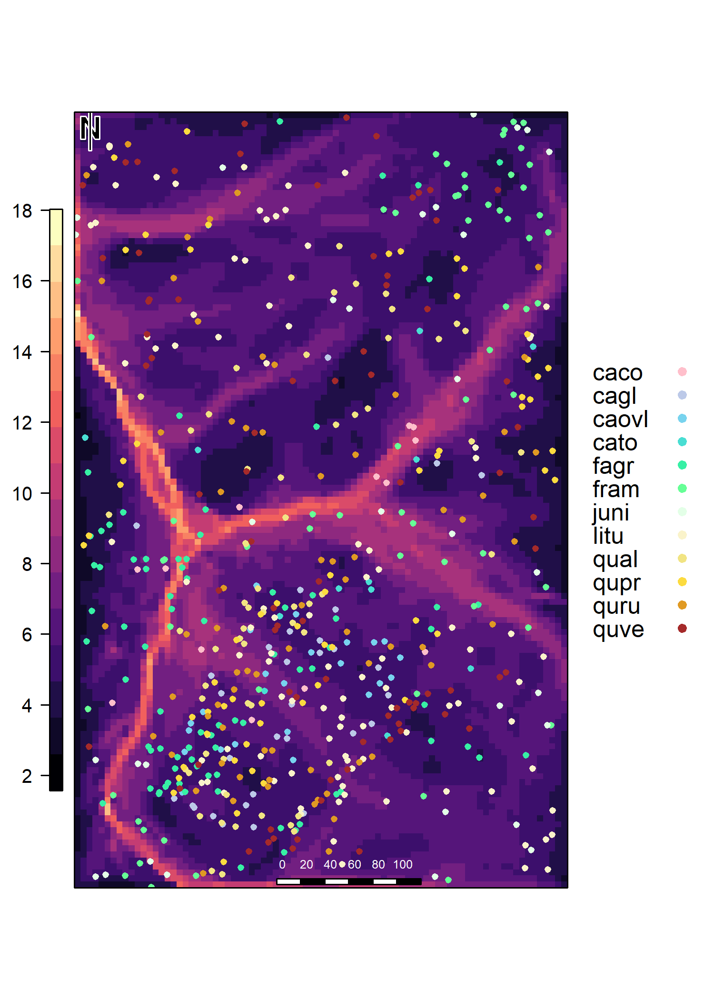
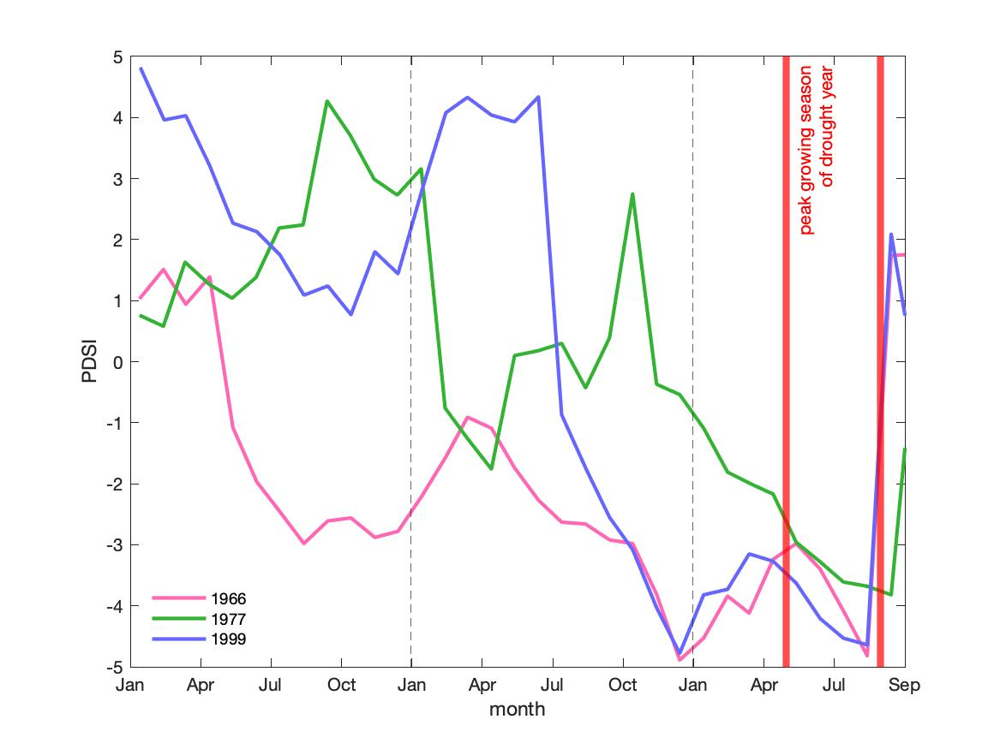
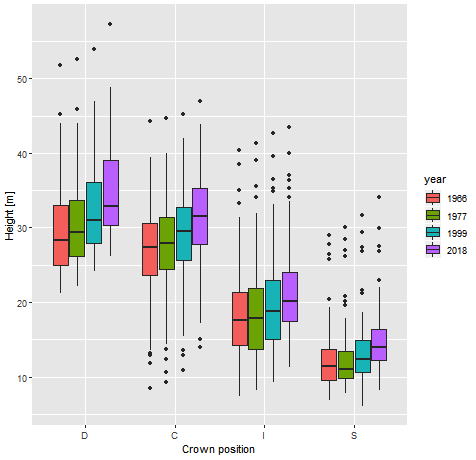
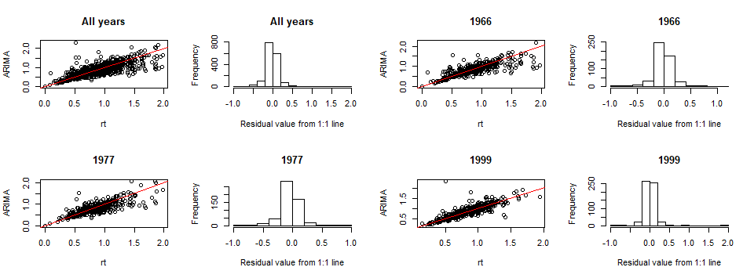

```{r, include=FALSE}
options(tinytex.verbose = TRUE)
options(knitr.table.format = "latex")
options(knitr.kable.NA = '')
```

### Supplementary Information
## Tree height and hydraulic traits shape growth responses across droughts in a temperate broadleaf forest 

Ian R. McGregor,
Ryan Helcoski,
Norbert Kunert,
Alan J. Tepley,
Erika B. Gonzalez-Akre,
Valentine Herrmann,
Joseph Zailaa,
Atticus E.L. Stovall,
Norman A. Bourg,
William J. McShea,
Neil Pederson,
Lawren Sack,
Kristina J. Anderson-Teixeira

\listoftables
\listoffigures

\newpage
While there were several R-packages we used for a specific purpose in our methods, numerous packages were immensely helpful for this research behind the scenes. As in all of science, this study is a representation of the work done by both the authors of this paper as well as countless others. While acknowledging everyone is impossible, we want to at least give thanks to those who made this work possible.

R-packages not already cited in the main manuscript include the following, listed alphabetically by corresponding package name:

[@R-base; @R-broom; @R-car; @R-cowplot; @R-data.table; @R-devtools; @R-dplR; @R-dplyr; @R-extrafont; @R-ggplot2; @R-ggpubr; @R-ggthemes; @R-gridExtra; @R-knitr; @R-lubridate; @R-MuMIn; @R-piecewiseSEM; @R-png; @R-purrr; @R-raster; @R-rasterVis; @R-RCurl; @R-readxl; @R-reshape2; @R-rgdal; @R-rgeos; @R-rmarkdown; @R-sf; @R-stringi; @R-stringr; @R-tidyr]

\newpage
```{r Table S1, eval=TRUE, echo=FALSE, message=FALSE}
library(knitr)
library(kableExtra)

bark <- read.csv("tables_figures/publication/tableS1_bark_regression.csv", stringsAsFactors = FALSE)
bark[,2] <- NULL
colnames(bark) <- c("Species", "Equations", "$R^{2}$")
kable(bark, booktabs=TRUE, format = "latex", caption = "Table S1: Species-specific bark thickness regression equations") %>%
  kable_styling(bootstrap_options = "striped", full_width = FALSE, latex_options = "hold_position")
```

\newpage
```{r Table S2, eval=TRUE, echo=FALSE, message=FALSE}
library(knitr)
library(kableExtra)

heights <- read.csv("tables_figures/publication/tableS2_height_regression.csv", stringsAsFactors = FALSE)
heights[,2] <- NULL
colnames(heights) <- c("Species", "Equations", "$R^{2}$")
kable(heights, booktabs=TRUE, format = "latex", caption = "Table S2: Species-specific height regression equations") %>%
  kable_styling(bootstrap_options = "striped", full_width = FALSE, latex_options = "hold_position")
```

\newpage
```{r, Table S3, eval=TRUE, echo=FALSE, message=FALSE}
tableS3 <- read.csv("tables_figures/publication/tables3_drought_stats.csv", stringsAsFactors = FALSE)
kable(tableS3, booktabs=TRUE, format = "latex", caption = "Table S3: Palmer drought severity index (PDSI) by month for focal droughts. Rank refers to ") %>%
  pack_rows("focal droughts", 1, 4, latex_gap_space = ".4em", colnum = 3, hline_before = FALSE) %>%
  pack_rows("", 5, 8, latex_gap_space = ".4em", colnum = 1, hline_before = FALSE) %>%
  pack_rows("", 9, 12, latex_gap_space = ".4em", colnum = 1, hline_before = FALSE) %>%
  pack_rows("other", 13, 16, latex_gap_space = ".4em", colnum = 3, hline_before = FALSE) %>%
  kable_styling(bootstrap_options = "striped", full_width = FALSE, latex_options = "hold_position")
```

\newpage
```{r, Table S4, eval=TRUE, echo=FALSE, message=FALSE}
tableS4 <- read.csv("tables_figures/publication/tableS4_Rt_arima.csv", stringsAsFactors = FALSE)
tableS4 <- tableS4[1:21, ]
colnames(tableS4) <- c("Year", "Tree", "Rt", "Rt_ARIMA")
kable(tableS4, booktabs=TRUE, format = "latex", caption = "Table S4: Comparison of Rt and ARIMA Rt results, showing a sample of 7 trees. Full table can be found at THIS WEBSITE.") %>%
  # pack_rows("", 1, 3, latex_gap_space = ".4em", colnum = 4, hline_before = FALSE) %>%
  pack_rows("", 4, 6, latex_gap_space = ".4em", colnum = 4, hline_before = FALSE) %>%
  pack_rows("", 7, 9, latex_gap_space = ".4em", colnum = 4, hline_before = FALSE) %>%
  pack_rows("", 10, 12, latex_gap_space = ".4em", colnum = 4, hline_before = FALSE) %>%
  pack_rows("", 13, 15, latex_gap_space = ".4em", colnum = 4, hline_before = FALSE) %>%
  pack_rows("", 16, 18, latex_gap_space = ".4em", colnum = 4, hline_before = FALSE) %>%
  pack_rows("", 19, 21, latex_gap_space = ".4em", colnum = 4, hline_before = FALSE) %>%
  kable_styling(bootstrap_options = "striped", full_width = FALSE, latex_options = "hold_position")
```


\newpage
{width=500px}

\newpage
{width=600px}

\newpage
{width=600px}

\newpage

