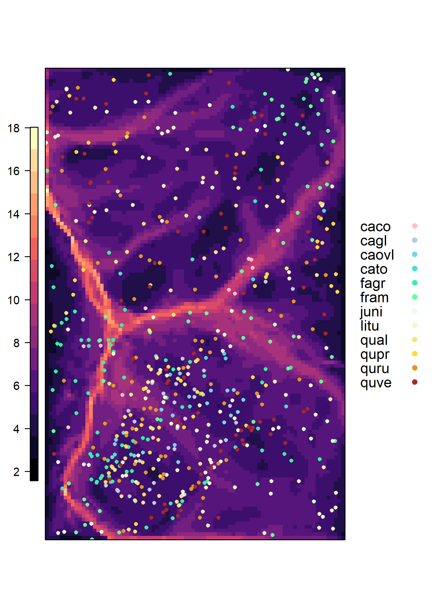

```{r, include=FALSE}
options(tinytex.verbose = TRUE)
```

### Supplementary Information
```{r Table S1, eval=TRUE, echo=FALSE, message=FALSE}
library(knitr)
library(kableExtra)

bark <- read.csv("tables_figures/tableS1_bark_regression.csv", stringsAsFactors = FALSE)
bark[,2] <- NULL
kable(bark, booktabs=TRUE, format = "latex", caption = "Table S1: Species-specific bark thickness regression equations") %>%
  kable_styling(bootstrap_options = "striped", full_width = FALSE, latex_options = "hold_position")
```

```{r Table S2, eval=TRUE, echo=FALSE, message=FALSE}
library(knitr)
library(kableExtra)

heights <- read.csv("tables_figures/tableS2_height_regression.csv", stringsAsFactors = FALSE)
heights[,2] <- NULL
kable(heights, booktabs=TRUE, format = "latex", caption = "Table S2: Species-specific height regression equations") %>%
  kable_styling(bootstrap_options = "striped", full_width = FALSE, latex_options = "hold_position")
```

```{r, Table S3, eval=TRUE, echo=FALSE, message=FALSE}
tableS3 <- read.csv("tables_figures/drought_stats.csv", stringsAsFactors = FALSE)
kable(tableS3, booktabs=TRUE, format = "latex", caption = "Table S3: Palmer drought severity index (PDSI) by month for focal droughts and other years referenced in the manuscript") %>%
  pack_rows("focal droughts", 1, 4, latex_gap_space = ".4em", colnum = 1, hline_before = FALSE) %>%
  pack_rows("", 5, 8, latex_gap_space = ".4em", colnum = 1, hline_before = FALSE) %>%
  pack_rows("", 9, 12, latex_gap_space = ".4em", colnum = 1, hline_before = FALSE) %>%
  pack_rows("others", 13, 16, latex_gap_space = ".4em", colnum = 1, hline_before = FALSE) %>%
  pack_rows("", 17, 20, latex_gap_space = ".4em", colnum = 1, hline_before = FALSE) %>%
  pack_rows("", 21, 24, latex_gap_space = ".4em", colnum = 1, hline_before = FALSE) %>%
  kable_styling(bootstrap_options = "striped", full_width = FALSE, latex_options = "hold_position")
```

\newpage

```{r, Table S4, eval=TRUE, echo=FALSE, message=FALSE}
tableS4 <- read.csv("tables_figures/tableS3_candidate_traits.csv", stringsAsFactors = FALSE)
kable(tableS4, booktabs=TRUE, format = "latex", caption = "Table S4: Candidate variables for best model") %>%
  kable_styling(bootstrap_options = "striped", full_width = FALSE, latex_options = "hold_position")
```

\newpage

```{r Table S5, eval=TRUE, echo=FALSE, message=FALSE}
tableS5 <- read.csv("tables_figures/tableS5_tested_traits_height.csv", stringsAsFactors = FALSE)

tableS5 <- tableS5[,-1]
names(tableS5) <- c("variable", "model", "coefficient", "p-value")
tableS5[,c(3)] <- round(tableS5[,c(3)], 2)

tableS5$variable <- c("WD", "LMA", "ring porosity", "PLA", "TLP")
tableS5$model <- c("WD~ln[H]","LMA~ln[H]","ring porosity~ln[H]", "PLA~ln[H]", "PLA~ln[H]")

kable(tableS5, booktabs=TRUE, format = "latex", caption = "Table S5. Correlation of species' traits with tree height across all individuals in the ForestGEO plot") %>%
  kable_styling(bootstrap_options = "striped", full_width = FALSE, latex_options = "hold_position")
```

\newpage
{width=500px}


