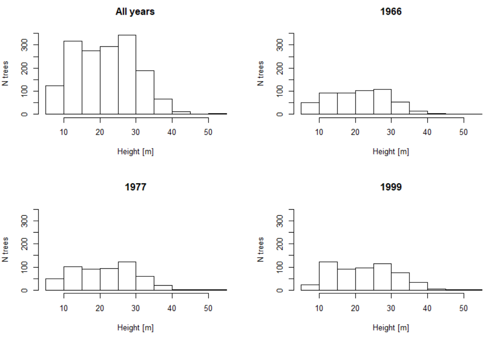
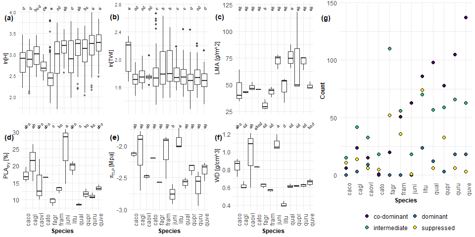

```{r, include=FALSE}
options(tinytex.verbose = TRUE)
options(knitr.table.format = "latex")
options(knitr.kable.NA = '')
```

# Supplementary Information
## Tree height and leaf drought tolerance traits shape growth responses across droughts in a temperate broadleaf forest 

Ian R. McGregor,
Ryan Helcoski,
Norbert Kunert,
Alan J. Tepley,
Erika B. Gonzalez-Akre,
Valentine Herrmann,
Joseph Zailaa,
Atticus E.L. Stovall,
Norman A. Bourg,
William J. McShea,
Neil Pederson,
Lawren Sack,
Kristina J. Anderson-Teixeira

\listoftables
\listoffigures

**Appendix S1. Further Package Citations**

\newpage

\newpage
```{r, Table S1, eval=TRUE, echo=FALSE, message=FALSE}
library(knitr)
library(kableExtra)
tableS1 <- read.csv("tables_figures/publication/tableS1_drought_stats.csv", stringsAsFactors = FALSE)
kable(tableS1, booktabs=TRUE, format = "latex", caption = "Table S1. Monthly Palmer Drought Severity Index (PDSI), and its rank among all years between 1950 and 2009 (driest=1), for focal droughts. ") %>%
  pack_rows("", 1, 4, latex_gap_space = ".4em", colnum = 3, hline_before = FALSE) %>%
  pack_rows("", 5, 8, latex_gap_space = ".4em", colnum = 1, hline_before = FALSE) %>%
  pack_rows("", 9, 12, latex_gap_space = ".4em", colnum = 1, hline_before = FALSE) %>%
  kable_styling(bootstrap_options = "striped", full_width = FALSE, latex_options = "hold_position", protect_latex = TRUE)
```

\newpage
```{r Table S2, eval=TRUE, echo=FALSE, message=FALSE}
library(knitr)
library(kableExtra)

bark <- read.csv("tables_figures/publication/tableS2_bark_regression.csv", stringsAsFactors = FALSE)
bark[,2] <- NULL
colnames(bark) <- c("Species", "Equations", "$R^2$")
kable(bark, booktabs=TRUE, format = "latex", escape=FALSE, caption = "Table S2. Species-specific bark thickness regression equations") %>%
  kable_styling(bootstrap_options = "striped", full_width = FALSE, latex_options = "hold_position")
```

\newpage
```{r Table S3, eval=TRUE, echo=FALSE,  warning=FALSE}
library(knitr)
library(kableExtra)

heights <- read.csv("tables_figures/publication/tableS3_height_regression.csv", stringsAsFactors = FALSE)
colnames(heights)[3] <- "$R^2$"
kable(heights, booktabs=TRUE, format = 'latex', caption = "Table S3. Species-specific height regression equations", escape = FALSE) %>%
  kable_styling(bootstrap_options = "striped", full_width = FALSE, latex_options = "hold_position", protect_latex = TRUE)
```

\clearpage
```{r table S4, eval = TRUE, echo=FALSE, warning=FALSE}
library(knitr)
library(kableExtra)
singlevar_table <- read.csv("tables_figures/publication/tableS4_Rt_singlevariable_models_CPout.csv", stringsAsFactors = FALSE, check.names = FALSE) #note: this table is a rearranged version of `tested_traits_all.csv`.
colnames(singlevar_table)[1] <- "variable"
kable(singlevar_table, booktabs = TRUE, caption = "Table S4. Individual tests of species traits as drivers of drought resistance, where $Rt$ is used as the response variable.", format = 'latex', escape = FALSE) %>%
  kable_styling(latex_options = c("scale_down", "hold_position"), font_size = 12, protect_latex = TRUE) %>%
  add_header_above(c(" "," ","all droughts"=2,"1966"=2, "1977" = 2, "1999" = 2)) %>%
  kable_styling()
```
Variable abbreviations are as in Table 2. 
$\Delta$AICc is the AICc of a model excluding the trait minus that of the model including it. 

**$\Delta$AICc > 2: variable considered significant as an individual predictor 


\newpage
```{r table S5, eval = TRUE, echo=FALSE, warning=FALSE}
library(knitr)
library(kableExtra)
singlevar_table <- read.csv("tables_figures/publication/tableS5_Rt_singlevariable_models_arimaratio_CPout.csv", stringsAsFactors = FALSE, check.names = FALSE) 
colnames(singlevar_table)[1] <- "variable"
kable(singlevar_table, booktabs = TRUE, caption = "Table S5. Individual tests of species traits as drivers of drought resistance, where $Rt_{ARIMA}$ is used as the response variable.", format = 'latex', escape = FALSE) %>%
  kable_styling(latex_options = c("scale_down", "hold_position"), font_size = 12, protect_latex = TRUE) %>%
  add_header_above(c(" "," ","all droughts"=2,"1966"=2, "1977" = 2, "1999" = 2)) %>%
  kable_styling()
```
Variable abbreviations are as in Table 2. 
$\Delta$AICc is the AICc of a model excluding the trait minus that of the model including it. 

**$\Delta$AICc > 2: variable considered significant as an individual predictor

\newpage
```{r table S6, eval = TRUE, echo=FALSE, warning=FALSE}
library(knitr)
library(kableExtra)
singlevar_table <- read.csv("tables_figures/publication/tableS6_Rc_singlevariable_models_CPout.csv", stringsAsFactors = FALSE, check.names = FALSE) 
colnames(singlevar_table)[1] <- "variable"
kable(singlevar_table, booktabs = TRUE, caption = "Table S6. Individual tests of species traits as drivers of drought recovery ($Rc$).", format = 'latex', escape = FALSE) %>%
  kable_styling(latex_options = c("scale_down", "hold_position"), font_size = 12, protect_latex = TRUE) %>%
  add_header_above(c(" "," ","all droughts"=2,"1966"=2, "1977" = 2, "1999" = 2)) %>%
  kable_styling()
```
Variable abbreviations are as in Table 2. 
$\Delta$AICc is the AICc of a model excluding the trait minus that of the model including it. 

**$\Delta$AICc > 2: variable considered significant as an individual predictor

\newpage
```{r table S7, eval = TRUE, echo=FALSE, warning=FALSE}
library(knitr)
library(kableExtra)
singlevar_table <- read.csv("tables_figures/publication/tableS7_Rs_singlevariable_models_CPout.csv", stringsAsFactors = FALSE, check.names = FALSE) 
colnames(singlevar_table)[1] <- "variable"
kable(singlevar_table, booktabs = TRUE, caption = "Table S7. Individual tests of species traits as drivers of drought resilience ($Rs$).", format = 'latex', escape = FALSE) %>%
  kable_styling(latex_options = c("scale_down", "hold_position"), font_size = 12, protect_latex = TRUE) %>%
  add_header_above(c(" "," ","all droughts"=2,"1966"=2, "1977" = 2, "1999" = 2)) %>%
  kable_styling()
```
Variable abbreviations are as in Table 2. 
$\Delta$AICc is the AICc of a model excluding the trait minus that of the model including it. 

**$\Delta$AICc > 2: variable considered significant as an individual predictor


\newpage
```{r table S8, eval = TRUE, echo=FALSE, warning=FALSE}
library(knitr)
library(kableExtra)
multivar_table <- read.csv("tables_figures/publication/tableS8_Rt_multivariable_models_CPout.csv", stringsAsFactors = FALSE, check.names = FALSE) 
colnames(multivar_table)[1] <- "drought"
kable(multivar_table, booktabs = TRUE, caption = "Table S8. Summary of top full models for each drought instance, where $Rt$ is used as the response variable.", format = 'latex', escape = FALSE) %>%
  kable_styling(latex_options = c("scale_down", "hold_position"), font_size = 12, protect_latex = TRUE) %>%
  pack_rows("", 1, 4, latex_gap_space = ".4em", colnum = 1, hline_before = FALSE) %>%
  pack_rows("", 5, 5, latex_gap_space = ".4em", colnum = 1, hline_before = FALSE) %>%
  pack_rows("", 6, 10, latex_gap_space = ".4em", colnum = 1, hline_before = FALSE) %>%
  pack_rows("", 11, 16, latex_gap_space = ".4em", colnum = 1, hline_before = FALSE) %>%
  row_spec(1, bold = T) %>%
  row_spec(5, bold = T) %>%
  row_spec(6, bold = T) %>%
  row_spec(11, bold = T) %>%
  kable_styling()
```
Models are ranked by AICc. Shown are all models whose AICc value falls within 2.0 ($\Delta$AICc<1) of the best model (bold). 
$R^2$ refers to conditional $R^2$. 
Year was included in the model for all drought years, but its effect was not included in any top models, and coefficients were small (1966: 0, 1977: -0.019, 1999: -0.005; same values in all top models).

\newpage
```{r table S9, eval = TRUE, echo=FALSE, warning=FALSE}
library(knitr)
library(kableExtra)
multivar_table <- read.csv("tables_figures/publication/tableS9_Rt_multivariable_models_arimaratio_CPout.csv", stringsAsFactors = FALSE, check.names = FALSE) 
colnames(multivar_table)[1] <- "drought"
kable(multivar_table, booktabs = TRUE, caption = "Table S9. Summary of top  models for each drought instance, where $Rt_{ARIMA}$ is used as the response variable.", format = 'latex', escape = FALSE) %>%
  kable_styling(latex_options = c("scale_down", "hold_position"), font_size = 12, protect_latex = TRUE) %>%
  pack_rows("", 1, 4, latex_gap_space = ".4em", colnum = 1, hline_before = FALSE) %>%
  pack_rows("", 5, 7, latex_gap_space = ".4em", colnum = 1, hline_before = FALSE) %>%
  pack_rows("", 8, 14, latex_gap_space = ".4em", colnum = 1, hline_before = FALSE) %>%
  pack_rows("", 15, 25, latex_gap_space = ".4em", colnum = 1, hline_before = FALSE) %>%
  row_spec(1, bold = T) %>%
  row_spec(5, bold = T) %>%
  row_spec(8, bold = T) %>%
  row_spec(15, bold = T) %>%
  kable_styling()
```
Models are ranked by AICc. Shown are all models whose AICc value falls within 2.0 ($\Delta$AICc<1) of the best model (bold). 
$R^2$ refers to conditional $R^2$. 
Year was included in the model for all drought years, but its effect was not included in any top models, and coefficients were small (1966: 0, 1977: -0.03, 1999: 0.008; same values in all top models).

\newpage
```{r table S10, eval = TRUE, echo=FALSE, warning=FALSE}
library(knitr)
library(kableExtra)
multivar_table <- read.csv("tables_figures/publication/tableS10_Rc_multivariable_models_CPout.csv", stringsAsFactors = FALSE, check.names = FALSE) 
colnames(multivar_table)[1] <- "drought"
kable(multivar_table, booktabs = TRUE, caption = "Table S10. Summary of top models for each drought instance, where $Rc$ is used as the response variable.", format = 'latex', escape = FALSE) %>%
  kable_styling(latex_options = c("scale_down", "hold_position"), font_size = 12, protect_latex = TRUE) %>%
  pack_rows("", 1, 4, latex_gap_space = ".4em", colnum = 1, hline_before = FALSE) %>%
  pack_rows("", 5, 9, latex_gap_space = ".4em", colnum = 1, hline_before = FALSE) %>%
  pack_rows("", 10, 20, latex_gap_space = ".4em", colnum = 1, hline_before = FALSE) %>%
  pack_rows("", 21, 26, latex_gap_space = ".4em", colnum = 1, hline_before = FALSE) %>%
  row_spec(1, bold = T) %>%
  row_spec(5, bold = T) %>%
  row_spec(10, bold = T) %>%
  row_spec(21, bold = T) %>%
  kable_styling()
```
Models are ranked by AICc. Shown are all models whose AICc value falls within 2.0 ($\Delta$AICc<1) of the best model (bold). 
$R^2$ refers to conditional $R^2$. 
Year was included in the model for all drought years, but its effect was not included in any top models, and coefficients were small **(1966: 0, 1977: -0.03, 1999: 0.008; same values in all top models)**.

\newpage
```{r table S11, eval = TRUE, echo=FALSE, warning=FALSE}
library(knitr)
library(kableExtra)
multivar_table <- read.csv("tables_figures/publication/tableS11_Rs_multivariable_models_CPout.csv", stringsAsFactors = FALSE, check.names = FALSE) 
colnames(multivar_table)[1] <- "drought"
kable(multivar_table, booktabs = TRUE, caption = "Table S11. Summary of top models for each drought instance, where $Rs$ is used as the response variable.", format = 'latex', escape = FALSE) %>%
  kable_styling(latex_options = c("scale_down", "hold_position"), font_size = 12, protect_latex = TRUE) %>%
  pack_rows("", 1, 5, latex_gap_space = ".4em", colnum = 1, hline_before = FALSE) %>%
  pack_rows("", 6, 10, latex_gap_space = ".4em", colnum = 1, hline_before = FALSE) %>%
  pack_rows("", 11, 16, latex_gap_space = ".4em", colnum = 1, hline_before = FALSE) %>%
  pack_rows("", 17, 21, latex_gap_space = ".4em", colnum = 1, hline_before = FALSE) %>%
  row_spec(1, bold = T) %>%
  row_spec(6, bold = T) %>%
  row_spec(11, bold = T) %>%
  row_spec(17, bold = T) %>%
  kable_styling()
```
Models are ranked by AICc. Shown are all models whose AICc value falls within 2.0 ($\Delta$AICc<1) of the best model (bold). 
$R^2$ refers to conditional $R^2$. 
Year was included in the model for all drought years, but its effect was not included in any top models, and coefficients were small **(1966: 0, 1977: -0.03, 1999: 0.008; same values in all top models)**.

\newpage


\newpage
{width=500px}


\newpage




\newpage




\newpage


\newpage
## Appendix S1. Further Package Citations
While there were several R-packages we used for a specific purpose in our methods, numerous packages were immensely helpful for this research behind the scenes. As in all of science, this study is a representation of the work done by both the authors of this paper as well as countless others. While acknowledging everyone is impossible, we want to at least give thanks to those who made this work possible.

R-packages not already cited in the main manuscript include the following, listed alphabetically by corresponding package name:

[@R-base; @R-broom; @R-car; @R-cowplot; @R-data.table; @R-devtools; @R-dplR; @R-dplyr; @R-extrafont; @R-ggplot2; @R-ggpubr; @R-ggthemes; @R-gridExtra; @R-knitr; @R-lubridate; @R-MuMIn; @R-piecewiseSEM; @R-png; @R-purrr; @R-raster; @R-rasterVis; @R-RCurl; @R-readxl; @R-reshape2; @R-rgdal; @R-rgeos; @R-rmarkdown; @R-sf; @R-stringi; @R-stringr; @R-tidyr]