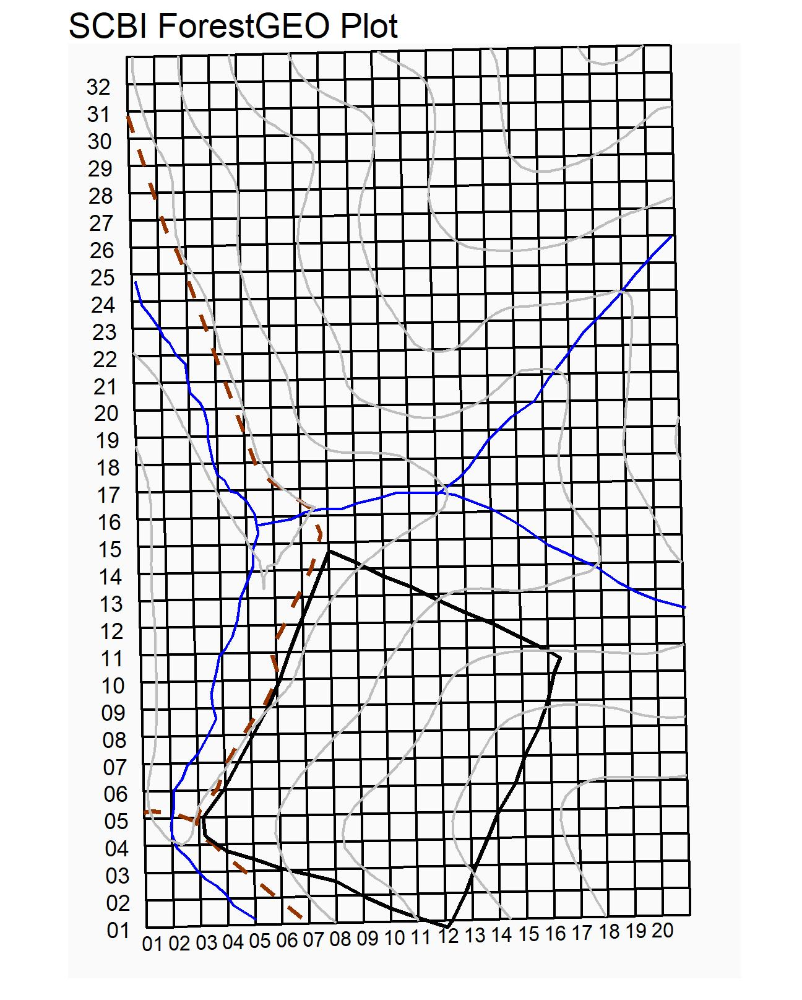
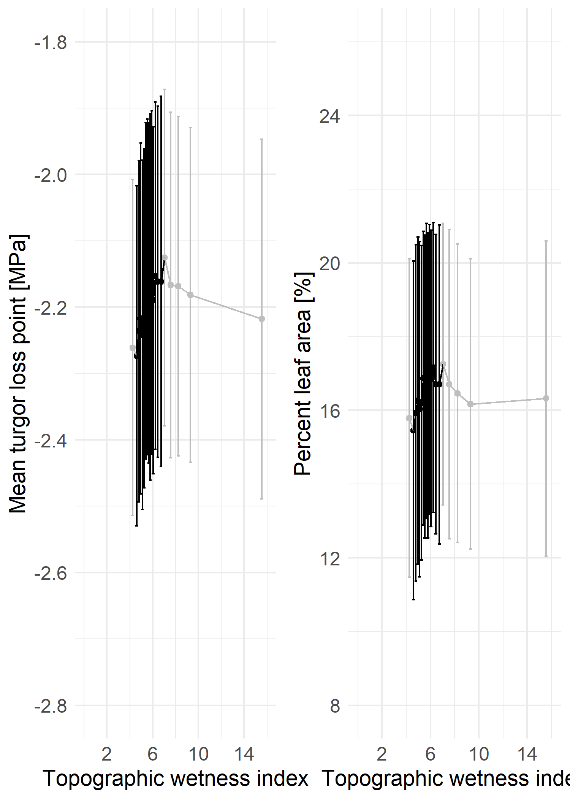

```{r, include=FALSE}
options(tinytex.verbose = TRUE)
```

### Supplementary Information
```{r Table S1, eval=TRUE, echo=FALSE, message=FALSE}
library(knitr)
library(kableExtra)

bark <- read.csv("tables_figures/tableS1_bark_regression.csv", stringsAsFactors = FALSE)
bark[,2] <- NULL
kable(bark, booktabs=TRUE, format = "latex", caption = "Table S1: Species-specific bark thickness regression equations") %>%
  kable_styling(bootstrap_options = "striped", full_width = FALSE, latex_options = "hold_position")
```

```{r Table S2, eval=TRUE, echo=FALSE, message=FALSE}
library(knitr)
library(kableExtra)

heights <- read.csv("tables_figures/tableS2_height_regression.csv", stringsAsFactors = FALSE)
heights[,2] <- NULL
kable(heights, booktabs=TRUE, format = "latex", caption = "Table S2: Species-specific height regression equations") %>%
  kable_styling(bootstrap_options = "striped", full_width = FALSE, latex_options = "hold_position")
```

```{r, Table S3, eval=TRUE, echo=FALSE, message=FALSE}
tableS3 <- read.csv("tables_figures/tableS3_candidate_traits.csv", stringsAsFactors = FALSE)
kable(tableS3, booktabs=TRUE, format = "latex", caption = "Table S3: Candidate variables for best model") %>%
  kable_styling(bootstrap_options = "striped", full_width = FALSE, latex_options = "hold_position")
```

```{r Figure S1, echo=FALSE, out.width='100%', fig.cap = "Figure S1: Map of ForestGEO plot", fig.pos='ht'}
  
```

\newpage
*how do we want to present Table S4? Would it be better as an image of an excel file, since it's so large? Did we want to keep all coefficients here?*
```{r Table S4, eval=TRUE, echo=FALSE, message=FALSE}
tableS4 <- read.csv("tables_figures/tableS4_top_models_dAIC.csv", stringsAsFactors = FALSE)
kable(tableS4, booktabs=TRUE, format = "latex", caption = "Table S4: Top model variations for each drought scenario, with dAICc values <= 2") %>%
  kable_styling(bootstrap_options = "striped", full_width = FALSE, latex_options = "hold_position")
```

```{r Table S5, eval=TRUE, echo=FALSE, message=FALSE}
tableS5 <- read.csv("tables_figures/tableS5_tested_traits_height.csv", stringsAsFactors = FALSE)

tableS5 <- tableS5[,-1]
names(tableS5) <- c("variable", "model", "coefficient", "p-value")
tableS5[,c(3)] <- round(tableS5[,c(3)], 2)

tableS5$variable <- c("WD", "LMA", "ring porosity", "PLA", "TLP")
tableS5$model <- c("WD~ln[H]","LMA~ln[H]","ring porosity~ln[H]", "PLA~ln[H]", "PLA~ln[H]")

kable(tableS5, booktabs=TRUE, format = "latex", caption = "Importance of height compared to each trait") %>%
  kable_styling(bootstrap_options = "striped", full_width = FALSE, latex_options = "hold_position")
```

\newpage
{width=500px}


