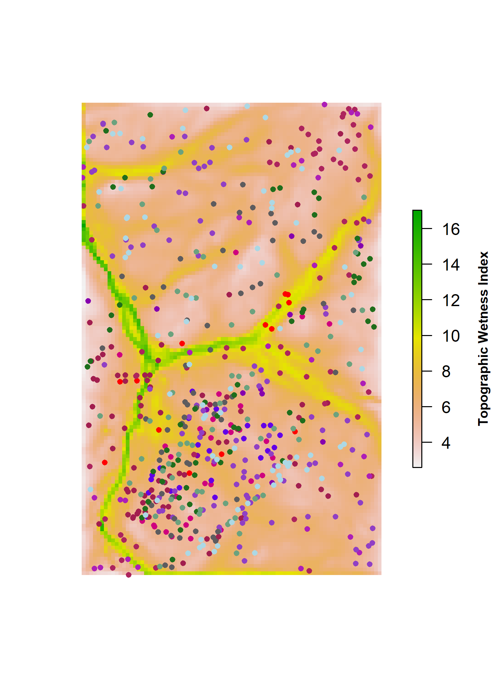

```{r, include=FALSE}
options(tinytex.verbose = TRUE)
```

```{r include=FALSE}
# automatically create a bib database for R packages
knitr::write_bib(c(
  .packages(), 'bookdown', 'knitr', 'rmarkdown', 'lme4', 'AICcmodavg', 'car', 'piecewiseSEM', 'MuMIn', 'stringr', 'dplyr', 'ggplot2', 'devtools', 'rgdal', 'broom', 'sf', 'ggthemes', 'rgeos', 'RCurl', 'readxl', 'pointRes', 'dplR', 'data.table', 'tools', 'reshape2', 'kableExtra', 'raster', 'elevatr', 'dynatopmodel', 'grid', 'gridExtra', 'ggstance', 'Hmisc', 'magrittr', 'ggpubr'
), 'packages.bib')
```
\raggedright

### Summary (**needs work**)
- Predicting forest responses to drought is an increasingly critical task under climate change effects.
[Part of the problem is due to the lack of studies analyzing the confluence of leaf hydraulic traits with biophysical parameters.]

- In this study, we analyze tree-ring records for 12 species representing 97% of woody productivity in the 25.6-ha ForestGEO plot in Virginia (USA) to determine how tree size, microhabitat, and species' traits interactively shape drought responses across the three strongest droughts over the 60 year period from 1950 and 2009. 

- Individual-level growth responses to the three individual droughts  were stronger in three cases: taller trees in dominant canopy positions, trees in wetter microsites, and more drought-sensitive species as assessed by leaf traits (turgor loss at less negative leaf water potential, greater shrinkage with leaf dehydration). However, there was substantial variation in the best predictor variables across given droughts.

- We conclude that when droughts occur, large dominant trees, drought-sensitive species, and individuals in wetter microhabitats tend to be most strongly affected.


*The Summary for research papers, which must be usable as a stand- alone document, must not exceed 200 words and should be organized using four bullet points to indicate: (1) the research conducted, including the rationale, (2) methods, (3) key results, and (4) the main conclusion, including the key points of discussion. It should not contain citations of other papers.* 

\newpage
### Introduction
Forests globally play a critical role in climate regulation ([Bonan 2008](https://science.sciencemag.org/content/320/5882/1444)), yet there remains enormous uncertainty as to how the terrestrial carbon (C) sink, which is dominated by forests, will respond to climate change ([Friedlingstein et al. 2006](https://journals.ametsoc.org/doi/full/10.1175/JCLI3800.1)). An important aspect of this uncertainty lies in responses to drought (**REF**). In many forested regions around the world, the risk of severe drought is increasing ([Trenbert et al. 2014](https://www.nature.com/articles/nclimate2067)), even in conjunction with increasing precipitation ([IPCC 2014](https://www.cambridge.org/core/books/climate-change-2014-impacts-adaptation-and-vulnerability-part-b-regional-aspects/036A899BD52861D61B0D519C5F2B9334)). Global change-type drought has been affecting forests worldwide ([Allen et al. 2015](https://doi.org/10.1016/j.foreco.2009.09.001)), and it is expected that future climate change-driven droughts will severely impact forests around the world ([Allen et al. 2015](https://doi.org/10.1016/j.foreco.2009.09.001); **REFS**). Larger trees tend to suffer more (e.g., [@bennett_larger_2015]; Stovall et al. 2019), resulting in disproportionate impacts on forest C storage ([Meakem et al. 2018](https://nph.onlinelibrary.wiley.com/doi/10.1111/nph.14633)). As a result, forest drought responses stand to strongly impact forest feedbacks to climate change (**REFS**), yet accurate characterization of drought responses remains a modeling challenge (**REFS**)-- in part because some of the mechanisms underlying drought responses remain unclear. Understanding forest responses to drought requires increased functional understanding of how tree size, microhabitat, and species' traits jointly confer individual-level vulnerability or resistance, and the extent to which their influence is consistent across droughts. 

**One fundamental question regarding forest responses to drought is what drives the observed tendency for large trees to suffer more during drought.** @bennett_larger_2015 showed that in forests globally, large trees suffer greater growth reductions during drought, and numerous subsequent studies have reinforced this finding (Stovall et al. 2019, Hacket-Pain et al. 2016 (DOI 10.1007/s10342-016-0982-7) **REFS**). However, this analysis quantified tree size based on DBH, which has no direct mechanistic meaning. This study proposed two major mechanisms--besides the tendency for bark beetles to preferentially attack larger trees (*Pfeifer, E. M., Hicke, J. A. & Meddens, A. J. H. Observations and modeling of aboveground tree carbon stocks and fluxes following a bark beetle outbreak in the western United States. Glob. Change Biol. 17, 339–350 (2011).*)--for the observed greater drought growth reductions of large trees. First, taller trees face greater biophysical challenge of lifting water greater distances against the effects of gravity and friction (* McDowell, N. G., Bond, B. J., Hill, L., Ryan, M. G. & Whitehead, D. in Size and age related changes in tree structure and function (eds Meinzer, F.C. & Niinemets, U.) 255–286 (Springer Publishing, 2011); McDowell, N. G. & Allen, C. D. Darcy’s law predicts widespread forest mortality under climate warming. Nat. Clim. Change 5, 669–672 (2015); Ryan, M. G., Phillips, N. & Bond, B. J. The hydraulic limitation hypothesis revisited. Plant Cell Environ. 29, 367–381 (2006).*), and this may become a greater liability during drought ([Zhang et al. 2009](https://www.researchgate.net/publication/26322653_Size-dependent_mortality_in_a_Neotropical_savanna_tree_The_role_of_height-related_adjustments_in_hydraulic_architecture_and_carbon_allocation)). Second, larger trees may have lower drought resistance because they are more often in the canopy, where they are exposed to higher solar radiation, greater wind speeds, lower humidity, and lower $CO_2$ concentrations (**REFS-KAT**). Alternatively, the generally supressed status of subcanopy trees may be insufficient to override the benefits of their buffered environment during drought. Potentially counteracting the biophysical challenges faced by large trees, their larger root systems may confer an advantage in terms of allowing greater access to water (**REFS?**); however, it appears that this effect is usually insufficient to offset the costs of height and/or crown exposure [@bennett_larger_2015]. A final mechanism that could mediate tree size-related responses to drought is how hydraulic traits are distributed with respect to size ([Meakem et al. 2018](https://nph.onlinelibrary.wiley.com/doi/10.1111/nph.14633)). It is possible that the pattern observed by @bennett_larger_2015 could be caused if the larger size classes were dominated by species less adapted to handle drought, be it through avoidance, resistance, or resiliance. Alternatively, larger size classes may be dominated by species that are better adapted to inherently greater biophysical challenges--as is the case in tropical moist forests of Panama, where larger size classes contain greater proportions of deciduous species ([Condit et al. 2000](https://doi-org.smithsonian.idm.oclc.org/10.2307/3236572); [Meakem et al. 2018](https://nph.onlinelibrary.wiley.com/doi/10.1111/nph.14633)). Understanding the mechanisms underlying the tendency for larger trees to suffer more during drought will require sorting out the interactive effects of height, canopy position, root water acess, and species' traits.

**A second fundamental question regarding forest responses to drought is how species' traits -- alone and in interaction with tree size -- influence drought response.** To link drought responss to fundamental physiological characteristics, and because measuring and modeling drought responses of every species is infeasible in diverse forests, it is important to understand how traits shape drought responses. Commonly measured traits including wood density ($WD$) (**REFS**), leaf mass per area ($LMA$) [@abrams_adaptations_1990; @guerfel_impacts_2009], and xylem architecture (Elliot et al. 2015, Friedrichs et al. 2009) have been linked to drought responses in temperate deciduous forests--as well as in other forest biomes (**REFS**). However, these traits have less direct linkage to plant hydraulic function than leaf hydraulic traits such as leaf area shrinkage upon dessication ($PLA_{dry}$; *Scoffoni et al. 2013- DOI: 10.1104/pp.113.221424*) and turgor loss point ($\pi_{tlp}$)--i.e., the water potential at which leaf wilting occurs ([Bartlett et al. 2016](https://www.pnas.org/content/113/46/13098.short)), which are emerging as traits with potential to explain greater variation in plant distribution and function than the more commonly-measured traits such as $WD$ and $LMA$ ([Medeiros et al. 2019](https://besjournals.onlinelibrary.wiley.com/doi/abs/10.1111/1365-2435.13229)). There is also evidence that ecosystems with high hydraulic trait diversity--but not traits like $LMA$ and $WD$-- show more modest ecosystem flux variation in response to drought ([Anderegg et al. 2018 (**but review this pub**)](https://doi.org/10.1038/s41586-018-0539-7)), but the ability of hydraulic traits to tree performance under drought remains untested. (**But see D'Orangeville et al. 2018--except that it may not be a well-constructed test for traits**)

**A final fundamental question regarding forest responses to drought is whether tree size and species' traits have similar influence across droughts, or whether drought variability in factors such as severity, duration, and timing interact with tree size and traits such that different components of the community respond differently to different droughts.** No two droughts are the same, and tree growth responses vary with drought characteristics such as timing and atmospheric demand ([D'Orangeville et al. 2018](https://onlinelibrary-wiley-com.smithsonian.idm.oclc.org/doi/full/10.1111/gcb.14096)). However, we are not aware of any studies that compare how tree size and species' traits mediate growth responses across droughts. (**BUT ARE WE MISSING SOMETHING??**) While tree-ring studies provide long-term records of tree responses to multiple droughts (e.g., [@lloret_components_2011];  D'Orangeville et al. 2018 **REFS**), these don't test for differential trait effects across droughts (D'Orangeville et al. 2018) and generally focus on species-level responses, which preclude consideration of the roles of tree size and microenvironment. The ecological studies that have shaped our understanding of the role of tree size and microenvironment in forest drought responses generally examine only a single drought and tend to focus disproportionately on extreme droughts with dramatic impacts (*e.g.*, [Allen et al. 2015](https://doi.org/10.1016/j.foreco.2009.09.001); [@bennett_larger_2015]; Stovall; **MORE REFS**). Thus, our knowledge of forest responses to more modest but frequent droughts--e.g., those with historical return intervals on the order of a decade--remains more limited. While the tendency for larger trees to suffer more definitely predominates [@bennett_larger_2015], there are exceptions (e.g., **REFS**). There is also evidence that the degree to which larger trees suffer more increases with the severity of drought conditions ([@bennett_larger_2015]; *Stovall et al. 2019 (I think!)*). [*Are there any studies showing interactions of drought type with traits?*] Thus, while we expect many of the fundamental mechanisms shaping drought responses to be universal, we have little undertanding of how tree size and traits interact with drought characteristics to result in differential responses across droughts.
(**PELTIER**)


Here, we combine tree-ring records covering three droughts (1966, 1977, 1999), species functional and hydraulic trait measurments, and forest census data from a 25.6-ha ForestGEO plot in Virginia (USA) to test a series of hypotheses and associated specific predictions (Table 1) designed to yield functional understanding of how tree size, microenrivonment, and species' traits collectively shape drought responses. 
First, we focus on the role of tree size and its interaction with microenvironement. 
We confirm that, consistent with most forests globally, larger-diameter trees have lower drought resistance in this forest, which is in an ecoregion represented by only one study in [@bennett_larger_2015] (*H1.0*). 
We then test hypotheses designed to disentangle the relative importance of tree height (*H1.1*), crown exposure (*H1.2*), and root water access, which should be greater for larger trees in dry but not in perpetually wet microsites (*H1.3*). 
Second, we focus on the role of species' functional and hydraulic traits and their interaction with tree height. We hypothesize that drought resistance will follow predicted and observed patterns in relation to wood density and specific leaf area, but that hydraulic traits including xylem architecture (*i.e.*, ring, semi-ring, or diffuse porous), leaf area shrinkage upon dehydration, and turgor loss point will prove better predictors (*H2.1*). 
We then test whether these traits correlate with tree height (*H2.2*), potentially driving the observed tendency for taller trees to suffer more during drought (*H2.3*). 
Finally, we focused on variability among droughts, asking how community resistance varied across droughts (*H3.1*) and whether the factors confirming vulnerability or resistance varied across droughts (*H3.2*).

```{r eval = TRUE, echo=FALSE, warning=FALSE}
library(knitr)
library(kableExtra)
hypothesis_table <- read.csv("tables_figures/hypothesis_table.csv", stringsAsFactors = FALSE, check.names = FALSE)
kable(hypothesis_table, booktabs = TRUE, caption = "**Table 1. Summary of hypotheses, corresponding specific predictions, and results.** We count predictions as fully supported / rejected when the response matches/contradicts the prediction in both univariate and multivariate models (when applicable). Parentheses indicate that predictions were partially supported/ rejected--i.e., that the direction of response matched/contradicted the prediction in some but not all models.") %>%
  pack_rows("H1.0. Larger-diameter trees have lower drought resistance.", 1, 1, latex_gap_space = "1em", colnum = 1, hline_before = FALSE) %>%
  pack_rows("H1.1. Tall trees have lower drought resistance.", 2, 2, latex_gap_space = "1em", colnum = 1, hline_before = FALSE) %>%
  pack_rows("H1.2. Trees with more exposed crowns have lower drought resistance .", 3, 4, latex_gap_space = "1em", colnum = 1, hline_before = FALSE) %>%
  pack_rows("H1.3. Small trees (lower root volume) suffer more in drier microhabitats.", 5, 5, latex_gap_space = "1em", colnum = 1, hline_before = FALSE) %>%
  pack_rows("H2.1. Species traits predict drought resistance.", 6, 10, latex_gap_space = "1em", colnum = 1, hline_before = TRUE) %>%
  pack_rows("H2.2. Taller trees have more drought-resistant traits.", 11, 15, latex_gap_space = "1em", colnum = 1, hline_before = FALSE) %>%
  pack_rows("H2.3. Size-dependent drought resistance is not driven by functional traits.", 16, 16, latex_gap_space = "1em", colnum = 1, hline_before = FALSE) %>%
  pack_rows("H3.1. Community drought resistance differs across droughts.", 17, 17, latex_gap_space = "1em", colnum = 1, hline_before = TRUE) %>%
  pack_rows("H3.2. The direction of responses to predictor variables differs across droughts.", 18, 18, latex_gap_space = "1em", colnum = 1, hline_before = FALSE) %>%
  pack_rows("H3.3. The strength of responses to predictor variables vary across droughts.", 19, 19, latex_gap_space = "1em", colnum = 1, hline_before = FALSE) %>%
  add_header_above(c(" ", "Prediction supported?" = 4, " ")) %>%
  column_spec(1, width = "12cm") %>%
  column_spec(2:5, width = "1cm") %>%
  column_spec(6, width = "2cm") %>%
  kable_styling(latex_options = c("scale_down", "hold_position"), font_size = 8.5) %>%
  kableExtra::landscape()
```

\clearpage

### Materials and Methods
*Study site*

Research was conducted at the 25.6 ha ForestGEO (Forest Global Earth Observatory) study plot at the Smithsonian Conservation Biology Institute (SCBI) in Virginia, USA (38\°53'36.6"N, 78\°08'43.4"W) [[Bourg et al. 2013](https://esajournals.onlinelibrary.wiley.com/doi/abs/10.1890/13-0010.1); @andersonteixeira_ctfs-forestgeo:_2015]. SCBI is located in the central Appalachian Mountains at the northern edge of Shenandoah National Park.  Elevations range from 273-338m above sea level [@gonzalezakre_patterns_2016] with a topographic relief of 65m [@bourg_initial_2013]. Dominant tree taxa include *Liriodendron tulipifera*,  oaks (*Quercus* spp.), and hickories (*Carya* spp.).

*Data collection and preparation*

Within or just outside the ForestGEO plot, we collected data on a suite of variables including tree size, microenvironemnt, and species traits (Table 2). The SCBI ForestGEO plot was censused in 2008, 2013, and 2018 following standard ForestGEO protocols, whereby all free-standing woody stems $\le$ 1cm diameter at breast height (DBH) were mapped, tagged, measured at DBH, and identified to species [@condit_tropical_1998]. From this census data, we used measurements of DBH from 2008 to calculate historical DBH, tree location in the plot to determine the topographic wetness index, and data for all stems $\ge$ 10cm to analyze functional trait composition relative to tree height (all analyses described below). Census data, which were last updated in 2018 (**confirm**), are available through the [ForestGEO data portal](www.forestgeo.si.edu).

```{r eval = TRUE, echo=FALSE, warning=FALSE}
library(knitr)
library(kableExtra)
hypothesis_table <- read.csv("tables_figures/variables_table.csv", stringsAsFactors = FALSE, check.names = FALSE)
kable(hypothesis_table, booktabs = TRUE, caption = "**Table 2. Summary of variables**", format = 'latex', escape = TRUE) %>%
  kable_styling(latex_options = c("scale_down", "hold_position"), font_size = 12, protect_latex = TRUE) %>%
  add_header_above(c(" "," "," "," "," "," ", "observed values" = 3, " ")) %>%
  column_spec(4, width = "7cm") %>%
  pack_rows("Dependent variable", 1, 1, latex_gap_space = "1em", colnum = 1, hline_before = FALSE) %>%
  pack_rows("Independent variables", 2, 18, latex_gap_space = ".4em", colnum = 1, hline_before = FALSE) %>%
  pack_rows("tree size", 5, 6, latex_gap_space = ".4em", colnum = 1, hline_before = FALSE, bold = FALSE, italic = TRUE) %>%
  pack_rows("microhabitat", 7, 11, latex_gap_space = ".4em", colnum = 1, hline_before = FALSE, bold = FALSE, italic = TRUE) %>%
  pack_rows("species' traits", 12, 18, latex_gap_space = ".4em", colnum = 1, hline_before = FALSE, bold = FALSE, italic = TRUE) %>%
  kable_styling()
```

We analyzed tree-ring data from 571 trees representing the twelve species contributing most to woody aboveground net primary productivity (ANPP), which together comprised 97% of study plot ANPP between 2008 and 2013 [@helcoski_growing_2019]. Cores were obtained in 2010-2011 or 2016-2017 from a breast height of 1.3m using a 5mm increment borer. In 2010-2011, cores were collected from randomly selected live trees of species with at least 30 individuals of DBH $\ge$ 10cm [@bourg_initial_2013]. In 2016-2017, cores were collected from all trees found dead in the annual mortality census [@gonzalezakre_patterns_2016]. Cores were sanded, measured, and cross-dated using standard procedures, as detailed in [@helcoski_growing_2019]. The resulting chronologies have been published in association with @helcoski_growing_2019: (ITRDB; GitHub/Zenodo).  *Ryan submitted the data to ITRDB but I don't think its posted yet. We should also cite GitHub/Zenodo here. I'll come back to that.* 

For each tree, we combined tree-ring records and allometric equations of bark thickness to retroactively calculate DBH for the years 1950-2009. 
Prior DBH was estimated using the following equation:

$DBH_Y  = DBH_{2008} - 2*\left[\sum_{year=Y}^{2008} (r_{ring, Y}:r_{ring,2008}) - r_{bark,Y} + r_{bark,2008}\right]$

Here, *Y* denotes the year of interest, $r_{ring}$ denotes ring width derived from cores, and $r_{bark}$ denotes bark thickness. 
Bark thickness was estimated from species-specific allometries based on the bark thickness data from the site [@andersonteixeira_size-related_2015].
Specifically, we used linear regression equations on log-transformed data to relate bark thickness to DBH (Table S#) and then used these to estimate bark thickness based on DBH. 

Height measurements (n=# trees) were taken by several researchers between 2012 to 2019, and are archived in a public [GitHub repository](https://github.com/SCBI-ForestGEO/SCBI-ForestGEO-Data/tree/master/tree_dimensions/tree_heights). Measurement methods included manual [@stovall_assessing_2018, NEON], digital rangefinders [@andersonteixeira_size-related_2015], and automatic LiDAR [@stovall_terrestrial_2018]. Rangefinders either used the tangent method (Impulse 200LR, TruPulse 360R) or the sine method (Nikon ForestryPro) for calculating heights. Both methods are associated with some error [@larjavaara_measuring_2013]. Species-specific height allometries were developed (Table S#). For species with insufficient height data to create reliable species-specific allometries, heights were calculated from equations derived from all species in the study. 

Crown positions were recorded in the field during the growing season of 2018 following the crown position protocol from [@jennings_assessing_1999], whereby positions were ranked as dominant, codominant, intermediate, or suppressed. As there was no way to retroactively estimate crown position, we assumed that 2018 crown position was reflective of each tree's position over the past 60 years. While some trees undoubtedly changed position, an analysis of crown position relative to height (Fig. 2) and height change since *1959* indicated that change was likely slow. Specifically, [**Ian, please provide details--e.g., average rate of height growth**]

Topographic wetness index (TWI) was calculated using the [@R-dynatopmodel] package in R. [** Ian, include a brief explanation of what this is (plus citations)**]

Hydraulic traits were collected from SCBI and are summarized in Table 3. In August 2018, we sampled small sun-exposed branches from three individuals of each species in and around the ForestGEO plot. These were covered with opaque plastic bags, re-cut under water, and re-hydrated overnight before further analysis. Rehydrated leaves (n=3 per indivdiual) were scanned, weighed, dried at 60$^\circ$ C for $\ge$ 48 hours, and then re-scanned and weighed. Leaf area was calculated from scanned images using an R script (**details**). $LMA$ was calculated as the ratio of leaf dry mass to fresh area. $PLA$ was calculated as the percent loss of area between fresh and dry leaves. $WD$ was calculated for ~1cm diameter stem samples (bark and pith removed) as the ratio of dry weight to volume. We used the rapid determination method of ([Bartlett et al., 2012]) to estimate the turgor loss point ($\pi_{tlp}$). Briefly, two 4mm diameter leaf discs were cut from each leaf, tightly wrapped in foil, submerged in liquid nitrogen, perforated 10-15 times with a dissection needle, and then measured using a vapour pressure osmometer (VAPRO 5520, Wescor, Logan, UT, USA). Osmotic potential ($\pi_{osm}$) given by the osmometer was used to estimate ($\pi_{tlp}$) using the equation $\pi_{tlp}=0.832 \pi_{osm} ^{-0.631}$ ([Bartlett et al., 2012]). We also characterized hydraulic vulnerability curves for the # most productive species, but because the water potentials at which 50% and 80% of conductivity is lost, $P50$ and $P80$, did not come out as top predictors in preliminary analyses and their inclusion limited the set of species that could be included in the full analysis, these traits were dropped from further consideration. Data and R scripts for hydraulic traits are available at [**create new public GitHub repo for hydraulic traits, archive in Zenodo, give DOI**].

```{r, Table3, eval=TRUE, echo=FALSE, message=FALSE}
library(knitr)
library(kableExtra)
table2 <- read.csv("tables_figures/species_table.csv")

#the percentage symbol has a double backslash because otherwise this writes out the latex code when making the table

kable(table2, booktabs=TRUE, caption = "**Table 3. Overview of analyzed species, their productivity in the plot, numbers and sizes sampled, and traits.**  Given are DBH mean and range of cored trees, the number of cores represented by each crown position of each species, and mean hydraulic trait measurements. Units of measurements are in mm (DBH), \\% (PLA), g/m2 (LMA), MPa (TLP), and g/cm3 (WD).") %>%
  kable_styling(bootstrap_options = "striped", full_width = FALSE)
```

(**add description of climate data used in Fig. 1, NEON vertical profiles**)

*Identification of drought years*

We identified droughts within the time period 1950-2009, defining drought [@slette_how_2019] as events where tree growth was substantially reduced and where peak growing season climatic conditions were among the driest of the time period. To identify years with widespread reductions in tree growth, we used the pointRes package [@R-pointRes] in R (version 3.5.3) to determine drought periods based on trees' drought resistance, which is defined as the ratio between the performance during and before the disturbance [@lloret_components_2011]. Specifically, we looked at the ratio between annual basal area increment (BAI) in the year of the drought to average annual BAI in the 5 preceding years. Candidate drought years were defined if >25% of the cored trees experienced <30% growth in a year compared to the previous 5 years. Separately, we identified the years with driest conditions during May-August, which stood out in the analysis of [@helcoski_growing_2019] as the months (of the current year) to which annual growth was most sensitive for trees at this site. We considered two metrics of moisture deficit: NOAA Divisional Data’s Palmer Drought Severity Index (PDSI) and the difference between potential evapotranspiration (PET) and precipitation (PRE). These data were obtained from the ForestGEO Climate Data Portal (https://github.com/forestgeo/Climate) in August 2018, with monthly PET and PRE sourced from Climatic Research Unit high-resolution gridded dataset (CRU TS v.4.01; Harris etal., 2014). The driest years were identified through simply ranking mean May-August PDSI or [PET-PRE] for the time period from driest to wettest. 


*Analysis*  (**this needs work**)

Linear mixed models were run following the order of the hypotheses as seen in Figure ??? [individual_tested_traits]. Using the [@R-pointRes] package, we set up models with the resistance value as the response variable (excluding outliers with values of $R\ge 2$), and each prediction's variable as the independent variable. Variables' importance in predicting drought tolerance was calculated from mixed-effects models and the lowest AICc [@R-lme4, @R-AICcmodavg].Null models were determined in order of the predictions. First, we analyzed the combined scenario to determine if "year" was significant. Upon establishing this, we tested height and DBH as size parameters. Although both were significant, height was kept due to its larger delta AICc compared with the null model. We then tested the remaining biophysical and hydraulic traits individually against a null model containing height and year. This yielded Figure ??? (cand_full). All variables with dAICc >2 were used as candidates for each scenario's best model (figure ???? (tested_traits_best))


### Results

*Focal droughts and their characteristics*

![**Figure 1. Climate and species-level growth responses over our study period, highlighting the three focal drougths (a) and community-wide responses** Time series plot (a) shows peak growing season (May-August) climate conditions and residual chronologies for each species. Focal droughts are indicated by dashed lines, and shading indicates the pre-drought period used in calculations of the resistance metric. Figure modified from [@helcoski_growing_2019]. Density plots (b) show community- wide resistance values for each drought.](tables_figures/Figure1.png){width=500px}

In the 60-year period between 1950 and 2009, there were three droughts that met our criteria of anomalously dry climatic conditions coupled with substantial reductions in tree growth for at least some portions of the community: 1966, 1977, and 1999 (Fig. 1). 
We excluded one year (1991) meeting the growth reduction criteria (26.5% of trees experienced >30% growth reduction, mean resistance= -13.8%) because this year was not among the strongest droughts of the study period (**DETAILS**). Rather, the severity of growth reduction may be explained by defoliation by gypsy moths (*Lymantria dispar* L.) from approximately 1988-1995, which most stronly impacted *Quercus* spp. (*Cite Shenanadoah paper, if accepted*). 
Climatically, these droughts included three of the five years between 1950 and 2009 with greatest moisture deficit (PET-PRE) during the peak growing season months of May-August, which are the months to which annual tree growth at this site is most sensitive [@helcoski_growing_2019]. Specifically, 1966, 1977, and 1999 had mean MJJA PET-PRE of 83.37, 86.97, and 80 mm mo<sup>-1</sup>, respectively. The years 1964 and 2007 also ranked in the top five driest (PET-PRE =83.87 and 82.13 mm mo<sup>-1</sup>), but *were not among the lowest in terms of PDSI and were not identified as a pointer yeasr.* 
**The droughts differed in timing/duration/etc. .. The year 1966 was preceded by two relatively dry years... 1964 among five driest in terms of May-August [PET-PRE],  1965  also anomalously hot and dry. **

Community-level tree growth responses to these droughts were modest, with modal resistance values of #, #, and # for 1966, 1977, and 1999, respectively (Fig. 1b). In each drought, roughly 30% of the cored trees suffered $\ge$ 30% growth reductions ($R$ $\le$ 0.7): #% in 1966, #2% un 1977, and #% in 1999. *Some* trees exhibited increased growth: ($R$ > 1.0): #% in 1966, #% un 1977, and #% in 1999. 


*Tree size and drought resistance*

Overall, our analysis confirmed the tendency for larger-diameter trees to show greater reductions in growth during drought [@bennett_larger_2015] (*H1.0*), although there was no signficant effect for 1977 or 1999 individually (Tables 1, 4). The same held true for $ln[H]$ as a univariate predictor (*H1.1*; Tables 1, 4). When combined with other predictor variariables in our multivariate models, the top models usually included an effect of $ln[H]$, and its coefficient was consistently negative, as predicted (Tables 1, 5). We note that a non-signficant positive correlation between $ln[H]$ and $R$ for 1999 became negative in the context of the multivariate models, again supporting *H1.1* (Table 1). 


```{r eval = TRUE, echo=FALSE, warning=FALSE}
library(knitr)
library(kableExtra)
hypothesis_table <- read.csv("tables_figures/univariate_models_table.csv", stringsAsFactors = FALSE, check.names = FALSE) #note: this table is a rearranged version of `tested_traits_best_coeff.csv`.
kable(hypothesis_table, booktabs = TRUE, caption = "**Table 4. Univariate models**", format = 'latex', escape = TRUE) %>%
  kable_styling(latex_options = c("scale_down", "hold_position"), font_size = 12, protect_latex = TRUE) %>%
  add_header_above(c(" "," "," ","all droughts"=2,"1966"=2, "1977" = 2, "1999" = 2)) %>%
  #mutate(dAICc = cell_spec(dAICc, "html", bold = ifelse(dAICc > 1.999, TRUE, FALSE))) %>%  #trying to put sig values in bold, but this doen't work
  kable_styling()
```


```{r eval = TRUE, echo=FALSE, warning=FALSE}
library(knitr)
library(kableExtra)
hypothesis_table <- read.csv("tables_figures/multivariate_models_table.csv", stringsAsFactors = FALSE, check.names = FALSE) #note: this table is a rearranged version of `tested_traits_best_coeff.csv`.
kable(hypothesis_table, booktabs = TRUE, caption = "**Table 5. Summary of R^2 and coefficients of the best multivariate models for each drought instance.** Models are ranked by AIC, and we show all models whose AIC value falls within 2.0 of the best model (dAICc<2).", format = 'latex', escape = TRUE) %>%
  kable_styling(latex_options = c("scale_down", "hold_position"), font_size = 12, protect_latex = TRUE) %>%
  add_header_above(c(" "," "," "," "," ", "crown position" = 4, " ","xylem architecture" = 3," ", " ")) %>%
  pack_rows("", 1, 6, latex_gap_space = ".4em", colnum = 1, hline_before = FALSE) %>%
  pack_rows("", 7, 11, latex_gap_space = ".4em", colnum = 1, hline_before = TRUE) %>%
  pack_rows("", 12, 15, latex_gap_space = ".4em", colnum = 1, hline_before = TRUE) %>%
  pack_rows("", 16, 24, latex_gap_space = ".4em", colnum = 1, hline_before = TRUE) %>%
  kable_styling()
```

\raggedright


Crown position was generally correlated with $H$, but with substantial variation (Fig. 2**e**). Crown position was a much poorer predictor of $R$ than was $H$ (Table 4), lending little overall support to *H1.2* (Table 1). When considered alone, $CP$ had a significant influence only in the 1977 drought, during which trees with dominant $CP$ had the lowest $R$. When considered in conjunction with $H$, $CP$ came out as a significant predictor only for the 1999 drought, during which suppressed trees had the lowest $R$. Crown position was included in **roughly half** of the top models, with mixed results as to how $R$ varied with $CP$ (Table 5). Most commonly in these multivariate models, as in the univariate models (Table 4), the resistance of dominant trees was less than that of co-dominant trees but higher that of suppressed trees. Thus, $CP$ was sometimes a useful predictor of $R$, but overall had a weak effect relative to that of $H$.

In the non-drought years for which we have vertical profiles in climate data (**YEARS**), taller trees--or those in dominant crown positions-- were generally exposed to higher evaporative demand during the peak growing season months (May-August; Fig. 2). Specifically, maximum daily wind speeds were signficantly higher above the top of the canopy (40-50m) than within and below (10-30m) (Fig. 2a). Relative humidity was also somewhat lower during June-August, ranging from ~50-80 above the canopy and ~60-90% in the understory (Fig. 2b). Air temperature did not vary across the vertical profile (Fig. 2c).  [**biological temperature?- probably drop**]


![**Figure 2. Height profiles in growing season climatic conditions, tree heights by crown position, and leaf hydraulic traits** The top row shows averages ($\pm$ SD) of daily maxima and minima of (a) wind speed, (b) relative humidity ($RH$), (c) air temperature ($T_{air}$), and (d) biological temperature ($T_{biological}$)averaged over each month of the peak growing season (May-August) from YEAR-YEAR. In these plots, heights are slightly offset for visualization purposes. Also shown are (e) 2018 tree heights by canopy position (see Table 2 for codes) and vertical profiles in (f) $PLA_{dry}$ and (g) $\pi_{tlp}$. In (f-g), values are community-wide averages across height bins (plotted at upper end of height bin), with grey indicating bins for which species-level trait measurements are available for <75% of individuals. In all plots, the dahsed horizontal line indicates the 95th percentile of tree heigts in the ForestGEO plot.](tables_figures/Figure2.png){width=500px}


Resistance was negatively correlated with $ln[TWI]$ (Tables 4-5), negating the idea that trees in moist microsites would suffer less during drought. Nevertheless, we tested for a negative $ln[H] *ln[TWI]$ interaction (*H1.3*), which could indicate that smaller trees (with smaller rooting volume) have a greater tendency to suffer more in drier microenvironments with greater depth to the water table. *H1.3* was rejected; the $ln[H] *ln[TWI]$ interaction was never signficant and had a consistently positive coefficient (Table 4). 

*Species' traits, height, and drought resistance*

We partially support *H2.1*: Species' hydraulic traits --$XP$, $PLA_{dry}$, and $\pi_{tlp}$--were useful in explaining variation in drought responses, whereas $LMA$ and $WD$ were not (Tables 1,4,5). Specifically, $LMA$ and $WD$ never significantly associated with $R$ in the univariate models (all dAIC $\le$ 0.23; Table 4), and therefore these were excluded as candidate variables for the full multivariate models. In contrast, $XP$, $PLA_{dry}$, and $\pi_{tlp}$ all explained at least modest amounts of variation (dAIC > 1.0) in at least one drought (Table 4). Of these, $PLA_{dry}$ was the strongest predictor, with consistently negative coefficients across all droughts. $\pi_{tlp}$ never came out as significant (dAIC $\ge$ 2) in the univariate models, but had a consistently negative coefficient (Table 4). Whereas ring-porous species had highest $R$ overall and in the 1966 and 1999 droughts, they had lower $R$ in 1977. Results were similar in the context of multivariate models (Table 5), except that $\pi_{tlp}$ had a positive coefficient in the 1966 models in which it was included.

We reject *H2.2*, finding no evidence that taller trees tend to have traits associated with greater drought resistance. In part because of the large sample size (n=# trees--all individuals of our 12 focal species $\ge$ 10 cm in 25.6 ha **Ian, confirm**), there were very significant (p<0.0001) correlations of $H$ with all species' traits (**SI Table?**). However, the correlation only matched the predicted direction (*i.e.*, more drought-resistant traits associated to taller trees) in the case of $LMA$, which did not correlate with $R$. Furthermore, although correlations were statistically signifcant, trait variation within each height class overwhelmed any vertical trends (Fig. 2**f-g**).

We support the hypothesis (*H2.3*) that the observed tendency for larger trees to have greater growth reductions during drought (lower $R$) is *not* driven by more drought-sensitive traits in larger trees, but rather by size itself (Tables 1,5). As discussed above, there was little meaningful variation in traits with height at the community level. When $ln[H]$ and hydraulic traits were considered together in multivariate models, the effect of $ln[H]$ on $R$ was consistently negative (Table 5)--reversing a non-signficant positive $ln[H]$-$R$ correlation in the univariate model for the 1999 drought (Table 4).


*Responses across droughts*

We reject the hypothesis (*H3.1*) that overall community responses varied across droughts. Within the context of mixed effects models, there were no significant differences in $R$ across drought years (Table 4). This is consistent with the observation that the distribution of $R$ values was similar across droughts (Fig. 1b).

We mostly reject the hyopthesis (*H3.2*) that directions of responses varied across droughts. In the majority of cases, response directions were consistent across droughts in both univariate and multivariate models (Tables 1,4,5). However, there were a few exceptions--most commonly in the categorical variables ($CP$ and $XP$) but also for $\pi_{tlp}$ in the multivariate model for the 1966 drought; Tables 4, 5). These differences may very well be random, as opposed to statistically meaningful. Among the univariate models, there was no instance predictor variables signficantly improved the models of two different droughts (dAIC $\ge$ 2), but with contrasting coefficients (Table 4). Among the multivariate models, $CP$ was not consistently in the top models for any drought (Table 5), and $\pi_{tlp}$ only appeared with a positive coefficient in two of five models for the 1966 drought (contrasting with a negative coefficient in the univariate model; Table 4). The difference most likely to be real is that ring and semi-ring porous species had lower resistance than diffuse porous species in the 1977 drought, contrasting with higher resistance in 1966 and 1999 (Tables 4,5), but note that $XP$ was not a signficant predictor on its own for the 1977 drought.

We support the hypothesis (*H3.3*) that the strength of predictor variables was different across the droughts (Tables 1,4,5). For instance, $ln[H]$ and $PLA_{dry}$ had much stronger negative effects in 1966 than in the other two years, $ln[TWI]$ had the strongest negative effect in 1977, and $CP$ (lowest $R$ among supressed trees) and $XP$ (lowest $R$ among diffuse-porous trees) were strongest in 1999 (Tables 4,5). 


### Discussion

Our results reveal how tree size, microhabitat, and hydraulic traits shaped tree growth responses across three droughts in a temperate deciduous forest (Table 1). The tendencey for larger trees to suffer more, observed here as in forests around the world (**REFS**), was driven primarily by their height. There was a marginal additional effect of crown exposure, with the most exposed and the most suppressed trees suffering most--consistent with observations of both greater drought sensitivity of exposed trees (e.g., [@suarez_factors_2004]; [@scharnweber_confessions_2019]; MORE??) and greater sensitivity of suppressed and crowded individuals (**REFS- **). There was no evidence that root water access increased drougth resistance; in contrast, trees in wetter topographic positions suffered more (consistent with [Zuleta et al.](https://repository.si.edu/bitstream/handle/10088/32814/Zuleta-et-al_2017_Ecology.pdf?sequence=1&isAllowed=y)), and larger rooting volume provided no advantage in the drier microenvironments. The lower drought resistance of larger trees was not driven by any tendency for the canopy to be dominated by more drought-sensitive species. Drought-sensitive species were not linked to $LMA$ and $WD$ but were predicted by hydraulic traits ($PLA_{dry}$, $\pi_{tlp}$, and $XP$), which is physiologically logical (**REFS**) but scientifically novel in that $PLA_{dry}$ and $\pi_{tlp}$ have not previously been linked to drought growth responses. The direction of these responses was mostly consistent across droughts, indicating that they were driven by fundamental physiological mechanisms; however, the strengths of each predictor varied across droughts, indicating that specific drought characteristics interact with tree size, microenvironment, and traits to shape which individuals suffer most. These findings significantly advance our knowledge as to the factors that confer vulnerability or resilience on trees during drought...

The droughts considered here were of similar severity (Fig. 1b) and fairly moderate; droughts of this magnitude have occurred with an average frequency of approximately one per 10-15 years (Fig. 1a, @helcoski_growing_2019). Therefore, we excpect that most species are adapted, and individual trees acclimatized, to survive droughts of this nature. While the majority of trees experienced reduced growth, a substantial portion had increased growth (Fig. 1b), underlining the fact that these droughts did not induce extreme stress on the entire forest. It is likely for this reason, combined with the fact that many factors other than climate affect tree growth in closed-canopy forests, that our best models characterize only a modest amount of variation: 10-12% for all droughts combined, and 21-27% for each individual drought (Table 5). Methodologically, the moderate nature of these drougths is an advantage because our analysis considers only trees that survived all of these droughts, and we lack information on the trees that were killed. These are likely to be relatively modest in number, and local forest monitoring data stretching back to the late 1980s confirms that the 1999 drought did not trigger major declines in tree abundance or biomass (*Anderson-Teixeira et al., in review*). Thus, the droughts considered here are substantially weaker than those that have triggered massive tree die-off (e.g., [Allen et al. 2015](https://doi.org/10.1016/j.foreco.2009.09.001)), many of which have shaped our understanding about the role of tree size (Bennett et al. 2015; Stovall et al. 2019) and--to some extent-- traits (**REFS**). Nevertheless, our results are consistent with findings from more extreme droughts.

Our analysis indicates that height is the primary factor through which tree size mediates drought response; however, specific identification of the primary physiological mechanism(s) is complicated by the fact that multiple drought-relevant environmental parameters and tree characteristics covary with tree height. To begin with, taller trees face inherent biophysical challenges in lifting water a greater distance against the effects of gravity and friction (**REFS**). They also face different microenvironments, which are partially related to canopy position. Even under non-drought conditions, evaporative demand increases with tree height (Fig. 1a-b; see also **REFS**. **The vegetation reaches higher temperatures[??](https://github.com/SCBI-ForestGEO/McGregor_climate-sensitivity-variation/issues/58)**, which would occur more during a drought when solar radiation tends to be higher and less water is available for evaporative cooling of the leaves. Furthermore, daytime CO_2 concentrations tend to be lower in the canopy than in the understory **(Fig. 2[??](https://github.com/SCBI-ForestGEO/McGregor_climate-sensitivity-variation/issues/58)** ([Koike et al. 2001](https://watermark.silverchair.com/21-12-13-951.pdf); MORE REFS), implying greater water costs of $CO_2$ uptake. **[McDowell-vertical profiles in isotopes?*]**. Taller trees are more likely to be in domiant canopy positions, although signficant decoupling can be introduced by the configuration of neighboring trees (Fig. 2**e?**) ([Mueller-Landau et al. 2016](https://www.ncbi.nlm.nih.gov/pubmed/16643303)). We show that height is a far stronger predictor than crown position (Tables 1,4,5). Our analysis does have the limitation that canopy positions were recored in 2018 and undoubtedly changed for some trees since the 1960s, and we note that $CP$ became an increasingly poor predictor moving from 1999 back to 1966 (Table 4). However, rates of change are relatively slow, and the fact that some trees inevitably did grow towards more dominant positions would bias against the acceptance of (*H1.2*), implying that dominant crown positions did indeed reduce $R$, which makes sense in light of the vertical enviromnental gradients described above and agrees with previous studies showing greater drought sensitivity in more exposed trees ([@suarez_factors_2004]; [@scharnweber_confessions_2019]; MORE??).  It is safe to assume that currently suppressed trees have always been suppressed, and their relatively low $R$ (after correcting for height effects) is real, which is consistent with analyses showing that suppressed--and particularly crowded--trees can suffer distproportionately during drought (**REFS**). The observed height-sensitivity of $R$, together with the apparent lack of importance of root water access (*H1.3*), agrees with the concept that physiological limitations to transpiration under drought shift from root water access to the plant-atmosphere intreface as forests age ([Bretfeld et al](https://nph-onlinelibrary-wiley-com.smithsonian.idm.oclc.org/doi/full/10.1111/nph.15071)), such that tall trees--particularly the very tallest--are the most sensitive in mature forests.


\newpage

### new discussion outline

1. summary of main findings

2. droughts were fairly week

3. height & canopy position - biophysical factors
  
4. tree size - biological factors
- Beyond microenvironment, multiple tree characteristics and scale with tree size (e.g., [Anderson-Teixeira et al. 2015_scaling](https://besjournals.onlinelibrary.wiley.com/doi/abs/10.1111/1365-2435.12470)) and vary with vertical position in a tree (**REFS**)...
 - we characterize hydraulic traits at the species level, missing known variation with height ([Couvreur et al. 2018](https://onlinelibrary-wiley-com.smithsonian.idm.oclc.org/doi/full/10.1111/pce.13322?casa_token=92wZmmL9EhQAAAAA%3A2cq5yAR0_pyM9TVBa5o_DKkhDuHwIUFryxZ43zsdTgQyEa8f0ZfiEHZ5SHV7fFB49UkzXNvL7nMwabU); [Koike et al. 2001](https://watermark.silverchair.com/21-12-13-951.pdf)). thus, *H2.2* is not a great test, and there may be interactions between height and traits that we're not capturing. What we show is that the canopy isn't dominated by more dorught sensitive species.
 - "Together, these findings demonstrate that the height is the primary mechanism through which tree size mediates drought response."" 


5. we advance knowledge regarding hydraulic traits
- the fact that  $PLA_{dry}$ and $\pi_{tlp}$ predict drought response is physiologically logical (**REFS**) but scientifically novel in that this is the first study to demonstrate that $PLA_{dry}$ and $\pi_{tlp}$ are useful for predicting drought response.   (*confirmed by Lawren*)
   - further contribution is we show that two leaf hydraulic traits - relatively easy to measure - are good predictors of drought response, can be helpful for scaling up (e.g. from our site to eastern deciduous biome)
  - tree species are variable around the world and very diverse in the tropics, and hydraulic traits give us the opportunity the generalize this response;
  
6. we advance knowledge regarding differences across droughts
  - biophysical mechanisms are things that should be seen as universal but relative importance of each can vary within each drought (or across sites)
  
7. science is better
- by advancing our understanding of the mechanisms for individual-level responses to drought, this opens door for better predictions (elaborate from above). "This is absolutely critical to predicting forest responses to future droughts, which we're likely to see more of in the future as a result to climate change. Forecasting forest responses to these droughts is a huge and important challenge",
- furthermore, we have deepened understading of which trees will suffer , and there are implications.
- big trees


*1. paragraph summarizing main results--> primary conclusions*

We partially supported the hypothesis that crown exposure makes trees more vulnerable to drought. Co-dominant trees had the highest drought resistance. Dominant trees had lower resistance, likely because they are the most exposed. Other studies have found clear evidence of greater drought sensitivity in trees with exposed crowns (e.g., [@suarez_factors_2004]; [@scharnweber_confessions_2019]). At the same time, intermediate and suppressed trees had even lower resistance. This indicates that other mechanisms such as competition or rooting depth were important. (Also note that our study design was not ideal for testing the role of canopy position. Current canopy position is a conservative separator of canopy position: trees may currently be in more dominant positions than they were at the time, but backwards movement is unlikely. This would bias against finding a signficant effect for H1.2. Height may be a more reliable predictor of past canopy position than is current canopy position, and explains a portion of variation in canopy position.)


**misc content to integrate**
From [@kannenberg_linking_2019], species with diffuse porous wood anatomy (*Liriodendron*) are more sensitive to drought, whereas ring-porous are not as affected because they more easily rebuild structures for hydraulic conductivity. This paper mentions it would be good to have this data with respect to latent affects from drought.

our ability to compare forest responses across droughts is hampered by the fact that droughts are rarely explicitly defined in ecological studies [@slette_how_2019]

No previous study has compared drought responses derived from tree-rings for so many species at one site. By comparing species at the same site, can control for other factors. 


### Acknowledgements
funding: ForestGEO,

### Author Contribution 
words

\newpage
### Supplementary Information
```{r, Table S1, eval=TRUE, echo=FALSE, message=FALSE}
heights <- read.csv("tables_figures/height_regression.csv", stringsAsFactors = FALSE)
kable(heights, booktabs=TRUE, format = "latex", caption = "Species-specific height regression equations") %>%
  kable_styling(bootstrap_options = "striped", full_width = FALSE, latex_options = "hold_position")
```

```{r, Table S2, eval=TRUE, echo=FALSE, message=FALSE}
tableS2 <- read.csv("tables_figures/candidate_traits.csv", stringsAsFactors = FALSE)
kable(tableS2, booktabs=TRUE, format = "latex", caption = "Candidate variables for best model") %>%
  kable_styling(bootstrap_options = "striped", full_width = FALSE, latex_options = "hold_position")
```

```{r, Plot, echo=FALSE, out.width='100%', fig.cap = "Map of ForestGEO plot", fig.pos='ht'}
  knitr::include_graphics("tables_figures/ForestGEO_plot.jpg")
```

*how do we want to present Table S3? Would it be better as an image of an excel file, since it's so large? Did we want to keep all coefficients here?*
```{r, Table S3, eval=TRUE, echo=FALSE, message=FALSE}
tableS3 <- read.csv("tables_figures/top_models_dAIC.csv", stringsAsFactors = FALSE)
kable(tableS3, booktabs=TRUE, format = "latex", caption = "Top model variations for each drought scenario, with dAICc values <= 2") %>%
  kable_styling(bootstrap_options = "striped", full_width = FALSE, latex_options = "hold_position")
```

{width=500px}


(see Issue #32)


