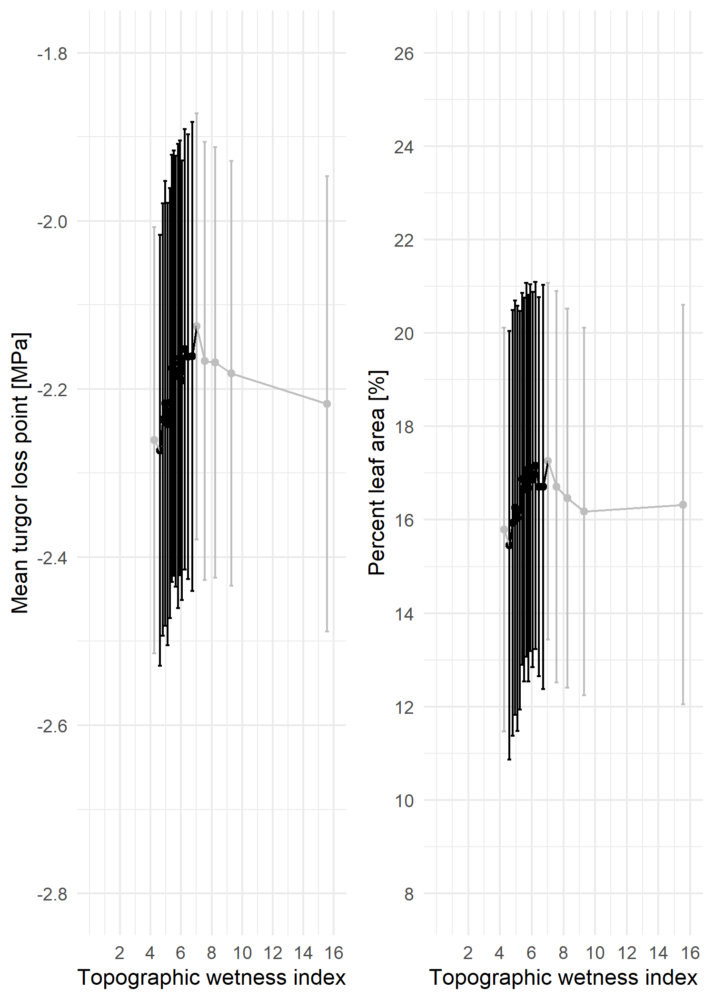

```{r, include=FALSE}
options(tinytex.verbose = TRUE)
```

```{r include=FALSE}
# automatically create a bib database for R packages
knitr::write_bib(c(
  .packages(), 'bookdown', 'knitr', 'rmarkdown', 'lme4', 'AICcmodavg', 'car', 'piecewiseSEM', 'MuMIn', 'stringr', 'dplyr', 'ggplot2', 'devtools', 'rgdal', 'broom', 'sf', 'ggthemes', 'rgeos', 'RCurl', 'readxl', 'pointRes', 'dplR', 'data.table', 'tools', 'reshape2', 'kableExtra', 'raster', 'elevatr', 'dynatopmodel', 'grid', 'gridExtra', 'ggstance', 'Hmisc', 'magrittr', 'ggpubr'
), 'packages.bib')
```


### Summary
Predicting forest responses to drought is an increasingly critical task under climate change effects.
Part of the problem is due to the lack of studies analyzing the confluence of leaf hydraulic traits with biophysical parameters.
In this study, we analyze the interaction between these two trait groups using forest census data from a 25.6-ha ForestGEO plot in Virginia (USA).
Drought periods were defined by both Palmer Drought Severity Indices (PDSI) and their identification from tree-ring records for 12 species representing 97% of woody productivity.
Each drought scenario (1966, 1977, 1999), along with the overall trend, was then tested against leaf hyraulic trait measurements and microhabitat biophysical data.
Individual-level growth responses to the three individual droughts  were stronger in three cases: taller trees in dominant canopy positions, trees in wetter microsites, and more drought-sensitive species as assessed by leaf traits (turgor loss at less negative leaf water potential, greater shrinkage with leaf dehydration). However, there was substantial variation in the best predictor variables across given droughts.
We conclude that when droughts occur, large dominant trees, drought-sensitive species, and individuals in wetter microhabitats are likely to be most strongly affected. **Add discussion points**


*The Summary for research papers, which must be usable as a stand- alone document, must not exceed 200 words and should be organized using four bullet points to indicate: (1) the research conducted, including the rationale, (2) methods, (3) key results, and (4) the main conclusion, including the key points of discussion. It should not contain citations of other papers.* 

### Introduction
Forests globally play a critical role in climate regulation ([Bonan 2008](https://science.sciencemag.org/content/320/5882/1444)), yet there remains enormous uncertainty as to how the terrestrial carbon (C) sink, which is dominated by forests, will respond to climate change ([Friedlingstein et al. 2006](https://journals.ametsoc.org/doi/full/10.1175/JCLI3800.1)). An important aspect of this uncertainty lies in responses to drought (**REF**). In many forested regions around the world, the risk of severe drought is increasing ([Trenbert et al. 2014](https://www.nature.com/articles/nclimate2067)), even in conjunction with increasing precipitation ([IPCC 2014](https://www.cambridge.org/core/books/climate-change-2014-impacts-adaptation-and-vulnerability-part-b-regional-aspects/036A899BD52861D61B0D519C5F2B9334)). Global change-type drought has been affecting forests worldwide ([Allen et al. 2015](https://doi.org/10.1016/j.foreco.2009.09.001)), and it is expected that future climate change-driven droughts will severely impact forests around the world ([Allen et al. 2015](https://doi.org/10.1016/j.foreco.2009.09.001); **REFS**). Larger trees tend to suffer more (e.g., [@bennett_larger_2015]; Stovall et al. 2019), resulting in disproportionate impacts on forest C storage ([Meakem et al. 2018](https://nph.onlinelibrary.wiley.com/doi/10.1111/nph.14633)). As a result, forest drought responses stand to strongly impact forest feedbacks to climate change (**REFS**), yet accurate characterization of drought responses remains a modeling challenge (**REFS**)-- in part because some of the mechanisms underlying drought responses remain unclear. Understanding forest responses to drought requires increased functional understanding of how tree size, microhabitat, and species' traits jointly confer individual-level vulnerability or resistance, and the extent to which their influence is consistent across droughts. 

**One fundamental question regarding forest responses to drought is what drives the observed tendency for large trees to suffer more during drought.** @bennett_larger_2015 showed that in forests globally, large trees suffer greater growth reductions during drought, and numerous subsequent studies have reinforced this finding (Stovall et al. 2019, **REFS**). However, this analysis quantified tree size based on DBH, which has no direct mechanistic meaning. This study proposed two major mechanisms--besides the tendency for bark beetles to preferentially attack larger trees (**REFS(KAT)**)--for the observed greater drought growth reductions of large trees. First, taller trees facea greater biophysical challenge of lifting water greater distances against the effects of gravity and friction (), and this may become a greater liability during drought (**REFS(KAT)**). Second, larger trees may have lower drought resistance because they are more often in the canopy, where they are exposed to higher solar radiation, greater wind speeds, and lower humidity (**REFS(KAT)**). Alternatively, the generally supressed status of subcanopy trees may be insufficient to override the benefits of their buffered environment during drought. Potentially counteracting the biophysical challenges faced by large trees, their larger root systems may confer an advantage in terms of allowing greater access to water (**REFS(KAT)**); however, it appears that this effect is usually insufficient to offset the costs of height and/or crown exposure. A final mechanism that could mediate tree size-related responses to drought is how hydraulic traits are distributed with respect to size ([Meakem et al. 2018](https://nph.onlinelibrary.wiley.com/doi/10.1111/nph.14633)). It is possible that the pattern observed by @bennett_larger_2015 could be caused if the larger size classes were dominated by species less adapted to handle drought, be it through avoidance, resistance, or resiliance. Alternatively, larger size classes may be dominated by species that are better adapted to inherently greater biophysical challenges--as is the case in tropical moist forests of Panama, where larger size classes contain greater proportions of deciduous species ([Condit et al. 2000](https://doi-org.smithsonian.idm.oclc.org/10.2307/3236572); [Meakem et al. 2018](https://nph.onlinelibrary.wiley.com/doi/10.1111/nph.14633)). Understanding the mechanisms underlying the tendency for larger trees to suffer more during drought will require sorting out the interactive effects of height, canopy position, root water acess, and species' traits.

**A second fundamental question regarding forest responses to drought is how species' traits - alone and in interaction with tree size - influence drought response.** To link drought responss to fundamental physiological characteristics, and because measuring and modeling drought responses of every species is infeasible in diverse forests, it is important to understand how traits shape drought responses. Commonly measured traits including wood density (**symbol**) (**REFS**), leaf mass per area ($LMA$) [@abrams_adaptations_1990; @guerfel_impacts_2009], and ring porosity (Elliot et al. 2015, Friedrichs et al. 2009) have been linked to drought responses in temperate deciduous forests--as well as in other forest biomes (**REFS**). However, these traits have less direct linkage to plant hydraulic function than leaf hydraulic traits such as leaf area shrinkage upon dessication (*PLA*; **REF**) and turgor loss point (*TLP*; **REF**), which are emerging as traits with potential to explain greater variation in plant distribution and function than the more commonly-measured traits such as WD and $LMA$ ([Medeiros et al. 2019](https://besjournals.onlinelibrary.wiley.com/doi/abs/10.1111/1365-2435.13229)). 

 However, we hypothesize that leaf hydraulic traits such as leaf area shrinkage upon dessication (PLA; REF) and turgor loss point (TLP; REF), which are emerging as potentially more informative traits but whose effect on drought resistance has never been tested, will prove better predictors.

(interaction between traits and tree size). 

**A final fundamental question regarding forest responses to drought is whether tree size and species' traits have similar influence across droughts, or whether drought variability in factors such as severity, duration, and timing is linked to a diversity of tree repsonses. **

Droughts are rarely explicitly defined in ecological studies [@slette_how_2019], yet no two droughts are the same.

We need to understand the the factors confirming drought vulnerability or resistance not only for extreme droughts with dramatic impacts on tree growth and mortality, which tend to dominate the literature [@bennett_larger_2015] (*Stovall_new*; REFS), but also for more modest but frequent droughts--e.g., those with historical return intervals on the order of a decade.


Here, we combine tree-ring records covering three droughts (1966, 1977, 1999), species functional and hydraulic trait measurments, and forest census data from a 25.6-ha ForestGEO plot in Virginia (USA) to test a series of hypotheses and associated specific predictions (Table 1) designed to yield functional understanding of how tree size, microenrivonment, and species' traits collectively shape drought responses. 
First, we focus on the role of tree size and its interaction with microenvironement. 
We confirm that, consistent with most forests globally [@bennett_larger_2015], larger-diameter trees have lower drought resistance in this forest, which is in an ecoregion represented by only one study in Bennett et al (2015) (H1.0). 
We then test hypotheses designed to disentangle the relative importance of tree height (H1.1), crown exposure (H1.2), and root water access, which should be greater for larger trees in dry but not in perpetually wet microsites (H1.3). 
Second, we focus on the role of species' functional and hydraulic traits and their interaction with tree height. We hypothesize that drought resistance will follow predicted and observed patterns in relation to wood density, specific leaf area, and ring porosity (P2.1a-c), but that leaf hydraulic traits such as leaf area shrinkage upon dehydration and turgor loss point will prove better predictors (P2.1d-e). 
We then test whether these traits correlate with tree height (P2.2), potentially driving the observed tendency for taller trees to suffer more during drought (P2.3). 
Finally, we focused on variability among droughts, asking how  community resistance varied across droughts (H3.1) and whether the factors confirming vulnerability or resistance varied across droughts (H3.2).


{width=500px}


We count predictions as fully supported (or rejected) when the direction of response matches (or contradicts) the prediction. 
H2.3-H3.2 are based on if models containing species traits in H2.1 had dAIC>=2 relative to the appropriate null model or to any alternative multivariate model within 2 dAIC. 
Parentheses indicate that predictions were partially supported (or rejected). In other words, parentheses indicate when the direction of response matched (or contradicted) the prediction in some but not all models with dAIC<2 relative to the appropriate null model. With categorical variables such as crown position,  a "(yes)" notation describes when the trend matched the prediction, but it wasn't significant 
A "(yes/no) or ("no/yes")" indicates tendencies in opposite directions in univariate tests versus the best full models, respectively. 
"(yes)


\clearpage

### Materials and Methods
*Study site*

Research was conducted at the 25.6 ha ForestGEO (Global Earth Observatory) study plot at the Smithsonian Conservation Biology Institute (SCBI) in Virginia, USA (38\°53'36.6"N, 78\°08'43.4"W) [[Bourg et al. 2013](https://esajournals.onlinelibrary.wiley.com/doi/abs/10.1890/13-0010.1); @andersonteixeira_ctfs-forestgeo:_2015]. SCBI is located in the central Appalachian Mountains at the northern edge of Shenandoah National Park.  Elevations range from 273-338m above sea level [@gonzalezakre_patterns_2016] with a topographic relief of 65m [@bourg_initial_2013]. Dominant species include *Liriodendron tulipifera*,  oaks (*Quercus* spp.), and hickories (*Carya* spp.).

*Data collection and preparation*

Within or just outside the ForestGEO plot, we collected data on a suite of variables including tree size, microenvironemnt, and species traits (Table 2). The SCBI ForestGEO plot was censused in 2008, 2013, and 2018 following standard ForestGEO protocols, whereby all free-standing woody stems \>= 1cm diameter at breast height (DBH) were mapped, tagged, measured at DBH, and identified to species [@condit_tropical_1998]. From this census data, we used measurements of DBH from 2008 to calculate historical DBH, tree location in the plot to determine the topographic wetness index, and data for all stems \>= 10cm to analyze functional trait composition relative to tree height (all analyses described below). Census data, which were last updated in 2018 (**???**), were obtained through the ForestGEO [data portal](www.forestgeo.si.edu).


{width=500px}


We analyzed tree-ring data from 571 trees representing the twelve species contributing most to woody aboveground net primary productivity (ANPP), which together comprised 97% of study plot ANPP between 2008 and 2013 [@helcoski_growing_2019]. Cores were obtained in 2010-2011 or 2016-2017 from a breast height of 1.3m using a 5mm increment borer. In 2010-2011, cores were collected from randomly selected live trees of species with at least 30 individuals of DBH >= 10cm [@bourg_initial_2013]. In 2016-2017, cores were collected from all trees found dead in the annual mortality census [@gonzalezakre_patterns_2016]. Cores were sanded, measured, and cross-dated using standard procedures, as detailed in [@helcoski_growing_2019]. The resulting chronologies have been published in association with @helcoski_growing_2019: (ITRDB; GitHub/Zenodo).  *Ryan submitted the data to ITRDB but I don't think its posted yet. We should also cite GitHub/Zenodo here. I'll come back to that.* 

For each tree, we combined tree-ring records and allometric equations of bark thickness to retroactively calculate DBH for the years 1950-2009. Prior DBH was estimated using the following equation:

$DBH_Y  = DBH_{2008} - 2*\left[\sum_{year=Y}^{2008} (r_{ring, Y}:r_{ring,2008}) - r_{bark,Y} + r_{bark,2008}\right]$

Here,  *Y*  is denotes the year of interest, $r_{ring}$ denotes ring width derived from cores, and $r_{bark}$ denotes bark thickness. Bark thickness was estimated from species-specific allometries based on the bark thickness data from the site [@andersonteixeira_size-related_2015].
Specifically, we used linear regression equations on log-transformed data to relate bark thickness to DBH (Table S#- **create table to give these equations in SI**) and then used these to estimate bark thickness based on DBH. 

Height measurements (n=# trees) were taken by several researchers between 2012 to 2019, and are archived in a public [GitHub repository](https://github.com/SCBI-ForestGEO/SCBI-ForestGEO-Data/tree/master/tree_dimensions/tree_heights). Measurement methods included manual [@stovall_assessing_2018, NEON], digital rangefinders [@andersonteixeira_size-related_2015], and automatic LiDAR [@stovall_terrestrial_2018]. Rangefinders either used the tangent method (Impulse 200LR, TruPulse 360R) or the sine method (Nikon ForestryPro) for calculating heights. Both methods are associated with some error [@larjavaara_measuring_2013]. Species-specific height allometries were developed (Table S# - **ADD THIS TABLE TO SI**). For species with insufficient height data to create reliable species-specific allometries, heights were calculated from equations derived from all species in the study. 

Crown positions were recorded in the field during the growing season of 2018 following the crown position protocol from [@jennings_assessing_1999], whereby positions were ranked as dominant, codominant, intermediate, or suppressed. As there was no way to retroactively estimate crown position, we assumed that 2018 crown position was reflective of each tree's position over the past 60 years. While some trees undoubtedly changed position, an analysis of crown position relative to height (Fig. XX) and height change since *1959* indicated that change was likely slow. [**work on this-- provide details?**]

Topographic wetness index (TWI) was calculated using the [@R-dynatopmodel] package in R. [**include a brief explanation of what this is**]

Hydraulic traits were collected from SCBI and are summarized in Table 3. In August 2018, we collected leaf samples from three individuals of each species ... (**Nobby's description of methods for the following (see word document**) 
1. PLA
2. LMA
4. Wood density
5. TLP

**Table 3. Species analyzed here, listed in descending order of ANPP_stem. n cores and DBH range represented, and species traits** [*This replaces/combines the two remaining tables in this section. Suggested columns, with those to include only if they fit in parentheses: species, (stems >=10 cm per ha in plot), (ANPP_stem), n cores, DBH range of cores, (n cores in each crown position) species means for each trait]
```{r, Table3, eval=TRUE, echo=FALSE, message=FALSE}
library(knitr)
library(kableExtra)
table2 <- read.csv("tables_figures/Table2.csv")

#the percentage symbol has a double backslash because otherwise this writes out the latex code when making the table

kable(table2, booktabs=TRUE, caption = "Overview of analyzed species, detailing DBH mean and range of cored trees, the number of cores represented by each crown position of each species, and mean hydraulic trait measurements. Units of measurements are in mm (DBH), \\% (PLA), g/m2 (LMA), MPa (TLP), and g/cm3 (WD).") %>%
  kable_styling(bootstrap_options = "striped", full_width = FALSE)
```

\raggedright

*Identification of drought years*

[**add description of climate data used in Fig. 1, NEON vertical profiles**]

We identified droughts within the time period 1950-2009, defining drought [@slette_how_2019] as events where tree growth was substantially reduced and where peak growing season climatic conditions were among the driest of the time period. To identify years with widespread reductions in tree growth, we used the pointRes package [@R-pointRes] in R (version 3.5.3) to determine drought periods based on trees' drought resistance, which is defined as the ratio between the performance during and before the disturbance [@lloret_components_2011]. Specifically, we looked at the ratio between annual basal area increment (BAI) in the year of the drought to average annual BAI in the 5 preceding years. Candidate drought years were defined if >25% of the cored trees experienced <30% growth in a year compared to the previous 5 years. Separately, we identified the years with driest conditions during May-August, which stood out in the analysis of [@helcoski_growing_2019] as the months (of the current year) to which annual growth was most sensitive for trees at this site. We considered two metrics of moisture deficit: regional Palmer Drought Severity Index (PDSI) values [**source- NOAA-same as Helcoski**] and the difference between potential evapotranspiration (PET) and precipitation (PRE) [**source- same as Helcoski**]. The driest years were identified through simply ranking mean May-August PDSI or [PET-PRE] for the time period from driest to wettest. 


*Analysis* 

Once the data was collected, linear mixed models were run following the order of the hypotheses as seen in Figure ??? [individual_tested_traits]. Using the [@R-pointRes] package, we set up models with the resistance value as the response variable, and each prediction's variable as the independent variable. Variables' importance in predicting drought tolerance was calculated from mixed-effects models and the lowest AICc [@R-lme4, @R-AICcmodavg].Null models were determined in order of the predictions. First, we analyzed the combined scenario to determine if "year" was significant. Upon establishing this, we tested height and DBH as size parameters. Although both were significant, height was kept due to its larger delta AICc compared with the null model. We then tested the remaining biophysical and hydraulic traits individually against a null model containing height and year. This yielded Figure ??? (cand_full). All variables with dAICc >2 were used as candidates for each scenario's best model (figure ???? (tested_traits_best))


\raggedright


\newpage
### Results

*Descriptions of Droughts*

![**Figure 1. ** (a) Time series of peak growing season (May-August) climate conditions and residual chronologies for each species. Droughts analyzed here are indicated by dashed lines, and shading indicates the pre-drought period used in calculations of the resistance metric. Figure modified from [@helcoski_growing_2019]. (b) density plots of community- wide resitance values for each drought.](tables_figures/Figure1.png){width=500px}

In the 60-year period between 1950 and 2009, there were three droughts that met our criteria of anomalously dry climatic conditions coupled with substantial reductions in tree growth for at least some portions of the community: 1966, 1977, and 1999 (Fig. 1). 
We excluded one year (1991) meeting the growth reduction criteria (26.5% of trees experienced >30% growth reduction, mean resistance= -13.8%) because this year was not among the strongest droughts of the study period (**DETAILS**). Rather, the severity of growth reduction may be explained by defoliation by gypsy moths (*Lymantria dispar* L.) from approximately 1988-1995, which most stronly impacted *Quercus* spp. (**Cite Shenanadoah paper, if accepted**). 
Climatically, these droughts included three of the five years between 1950 and 2009 with greatest moisture deficit (PET-PRE) during the peak growing season months of May-August, which are the months to which annual tree growth at this site is most sensitive [@helcoski_growing_2019]. Specifically, 1966, 1977, and 1999 had mean MJJA PET-PRE of 83.37, 86.97, and 80 mm mo<sup>-1</sup>, respectively. The years 1964 and 2007 also ranked in the top five driest (PET-PRE =83.87 and 82.13 mm mo<sup>-1</sup>), but *were not among the lowest in terms of PDSI and were not identified as a pointer yeasr.* 
**The droughts differed in timing/duration/etc. .. The year 1966 was preceded by two relatively dry years... 1964 among five driest in terms of May-August [PET-PRE],  1965  also anomalously hot and dry. **

Community-level tree growth responses to these droughts were modest, with modal resistance values of #, #, and # for 1966, 1977, and 1999, respectively (Fig. 1b). In each drought, roughly 30% of the cored trees suffered growth reductions of 30% or more (resistance <= 0.7): #% in 1966, #2% un 1977, and #% in 1999. *Some* trees exhibited increased growth: (resistance > 1.0): #% in 1964-66, #% un 1977, and #% in 1999. Within the context of mixed effects models, there were no significant differences in resistance across drought years (Table 4).


 #this is tested_traits_all

 

**Results for first main question: what drives the observed tendency for large trees to suffer more during drought?**
H1.0, H1.1, H1.2, H1.3
DBH, height, crown position, and TWI

{width=500px}


**Results for second main question: how do species' traits - alone and in interaction with tree size - influence drought response? **
H2.1, H2.2, H2.3
Hydraulic traits alone, traits with height


**Results for third main question: are responses similar or variable across individual drought years?**
H3.1 and H3.2
Combining biophysical with hydraulic traits, which come out as candidates for best model?


\newpage
### Discussion
Discussion outline

- first paragraph is summary of main findings, not re-presenting the results
  - "we supported this hypothesis, but not this one" (following same order as Table 1 still)
  - direction of responses seems to be relatively consistent but the individual responses vary
- tie things in (see here
  - main thing is that we're now better understanding what confers vulnerability or resilience on trees during drought - how forests respond to future droughts/climate change
- "we filled the gap" = 1-2 sentences
- limitations at our site:
  - aren't able to analyze historical forest community, nor trees that were killed by these droughts [aka we don't have data for individuals that were most severely affected] (though we found that there's little variation in climate sensitivity for trees that were cored dead vs cored alive).
  - p50/p80
  - We used crown position despite its uncertainty. However, height and crown position change relatively slowly so it shouldn't be that far off.
  - We did not use crowding index because it has much more uncertainty
- limitations for extrapolating other sites:
  - forests are different from place to place, but we've seen how in forests around the world, forests tend to suffer more. We've identified some facets for why this happens. (cite other studies)
  - has been observed elsewhere that individuals in more moist habitats are more susceptible to drought (cite other studies)
  - the species may be different from other sites but the hydraulic traits are general across species;
- next paragraph saying that our study advances understanding of droughts, e.g. bennett et al 2015 doesn't go into mechanisms but we do
  - and we show that height is more important than exposure, but doesn't eliminate the effect of it
  - further contribution is we show that two leaf hydraulic traits - relatively easy to measure - are good predictors of drought response, can be helpful for scaling up (e.g. from our site to eastern deciduous biome)
  - biophysical mechanisms are things that should be seen as universal but relative importance of each can vary within each drought
  - first study to show how these traits affect woody growth response to drought **confirmed by Lawren**
  - science is better now. by advancing our understanding of the mechanisms for individual-level responses to drought, this opens door for better predictions (elaborate from above). "This is absolutely critical to predicting forest responses to future droughts, which we're likely to see more of in the future as a result to climate change. Forecasting forest responses to these droughts is a huge and important challenge", science is better.


*1. paragraph summarizing main results--> primary conclusions*
When including only biophysical traits, trees' resistance value (on a per-species basis) is explained best by crown position and height, with codominant trees being the most resistant to drought. This follows on work done by [@bennett_larger_2015] [and others?] which show that larger trees suffer more during drought, and confirms that this susceptibility can be seen in tree ring analyses. Adding in crown position with the leaf hydraulic traits yields a slightly worse predictive model for drought tolerance, with height remaining as the only significant biophysical variable.

We partially supported the hypothesis that crown exposure makes trees more vulnerable to drought. Co-dominant trees had the highest drought resistance. Dominant trees had lower resistance, likely because they are the most exposed. Other studies have found clear evidence of greater drought sensitivity in trees with exposed crowns (e.g., [@suarez_factors_2004]; [@scharnweber_confessions_2019]). At the same time, intermediate and suppressed trees had even lower resistance. This indicates that other mechanisms such as competition or rooting depth were important. (Also note that our study design was not ideal for testing the role of canopy position. Current canopy position is a conservative separator of canopy position: trees may currently be in more dominant positions than they were at the time, but backwards movement is unlikely. This would bias against finding a signficant effect for H1.2. Height may be a more reliable predictor of past canopy position than is current canopy position, and explains a portion of variation in canopy position.)

Proximity to stream--either vertical (elev) or horizontal (distance)-- did not increase drought resistance; rather, it tended to decrease resistance (H1.3a). This may be because individuals growing further from water are acclimatized to drier conditions. However, the increase in drought resistance with distance from stream was less for small than large trees (H1.3b), indicating a potential importance of root depth/volume in conferring drought resistance.


**misc content to integrate**
From [@kannenberg_linking_2019], species with diffuse porous wood anatomy (*Liriodendron*) are more sensitive to drought, whereas ring-porous are not as affected because they more easily rebuild structures for hydraulic conductivity. This paper mentions it would be good to have this data with respect to latent affects from drought.
\newpage
### Acknowledgements
funding: ForestGEO,

### Author Contribution 
words

### Supplementary Information
```{r, Table S1, eval=TRUE, echo=FALSE, message=FALSE}
heights <- read.csv("tables_figures/height_regression.csv", stringsAsFactors = FALSE)
kable(heights, booktabs=TRUE, format = "latex", caption = "Species-specific height regression equations") %>%
  kable_styling(bootstrap_options = "striped", full_width = FALSE, latex_options = "hold_position")
```

```{r, Table S2, eval=TRUE, echo=FALSE, message=FALSE}
tableS2 <- read.csv("tables_figures/candidate_traits.csv", stringsAsFactors = FALSE)
kable(tableS2, booktabs=TRUE, format = "latex", caption = "Candidate variables for best model") %>%
  kable_styling(bootstrap_options = "striped", full_width = FALSE, latex_options = "hold_position")
```

```{r, Plot, echo=FALSE, out.width='100%', fig.cap = "Map of ForestGEO plot", fig.pos='ht'}
  knitr::include_graphics("tables_figures/ForestGEO_plot.jpg")
```

*how do we want to present Table S3? Would it be better as an image of an excel file, since it's so large? Did we want to keep all coefficients here?*
```{r, Table S3, eval=TRUE, echo=FALSE, message=FALSE}
tableS3 <- read.csv("tables_figures/top_models_dAIC.csv", stringsAsFactors = FALSE)
kable(tableS3, booktabs=TRUE, format = "latex", caption = "Top model variations for each drought scenario, with dAICc values <= 2") %>%
  kable_styling(bootstrap_options = "striped", full_width = FALSE, latex_options = "hold_position")
```

{width=500px}



(see Issue #32)


