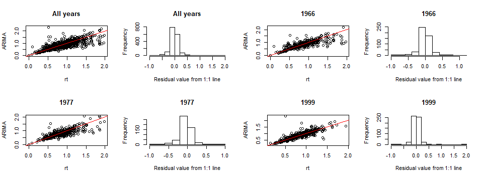

```{r setup, include=FALSE}
knitr::opts_chunk$set(echo = TRUE)
```

*italics - temporary comments for points that remain to be addressed*

**bold - response**

~~~~

Dear Editor:

... Major changes included the following:

* At the request of 3 reviewers (R1,R3,R4), we tried an alternate metric of drought resistance (using an ARIMA model to project what growth would have been in drought year based on the trend over the past 10 years). Results were similar, and we now present that as a secondary model (mostly in SI).

* We dropped crown position as a factor in the statistical models of drought resistance, and instead include it as part of an enhanced focus on the differences in microenviroment experienced by trees of different height (now in Table 1; Fig. 2). This change was prompted by comments by two reviewers (**R1, R3**) that canopy position could not be reliably projected back to 1966 or disentagled from height.

* We added two figures: one showing Rt differences across species, and one visualizing the model results  (the latter is not yet right, as gg-plot is being difficult, but will eventually match  the model results.)

* We moved former tables 4 and 5 to the SI.

The result is an easier to read paper with more robust support.

\newpage

## Referee: 1

Comments to the Author

The study addresses the relationship between drought resistance (Rt) calculated from radial growth, and different traits and microenvironmental characteristics on 12 tree species from one forest in the Eastern US. Both the dataset and the study are meaningful, and the relationship found between Rt and height of biological importance. However, I think there are a number of issues that need to be worked out.

It is important to better discuss the proper use of Rt, particularly when comparing single drought years, to assess tree resistance to drought. This metric has been much used lately as one of the so-called resilience indices (I wonder why other Rs indices where not included in the manuscript). In the paper, the authors use Rt similarly to most studies in the literature, which is fine. Yet, Rt (and particularly the other resilience indices based on radial growth) does not only depend on the individual response to drought events, but also on stand dynamics around target trees. For this reason, if stands around trees are not comparable or show changes after some disturbance (e.g. the drought events analysed) differently, this may bias comparisons of Resilience indices (although it is true that Rt should be less influenced than the other indices). The problem is that there is not such stand competition data for old droughts. This does not invalidate the study but I think the authors should discuss the issue, particularly for the analysis and comparisons of single droughts. I would suggest including also other Resilience indices, not only Rt, to enrich the discussion.

[*issue #92*](https://github.com/SCBI-ForestGEO/McGregor_climate-sensitivity-variation/issues/92)

**To account for potential trends in individual tree growth prior to the drought, which could be influenced by stand dynamics, we tried an intervention time series analysis (ARIMA). Details on the comparison between $Rt$ and $Rt_{ARIMA}$ are presented in the responses to reviewer 4. In short, the ARIMA method yielded broadly similar results, but tended to produce less reasonable estimates when the difference between the two metrics was large, so we decided to retain $Rt$ as the focal metric. While this unquestionably leads to biased estimates for some trees, we would not expect it to bias our analysis; rather, it is one of the reasons that the amount of variation that can be explained by analyses such as these is relatively low. We now include the following content on ARIMA in the manuscript:**

(*insert text*)

**Regarding the resilience indices, we considered analyzing these and decided it would be best to stick with just resistance for three reasons: (1) Most importantly, we would expect resilience to be governed by fundamentally different mechanisms than resistance. While it would be interesting to examine resilience, this would be beyond the scope of the current paper. (2) [DeSoto et al. (2020, Nature)](https://www.nature.com/articles/s41467-020-14300-5) used an extensive dataset of trees sampled after severe droughts and compared the responses to previous, less-severe droughts between trees that survived and trees that were killed by the severe drought. In angiosperms, trees that died from a severe drought had lower resistance to previous droughts, compared to trees that survived the severe drought. In gymnosperms, trees that died during severe droughts had lower recovery following previous droughts, compared to trees that survived the severe drought. These findings would argue that resistance is a more important variable for angiosperms. (3) As the reviewer notes, resilience indices would probably tend to be more sensitive to a tree's neighborhood and prior conditions. We now state the logic for focusing on $Rt$ in the methods section:** 

**"We focus exclusively on drought resistance ($Rt$ or $Rt_{ARIMA}$), and not on the resilience metrics described in @lloret_components_2011, because (1) we would expect resilience to be controlled by a different set of mechanisms, and (2) the findings of *[DeSoto et al. (2020)](https://www.nature.com/articles/s41467-020-14300-5)* suggest that $Rt$ is a more important drought response metric for angiosperms in that low resistance to moderate droughts was a better predictor of mortality during subsequent severe droughts than the resilience metrics."**

Statistical analysis: the analysis would be more precise if the authors used Generalized linear mixed models to avoid data transformation and take into account (with random effects, as they do for the linear mixed model, LMM, presented now) the influence of species in the analysis. Then I missed a further discussion on the role of individual species (e.g. see my comment below on Rt>1).

**A GLMM would only avoid transformation of the dependent variable (Rt), but that was (and is) not transformed. We tried the analysis with generalized linear mixed models with a Gaussian distribution, and confirmed that this gave very similar results, so we are sticking with LMM.**


I suggest to show some relationship, e.g. between Rt and traits in figures. The study only presents two figures and there is plenty of room to present results more clearly with extra figures.

**We created two new figures: one showing how $Rt$ varied across species in each of the three droughts (Fig. 3) and one visualizing the best models (Fig. 4).** 

Only assessing models with AIC is not enough to prove sound relationships in multidimensional and complex data-models. LL ratio tests or deviance-anova tests can be used in the case of nested models with LMM or GLMM respectively. Along the text: dAIC is generally referred as $\Delta$AIC, please change accordingly.

[*issue #94*](https://github.com/SCBI-ForestGEO/McGregor_climate-sensitivity-variation/issues/94)

**We have gone through the manuscript / tables and figures and updated where it said "dAICc" to be $\Delta$AICc. **

Following the two previous comments, I suggest to leave in Table 5 just the best model (rather that a multimodel inference as is presented now) to discuss more clearly the covariates included. And I suggest discussing only the model with all years together. This would be more robust and avoid ramble differences between years that mostly look spurious and with a difficult physiological explanation. This would help to ensure a better use of the Resilience indices.

**In the spirit of this comment (simplifying presentation), we have created a new figure (*Fig. 4*) visualizing the results of the best model. We moved Table 5 to the Appendix (now Table S6, plus a parallel Table S7 for $Rt_{ARIMA}$).**

**We have also decreased the emphasis on differences across drought years, as follows:* **

**(1) Table 1 now shows just the results from the model with all drought years combined.** 

**(2) To make models more consistent across years and reduce spurious correlations, we now include the criteria that for a trait to be included as a candidate variable in the full model, the sign of coefficients must be consistent across all droughts (in addition to meeting the AIC criteria, as before). This resulted in only two candidate variables for the main model ($PLA_{dry}$ and $\pi_{tlp}$). (Removed was ring porosity, which had opposite effects in different droughts.)**

**(3) The results and discussion now focus more on the results from the three drought years combined.** 

**We do still present results from the three droughts separately (e.g., Figs. 1,3,4; Tables S4-S7), as we do feel that this makes the story richer.**

The authors might like to consider including Table 4 as a supplement, because as it stands it looks like an exploratory analysis. If the ‘single-variable approach’ is not just exploratory, state it clearly and why it is needed besides the full models with several parameters.

**We have moved this table to the SI. We modified the analysis approach such that separate models for individual variable tests (as previously show in this table) are now limited to the species traits. While this table is (and was) the only display item (besides Table 1) giving these results, the results are either mostly negative (wood density, SLA, xylem porosity) or preliminary tests qualifying variables for inclusion in full model ($PLA_{dry}$ and $\pi_{tlp}$).** 


Importantly, the drought selection would be biased if years were selected as from line 202, which is a common mistake in similar studies (the original of Lloret et al. included). Droughts must be selected based only on some climatic/drought index (PDSI, SPEI,…) and independently of growth. Otherwise the analysis is biased towards years with low growth, and different questions would arise with a difficult answer. If the authors select only those droughts where there is a growth decrease: is that decrease evident in all species and similar across species? What happens with more intense droughts that those selected (if any), why they do not force a decrease in growth if drought is a main forcing agent? I see that 1966 and 1999 are the driest (as in PDSI) in Figure 1, but there is at least one year around 1955 that it is as dry or drier than 1977. In line 204 it is stated that they are the driest. If this is the case, the analysis should be sound but it should be deleted what is stated in lines 202-203 where authors say that they selected years also based on low growth. In fact, that should be a result after having selected the drought years only based on dryness (as in lines 208-209). Line 211 then they search for pointer years… a little bit messy. Please, explain better, and it should follow: 1) selection of dry years without regarding growth data; 2) characterise growth those dry years; 3) If the authors want to compare with other pointer years, fine, but that should be a third independent step properly justified and explained. Following this rationale, then in line 221 it should be difficult that Rt>1, had we selected those years with a negative growth anomaly. Please, explain clearly and consistently.

**We have made the suggested change: we now present only the PDSI criteria in the methods, and mention the fact that the selected years were also the ones with largest growth reductions during the study period in the results section. Using just the PDSI criterion does not change the years analyzed.**  

Other minor comments:

- Line 113: correct ‘positively’. 

**done**

- Line 134: cambial growth also includes that of phloem; so better refer to ‘xylem growth’. 

**done**

- Line 161: how many species were estimated for height like this? Wouldn’t it be possible for authors to go to the field and perform some height estimations? This 
should be rather straightforward and the authors would increase accuracy across species in height estimation.

**We have specified how many species used the interspecific allometry (n=2, JUNI and FRAM). Because of COVID-19, it would not be possible to go collect more data for these species.** 

- Lines 166-167: please explain further the hypothesis and why. 

**We have reworded this sentence to read, "While some tree crowns undoubtedly changed position over the past several decades, in this case the bias would be unlikely to result in false acceptance of the prediction that dominant trees have the lowest $Rt$ (*i.e.*, type I error unlikely, type II error possible), making our hypothesis test conservative."** 

- Line 222: what about climate in years before 1991? 

**We no longer mention 1991, as it does not meet the PDSI criteria.** 

- Line 231: define AICc. 

**This is done (with added reference)**

- Line 234-247: it is not clear what the authors did, please explain clearer this paragraph and the next and why you did two different (yet similar) analyses (single-variable and full model).

**This section has been re-written.**

- Line 241-242: enough to say once that models were selected based on AIC (line 237-238) and then one criterion, why dAIC<1 here and dAIC<2 before? The classic assumption is 2 (e.g. Burnham & Anderson 2004). See also my other comment above.

**We have modified this text to read as follows:**

**"Trait variables were considered appropriate for inclusion in the main model if they had a consistent direction of response across all droughts and if their addition to a corresponding null model lacking the trait improved fit (at $\Delta$AICc $\ge$ 1.0) in at least one drought year (Table 4). We note that the $\Delta$AICc $\ge$ 1.0 criterion is not a test of significance, but of whether the variable has enough influence to be considered as a *candidate* variable in full models."**

- Line 255-256: but this was already an assumption in M-M (line 202-203). Please, see my comment below and be consistent along the text.

**As stated above, we have removed the $Rt$ criterion from the drought identification process, and now present this information for the first time in this section, adding the following statement: "Across the entire study period (1950-2009), the focal drought years were the three years with the largest fraction of trees exhibiting $Rt \le 0.7$."**

- Line 258: so this means that they are no sensitive to the drought? Which trees, any species in particular? Is this a consequence of stand dynamics shadowing the impact of drought events?

**It's not unprecedented to see some trees exhibit increased growth during drought, and not surprising. Stand dynamics and other factors result in a lot of scatter in the relationship between tree growth and climate, so while the distribution of $Rt$ in Fig. 1b was shifted left (normal year should be normally distributed around 1), there still are some trees with increased growth. Our analysis helps to work out which trees these were (often shorter trees).**

**We address this question in the discussion, where we have added a statement about how this is not unprecedented: "Across all three droughts, the majority of trees experienced reduced growth, but a substantial portion had increased growth (Fig. 1b), potentially due to decreased leaf area of competitors during the drought, and consistent with prior observations that smaller trees can exhibit increased growth rates during drought (Bennett et al. 2015). It is likely because of the moderate impact of these droughts, along with other factors influencing tree growth (e.g., stand dynamics), that our best models characterize only a modest amount of variation"**

**We have also added a new figure (*Fig. 3*) showing how $Rt$ varied across species in each of the three droughts.**

- Line 266-267: why only in 1966? I think this shows that this variable is not properly assessed. The older the date, the more accurate the estimation of crown position and height were.

**We no longer attempt to use crown position to describe variation in drought resistance. Instead, we now use it to characterize *contemporary* differences in microenvironmental conditions faced by trees of different heights.**

- Line 275-280: those profiles were assumed a priori in the introduction and are common to any forest. They are indeed interesting to characterise the forest, but they do not add to individual tree variability. You could think to send Figure 2 to an appendix, in consequence, and use figures to show more specific results related to your individual tree analyses.

**Unless the reviewers and editor strongly disagree, we would request to keep this figure to clarify the main manuscript. We have revised the manuscript such that this figure is better integrated with the hypothesis testing (Table 1) and interpretation of results. We agree that similar patterns are common to any forest, and are not trying to claim this as any kind of novel result, but we're not aware of studies showing this depiction of height profiles for a temperate forest. (Such patterns are not shown in some relevant textbooks: Gordan Bonan's 2016 *Ecological Climatology* and Norman & Campbell's *Environmental Biophysics*. If we're missing studies that show such vertical profiles, we'd appreciate the references.)**

**We did create two new figures showing the results of the tree-ring analysis (and moved two tables to the SI).**

- Line 330-331: any evidence to support this? It looks rather speculative. As suggested above, does any species particularly show positive Rt or positive Rt are randomly distributed in your trees?

*Current text, with phrase of concern in bold: "Across all three droughts, the majority of trees experienced reduced growth, but a substantial portion had increased growth (Fig. 1b), potentially due to decreased leaf area of competitors during the drought (**REF--if we can find one**), and consistent with prior observations that smaller trees can exhibit increased growth rates during drought [@bennett_larger_2015]." *

**To address the question about species, we have added a new figure (*Fig. 3*) showing how $Rt$ varied across species in each of the three droughts.**

- Line 331-333: not so sure about this. It can also mean that there is no causal relationship between Rt and covariates, mostly because radial growth Rt should not be used as an integral proxy of tree resistance to drought, such as it is often used now in the literature.

*Tree-ring data inherently have a lot of variation. Neil could probably write a better response here, with refs.*

- Line 334-339: indeed, assessment of these two variables is not conclusive, as suggested above (just data from 2018, from the past estimated and correlated). 

**Please see response above.** 

- Line 348: non-drought. 

**Fixed.** 

- Line 349: do authors really think that lower radial growth as from Rt on a specific year means that the tree is more vulnerable? I think this is over conclusive.

**We did not intend the meaning here as vulnerability *to mortality* (assuming that's the objection here). We have reworded this sentence to read, "Belowground, taller trees would tend to have larger root systems, but the potentially greater access to water did not override the disadvantage conferred by height--and, in fact, greater moisture access in non-drought years (here, higher TWI) appears to make trees more sensitive to drought [@zuleta_drought-induced_2017; @stovall_tree_2019]."**

- Line 400: I do not agree we can directly link Rt with tree vulnerability to drought; we might be currently overinterpreting these resilience indices extrapolating to physiological conclusions that do not necessary need to hold.

**See above comment. We have reworded this sentence to read, "In the meantime, the results of this study advance our knowledge of the factors conferring drought resistance in a mature forest, opening the door for more accurate forecasting of forest responses to future drought."** 

Table 1: do ‘-‘ signs in the table correspond to ‘no’ (non-significant)? Please explain.

**This is now clarified in the table footnote.** 

Table 3: please, add also the number of trees, it is more informative than the number of cores to check sample size in your study.

**In this study, we have one core per tree, now specified in the methods. We have changed the table header to "n trees".** 

Table 3: the authors could show some test to see if the traits presented are different among species.

**We now show differences in traits among species (with significance groupings) in Figure S4.**

Table S1 and S2: correct R2. 

**This is an issue with rendering latex in R Markdown tables, and we have some bug that is preventing it from rendering correctly. We have noted the problem and will ensure that it's fixed before publication. We note that, for *New Phytologist*, SI materials would be transferred to the journal template rather than be in a file generated by R Markdown.** 

Table S3: please, explain what ‘rank’ means. 

**Done.**

Figure S3: I understand that authors only have height data from 2018 and height for the other dates looks trivial: indeed there will be an increase in height with an increase in DBH in time. The question is whether there was any stand dynamics involved in those height series that had to be included in the models.

**We recognize the importance of stand dynamics, and have added specific mention to the discussion: "It is likely because of the moderate impact of these droughts, along with other factors influencing tree growth (e.g., stand dynamics), that our best models characterize only a modest amount of variation,... "**


## Referee: 2

Comments to the Author

This manuscript examines a truly urgent and important issue. The general issue is the clear vulnerability of forests to ongoing climate change induced drought worldwide. The issue is particularly vexing because, while it seems clear that plant hydraulics is involved in vulnerability to drought, the exact mechanisms connecting hydraulics to vulnerability are not clear, and just what indices biologists should use to gauge vulnerability is as a result unclear. Within the broad pattern of global forest decline with climate change induced drought is the particularly mystifying and horrific preferential loss of the largest individuals all over the world. In addition to their esthetic appeal, large individuals make disproportionate contributions to forest function, making the issue examined in this ms extremely timely and important.

The issue of the preferential death of large trees is not only important because of its effects on forest function and culture. It is important because it seems to require novel theory. Under current expectations, the largest individuals, with their greater root reach, etc., should be more rather than less resistant. That they might not be demands a novel explanatory framework. Yet the very existence of the tendency is debated, with some studies reporting greater mortality among small rather than large individuals (Camarero et al., 2015; Colangelo et al., 2017). These studies, however, were not designed to take into account the microsite variation that presumably should lead to marked differences in survivorship even within the same height class with drought. One approach, which we have used (Soriano et al., in press; Olson et al., 2018) is to conduct experiments under controlled conditions to detect the effect of height, and our results are consistent with the greater vulnerability of taller individuals. However, under natural conditions, a study that takes this variation into account is needed to test the notion that taller individuals are preferentially vulnerable is needed, and this study provides exactly such a design.

I found this paper not only to address a very important point but also to be exceptionally well structured and written. My main suggestion is that it could use a bit more emphasis on its importance, and I would be interested in hearing a bit more about what the authors feel their results imply regarding the cause of the preferential vulnerability of large individuals. I give line-by-line suggestions (and sometimes just reactions):

**Thank you for this wonderful review.**

*What a nice review! We can easily add some language on the importance. We should also add citations to many of the studies mentioned.*

first paragraph—this setup is very compelling, and the point is urgently true.

**Thank you**

66- “in their basal portions” seems fine for this level of intro, but note that in angiosperms, taller trees also have wider vessels at the stem tip (and thus throughout the conductive system) (Zach et al., 2010; Olson et al., 2014, 2018). This seems plausibly the result of selection keeping conduit carbon costs down with height growth. As a tree grows taller, if terminal twig vessel diameters become wider, then given a constant rate of tip-to-base vessel widening, vessel diameters will be wider along the entire stem. Vessels that are wider throughout would have lower per-conduit resistance than those that, all else being equal, are narrower. So, conceivably as a tree gets taller, if vessels widen at the twig tip, then lower per-conduit resistance could mean that the same leaf area is supplied by fewer vessels. This could potentially contribute to keeping per-leaf area carbon costs constant with height growth. This prediction seems confirmed by the experiment of (Echeverría et al., 2019), who found that as Moringa trees grew taller, there were wider vessels at the stem tip and fewer vessels per unit leaf area, but that conductance per unit leaf area should remain the same. Terminal twig tracheids don’t seem to widen in gymnosperms, e.g. (Williams et al., 2019). (Sack et al., 2012) have shown very clearly that petiole base vessel diameter scales predictably with leaf size, as would be expected; it is not clear how leaf size variation is involved in terminal twig vessel diameter scaling with height, though in wide samplings leaf size doesn’t seem to scale with height (Jensen & Zwieniecki, 2013).

**Thank you for this interesting information. We've modified the sentence to read, "Indeed, tall trees require xylem of greater hydraulic efficiency, such that xylem conduit diameters are wider in the basal portions of taller trees, both within and across species [@olson_plant_2018; @liu_hydraulic_2019], and throughout the conductive systems of angiosperms (Zak et al. 2010, Olson et al. 2014,2018).**

67 Appealing to the vulnerability-diameter link might get blowback from some readers because there is as yet no satisfactory theory linking vulnerability to diameter in an entirely satisfactory way, so maybe just say “wider conduits are likely” or that they are “plausibly” or “possibly” more vulnerable, or that many “data are consistent” with such a link. My view is that there very well might not be a link, but in the absence of a link between vulnerability and conduit diameter, it is very hard to explain a very large number of well-established observations. These include the following: why growth rings always proceed from wide to narrow conduits as drought ensues; why maximum community conduit diameter is narrower in drylands than in wet places; why lianas have wider vessel diameter variances (i.e. not only wider but also numerous narrower vessels) than self-supporting plants (Rosell & Olson, 2014); why plants virtually always produce vessels narrower than the maximum possible; when internal helical sculpture in conduits varies in a growth ring it is always associated with narrow latewood vessels; when simple and scalariform plates vary across growth rings sclariform plates are always found in the narrow latewood vessels; and many other observations. If there is no link between drought induced embolism vulnerability and conduit diameter, and there might not be, all of these observations, which are currently simultaneously and parsimoniously explained by the link, will require alternative explanations. As a result, while there is as yet no well accepted mechanistic link between vulnerability and diameter, it seems to me irresponsible to reject the link without providing a satisfactory and similarly parsimonious and general replacement explanation for all of these phenomena. So, I think the authors are justified in cautiously invoking the link here.

**We've added the word "plausibly". We agree that this linkage makes a lot of sense.**

69 this is a very important point—microsite is crucial both for the ultimate height an individual grows to as well as its vulnerability. The generalization that on a global level large trees seem disproportionately vulnerable is often greeted with the skeptical observation that in specific cases a small tree died next to a large one that survived. However, the prediction is that *all else being equal* large individuals should be more vulnerable than smaller *conspecifics*. There is so much variation in microsite and other factors that the greater vulnerability of larger individuals should emerge clearly only in carefully controlled experiments where all else is indeed (virtually) equal, or with high sample sizes where variation in microsite etc should random out and the signal of generally higher vulnerability should come through.

**Thank you.**

73 The “greater root reach” point is almost universally appealed to—cites for these counterarguments would be useful.

**We now address this in the discussion: "Belowground, taller trees would tend to have larger root systems (Enquist and Niklas 2001), but this does not necessarily imply that they have greater access to or reliance on deep soil-water resources that may be critical during drought. Rather, larger trees may allocate more to abundant shallow roots that are beneficial for taking up water from rainstorms (Meinzer et al. 1999)."**

73 Also, larger trees would necessarily seem to have greater stem storage capacity and thus, if capacitance really is important, more water volume available for buffering transient drought events, so this is another reason to expect larger individuals to be more rather than less resistant.

*We now mention this: "Greater stem capacitance (*i.e.*, water storage capacity) of larger trees may also confer resistance to transient droughts (**REF**)."*

77 In the concluding sentence, “greater growth reductions” came as a surprise because I thought that the focus was greater vulnerability/ mortality. Also, there are convincing theoretical and empirical reasons to think that large trees don’t slow down e.g. (Sillett et al., 2010; Selaya & Anten, 2010; Michaletz et al., 2014).

*We've ensured that language at the start of the paragraph refers to growth: "Many studies have shown that within and across species, large trees tend to be more affected by drought. Greater growth reductions for larger trees were first shown on a global scale by @bennett_larger_2015, and subsequent studies have reinforced this finding [*e.g.*, @hacket-pain_consistent_2016; **REF**]. "*

**Regarding the issue of whether large trees slow down or not as they age, that's another (very interesting) issue. The cited references apply to non-drought situations, and I'd see drought response versus age-related growth patterns as largely independent. In this study, it shouldn't matter because our resistance metric takes the ratio of growth during drought relative to what would be expected based on recent years.**


96 this all seems compelling. To make the point stronger, either justify that the leaf traits are causally more important, or that, while they make up part of a unified hydraulic system all of whose components are important, leaf traits are simply easier to measure and this justifies their study. The latter position seems most plausible to me.

**We have revised this paragraph to make the latter point: "Both traits correlate with hydraulic vulnerability and drought tolerance as part of unified plant hydraulic systems [@scoffoni_leaf_2014; @bartlett_correlations_2016]."**

102 great questions, though within-species comparisons are likely to be most informative here, and your mixed model design is in accord with this; just being cautious because sometimes it’s seductive to regard selection acting between rather than within species

**Thank you.**

105 this sounds great, but was a little unclear. When you say “first, we test…” I thought that you would examine a relationship between microsite and some tree characteristic, e.g. that the largest trees are in moist microsites. But the next sentence didn’t refer to a tree-microsite correlation but vulnerability-size. It would be good to clarify the prose here because these are very important passages.  The third sentence did seem to be about tree-microsite correlations.

**We have considerably resivesd this paragraph. It now reads as follows: **

*insert text*

112 wasn’t clear where the “ring porous more drought resistant” hypothesis came from. Global data show that ring porous species are almost entirely restricted to the north temperate zone, especially deciduous broadleaf forests (Wheeler et al., 2007). They are virtually absent in drylands, especially warm tropical drylands. Species in drylands are almost overwhelmingly diffuse porous; the high wood density species in chaparrals and in some desert plants can be semi ring porous (Olson et al., in press).

**This is a great point. The hypothesis refers to temperate deciduous biome, which we now clarify in the sentence in question:**

**"Studies in temperate broadleaf forests have observed that ring-porous species showing higher drought tolerance than diffuse-porous species [@friedrichs_species-specific_2009; @elliott_forest_2015; @kannenberg_linking_2019], but this distinction would not hold in the global context (*Wheeler et al. 2007, Olson et al. 2020*) and does not resolve differences among the many species within each category."**

**We dug into the ring/diffuse porous distinction more, and ended up making a few substantive changes that relate to this theme: (1) We added a new figure showing $Rt$ across species (Fig. 3). This illustrates that the two diffuse-porous species, *Liriodendron tulipifera* and *Fagus grandifolia*, were at opposite ends of the $Rt$ spectrum. (2) We modified the criteria of selecting candidate variables for the full models to include the criterion that directions of responses must be consistent across droughts for inclusion in the full model. This resulted in exclusion of xylem porosity (Table S4)--a change that is also warrented by the fact that we only have two diffuse-porous species. (3) We added the following content to the discussion: **

*insert text*

113 These correlations seem reasonable, e.g. see (Méndez-Alonzo et al., 2012)

**Thank you.**

124 and Table 3. This seems like a good palette of species because they are very different in their hydraulic construction. In addition to libriform fibers, oaks have very abundant vasicentric tracheids, especially in latewood. This means that the oaks will likely maintain some conductance even under highly negative tensions. This is not by virtue of their ring porosity (note that most oaks globally aren’t ring porous!), but because of the high proportion of vasicentric tracheids in their latewood. Liriodendron (diffuse porous, scalariform perforation plates) and Carya (likely ring porous at your locality; simple perforation plates) both have libriform fibers and lack vasicentric tracheids. See the data in (Olson et al., in press). There is relatively low family-level diversity represented here; our phylogenetic analyses (Olson et al., in press) suggest that there is very little phylogenetic signal in the conduit diameter-stem length relationship, so this could help justify if necessary not including phylogeny in the analyses.

**Thank you.**

127 “tree size”= height?

**Yes; clarified.**

138 you might discuss the adequacy of the height range studied. If it is true that conduit diameter predicts vulnerability, then the greatest differences in vulnerability should be over the height range over which conduit diameter changes most rapidly. The relationship between conduit diameter and plant height turns out to follow a power-law like distribution, see for example the SI in (Olson et al., 2018). This means that differences in vulnerability should be very marked across smaller size classes (say below 7 m or so and very marked below 3 m) and be less and less visible across larger plants. So, studies of changes in conduit diameter/ vulnerability with height would ideally include plants smaller than those included here, so maybe comment on how the height range might affect the ability to detect the patterns of interest. It strikes me that it is appropriate because it is the height range over which the putative preferential susceptibility of large trees to drought is being observed.

**Our trees were mostly above the 3 or 7m threshold (see Fig. S3). It's important to note that the DBH and height at the time of coring did not correspond to that at the time of drought. Still, the minimum height was about 5m, so we'd presumably be mostly missing that range of most dramatic changes in conduit diameter. It could be interesting to try to align the size range over which Rt changes most dramatically with those over which conduit diameter and microclimate change most rapidly, but unfortunately that's beyond the scope here.** 

*need to put something in the text here. Line 138 was where we talked about the sizes of cored trees.*

*https://github.com/SCBI-ForestGEO/McGregor_climate-sensitivity-variation/issues/121*

173 TWI seems like an appropriate index for characterizing microsite, with the expectation that individuals in moister areas should be more buffered from drought.

**Thank you.**

209 It couldn’t hurt to define basal area increment

**Done.**

227 the nesting seems appropriate and sufficient for taking species/ “phylogeny” into account

**Thank you.**

260 amazing

**Thank you.**

275—some people think that the increase in terminal twig vessels with height growth keeps pace with the changes in VPD from understory to canopy

**Interesting, thanks.**

281 nice

**Thank you.**

301 this intro paragraph to the discussion ranks very well the results from most significant to least

**Thank you.**

327 I agree that this is the point that most deserves discussion in paragraph 2

**Thank you.**

334 You might go into detail regarding what you think this says about the causal hypothesis behind the global decline of large individuals. To me it helps reject notions that somehow larger trees are more exposed to wind throw or other damaging agents. It is consistent with the hypothesis that larger individuals have wider conduits, and (assuming that wider conduits are more vulnerable to drought induced embolism) thus larger individuals are (all else being equal…) more vulnerable to embolism than smaller conspecifics.

**Unfortunately, we ended up concluding that we can't reliably parse the effects of height *per se* and canopy position in this forest, due to collinearity of height and canopy position, and also because of increasing uncertainty in canopy position as we go back in time. Thus, the paragraph is now modified to discuss both height and associated microenvironment.**

336 beautifully said “impossible for trees to efficiently transport water to great heights and simultaneously maintain strong resistance and resilience to drought-induced embolism”

**Thank you.**

349 fascinating; it seems plausible that current climate changed induced large-individual mortality involves trees growing to conduit diameters, and thus heights, permitted under previously more even and moister climates, and now finding themselves in more extreme climates that make their heights and conduits excessively wide given current conditions.

**We have added the following text:**

*This may be because moister habitats would tend to support species and individuals with more mesophytic traits (*Bartlett et al. 2016 Drought. DOI: 10.1890/15-0468.1*; *Mencuccini 2003, DOI: 10.1046/j.1365-3040.2003.00991.x*) [@medeiros_extensive_2019], potentially growing to greater heights (e.g., *Detto et al. DOI: 10.1371/journal.pone.0076296*), and these are then more vulnerable when drought hits.*


350 if you wanted to expand your discussion of causal mechanisms or the implications of your findings, I think you could jettison this paragraph. I admire your thoroughness in offering caveats, but I agree that this does not seem like a serious problem for your study.

**We have changed our treatment of canopy position and removed this paragraph.** 

382 an effort that seems in harmony with these concerns is (Christoffersen et al., 2016)

**Agreed. We have added this citation.**

385 very nice paragraph

**Thank you.**

In conclusion, this ms addresses a very important issue with a well-designed study and appropriate analyses. It is well written and interesting and I hope my comments are useful.

**Thank you.**

Mark Olson molson@ib.unam.mx


Camarero JJ, Gazol A, Sangüesa-Barreda G, Oliva J, Vicente-Serrano SM. 2015. To die or not to die: early warnings of tree dieback in response to a severe drought (D Gibson, Ed.). Journal of Ecology 103: 44–57.

Christoffersen BO, Gloor M, Fauset S, Fyllas NM, Galbraith DR, Baker TR, Kruijt B, Rowland L, Fisher RA, Binks OJ, et al. 2016. Linking hydraulic traits to tropical forest function in a size-structured and trait-driven model (TFS v.1-Hydro). Geoscientific Model Development 9: 4227–4255.

Colangelo M, Camarero JJ, Borghetti M, Gazol A, Gentilesca T, Ripullone F. 2017. Size Matters a Lot: Drought-Affected Italian Oaks Are Smaller and Show Lower Growth Prior to Tree Death. Frontiers in Plant Science 8.

Echeverría A, Anfodillo T, Soriano D, Rosell JA, Olson ME. 2019. Constant theoretical conductance, changes in vessel diameter and number with height growth in Moringa oleifera. Journal of Experimental Botany.

Jensen KH, Zwieniecki MA. 2013. Physical Limits to Leaf Size in Tall Trees. Physical Review Letters 110.

Méndez-Alonzo R, Paz H, Zuluaga RC, Rosell JA, Olson ME. 2012. Coordinated evolution of leaf and stem economics in tropical dry forest trees. Ecology 93: 2397–2406.

Michaletz ST, Cheng D, Kerkhoff AJ, Enquist BJ. 2014. Convergence of terrestrial plant production across global climate gradients. Nature 512: 39–43.

Olson ME, Anfodillo T, Rosell JA, Petit G, Crivellaro A, Isnard S, León-Gómez C, Alvarado-Cárdenas LO, Castorena M. 2014. Universal hydraulics of the flowering plants: vessel diameter scales with stem length across angiosperm lineages, habits and climates. Ecology Letters 17: 988–997.

Olson ME, Rosell JA, Martínez-Pérez C, León-Gómez C, Fajardo A, Isnard S, Cervantes-Alcayde M-A, Echeverría A, Figueroa-Abúndiz, Segovia-Rivas A, et al. in press. Xylem vessel diameter-shoot length scaling: ecological significance of porosity types and other traits. Ecological Monographs.

Olson ME, Soriano D, Rosell JA, Anfodillo T, Donoghue MJ, Edwards EJ, León-Gómez C, Dawson T, Camarero Martínez JJ, Castorena M, et al. 2018. Plant height and hydraulic vulnerability to drought and cold. Proceedings of the National Academy of Sciences 115: 7551–7556.

Rosell JA, Olson ME. 2014. Do lianas really have wide vessels? Vessel diameter–stem length scaling in non-self-supporting plants. Perspectives in Plant Ecology, Evolution and Systematics 16: 288–295.

Sack L, Scoffoni C, McKown AD, Rawls M, Havran JC, Tran H, Tran T. 2012. Developmentally based scaling of leaf venation architecture explains global ecological patterns. Nature Communications 3: ncomms1835.

Selaya NG, Anten NPR. 2010. Leaves of pioneer and later-successional trees have similar lifetime carbon gain in tropical secondary forest. Ecology 91: 1102–1113.

Sillett SC, Van Pelt R, Koch GW, Ambrose AR, Carroll AL, Antoine ME, Mifsud BM. 2010. Increasing wood production through old age in tall trees. Forest Ecology and Management 259: 976–994.

Soriano D, Echeverría A, Anfodillo T, Rosell JA, Olson ME. in press. Hydraulic traits vary as the result of tip-to-base conduit widening in vascular plants. Journal of Experimental Botany.

Wheeler EA, Baas P, Rodgers S. 2007. Variations In Dicot Wood Anatomy: A Global Analysis Based on the Insidewood Database. IAWA Journal 28: 229–258.

Williams CB, Anfodillo T, Crivellaro A, Lazzarin M, Dawson TE, Koch GW. 2019. Axial variation of xylem conduits in the Earth’s tallest trees. Trees 33: 1299–1311.

Zach A, Schuldt B, Brix S, Culmsee H, Culmsee H. 2010. Vessel diameter and xylem hydraulic conductivity increase with tree height in tropical rainforest trees in Sulawesi, Indonesia. Flora 205: 506–512.


## Referee: 3

Comments to the Author

McGregor and colleagues use a combination of long-term tree records and functional trait data to explore the key drivers that shape the growth resistance of different temperate tree species to extreme drought. They find that that leaf hydraulic traits and tree size are strong predictors of growth responses to drought – with taller trees most affected.

I enjoyed the paper very much. It’s clearly and succinctly written, and brings together a range of complementary datasets to address some very topical questions in forest ecology. I could definitely see the paper being of interest to a broad readership. However, I do have some important questions and suggestions about the analysis which I think need more careful thought. Below I’ve listed my main concerns, following which there are some other comments that the authors may want to take into consideration in revising their paper.

Main comments

L139-140: makes sense to not core live trees in the plot (surprised you got permission to do this in 2011!). But doesn’t this introduce a bias in your analysis? Trees that died may have had very different responses to drought that those which survived. Do you get similar results if you analyse trees that lived and died separately?

**We agree that this could be a concern, but do not believe it is applicable here, for two reasons. First, this would be more likely to introduce a bias if the trees cored dead were killed by drought. We are aware of studies showing differences in climate sensitivity of trees killed by drought versus those that survived. However,these trees were not killed by drought; there was no significant drought in the years in which dead trees were cored or in the 3 previous years. Second, quoting our previous publication using these cores (Helcoski et al. 2019): " Chronologies of trees cored live and dead were pooled following analyses showing similar climate sensitivity at least up to 2009 (that is excluding 7–8 yr before death) for all four species with $\ge$ 10 cores in each category (LITU, QURU, QUVE, FRAM; comparison plots available at https://github.c om/SCBI-ForestGEO/climate_sensitivity_cores/tree/master/ results/live_vs_dead).".** 

**To clarify that this shouldn't be an issue, we have added the following sentence (methods section): "We note that drought was probably not a cause of mortality for these trees, as monthly May-Aug $PDSI$ did not drop below -1.75 in these years or the three years prior (2013-2017), and that trees cored dead displayed similar climate sensitivity to trees cored live [@helcoski_growing_2019]."** 

L165-167: I think this needs to be explained more clearly. Why are type I errors unlikely and type II error possible? I also think there are real issue with the analysis of crown position. Presumably on average the crown illumination index of trees would have increased over the past 50 or so years (from suppressed to dominant) as trees grew and neighbouring trees died. So I’m not convinced you can include this in your models going back half a century. It’s just not sensible to assume that crown position would not have changed over such a long time period.

**We no longer attempt to use crown position to describe variation in drought resistance. Instead, we now use it to characterize *contemporary* differences in microenvironmental conditions faced by trees of different heights.**

L217-226: this is problematic because drought resistance (Rt) as defined by Lloret et al. (2011) assumes that tree growth (BAI in this case) fluctuates around a long term mean that is stable through time. But this is rarely/never the case with tree growth, which shows clear temporal trends related to tree size/ontogeny. If you don’t account for these directional trends then your estimates of Rt will be biased. For instance, if a tree is on a long-term trajectory of decreasing BAI over time, when you calculate Rt you will overestimate the impact of the drought (and vice versa for trees on an upward growth trajectory). So you need to first detrend the tree ring series to remove long-term growth trends (unless you can show that your trees exhibited no long-term temporal trends in BAI). The fact that pre-drought conditions were different for the three droughts is also a problem, but not much you can do about this except acknowledge as you have done.

[*issue #92*](https://github.com/SCBI-ForestGEO/McGregor_climate-sensitivity-variation/issues/92)

**We do not agree that the $Rt$ metric "assumes that tree growth (BAI in this case) fluctuates around a long term mean that is stable through time." If this was true, $Rt$ would be calculated by dividing growth (BAI) in the drought year by the long-term mean growth increment. Instead, $Rt$ is calculated by dividing growth in the focal year by the mean growth over a narrow window of preceding years (5 years in this study). Even though there may be a long-term directional trend in BAI, if you were to calculate the trend in BAI over each 5-year increment, the trend could go in any direction. To account for such trends, we tried an intervention time series analysis (ARIMA). Details on the comparison between $Rt$ and $Rt_{ARIMA}$ are presented in the responses to reviewer 4. In short, the ARIMA method yielded broadly similar results, but tended to produce less reasonable estimates when the difference between the two metrics was large, so we decided to retain $Rt$ as the focal metric. We now include the following content on ARIMA in the manuscript:**

(*insert text*)


L260-261: This is rather strange. So for the same individual tree, size was important in determining response to drought in one year but not in the others? And that’s for the years further back in time when the tree would have been smallest? Couldn’t that be interpreted as trees becoming less susceptible to drought as they grow larger/older? It’s also a little concerning that results are very different across the three droughts. Of these, the 1999 drought is the one I would tend to trust most as stand structure and composition would have been most similar to today.

**We don't find it surprising that height could be more important in some droughts than in others. We address this in the second paragraph of the discussion: "Of the droughts considered here, the 1966 drought, which was preceded by two years of dry conditions (Fig. **S1**), severely stressed a larger portion of trees (Fig. **1b**). The tendency for large trees to have lowest resistance was most pronounced in this drought, consistent with other findings that this physiological response increases with drought severity [@bennett_larger_2015; @stovall_tree_2019]."**

**It's important to keep in mind that we're using height estimates specific to each drought year, and these estimates should be fairly reliable (we've dropped crown position). We now clarify that height is specific to the drought year: "Taller trees (based on $H$ in the drought year) showed stronger growth reductions during drought (Table 1; Fig. **4**)." While the distribution of heights did shift upwards with progressive droughts, this shift is modest relative to the total height range (a few meters relative to a height range of ~40 m; Fig. S3).** 

**There are a number of factors-- including height distribution and also atmospheric CO2 -- that differ across the droughts and may bias the mean response. To account for this as best as possible, we included year as a fixed effect in all statistical models (even though it did not come out significant). This is now clearly specified in the methods: "In the multi-year model, we also included a fixed effect of drought year to represent the combined effects of differences in drought characteristics." There were no significant differences across years, which we now specify in the results.**


Other comments

L42-54: I think it would be worth making the link between growth resilience and probability of mortality. Below are links to a couple of papers that have recently shown that trees that are less resilient to drought are also the ones most likely to die.
https://nam02.safelinks.protection.outlook.com/?url=https%3A%2F%2Fwww.nature.com%2Farticles%2Fs41467-020-14300-5.epdf%3Fshared_access_token%3DD9UngngFedreJeMMIQaYctRgN0jAjWel9jnR3ZoTv0PoKBL3IktPXOnnO0jnQ18EsS6uIPgICnN1RqVtsCGbwDx3K-1u5B0F1T9z3onm3gq-9mknjXKtuc0p7xxY3JipBCqwvtnrdqVNpsLdyzkNRw%253D%253D&amp;data=02%7C01%7CTeixeiraK%40si.edu%7Cda67e36e2ccc4277d4aa08d7ed356305%7C989b5e2a14e44efe93b78cdd5fc5d11c%7C0%7C0%7C637238685875974418&amp;sdata=6%2B7kb11Bzq4LivdOhnR4frg1MEFGaX%2FiIMUqJBG9gsM%3D&amp;reserved=0

 *[DeSoto et al. (2020)](https://www.nature.com/articles/s41467-020-14300-5)*
 
https://nam02.safelinks.protection.outlook.com/?url=https%3A%2F%2Fwww.nature.com%2Farticles%2Fs41558-019-0583-9&amp;data=02%7C01%7CTeixeiraK%40si.edu%7Cda67e36e2ccc4277d4aa08d7ed356305%7C989b5e2a14e44efe93b78cdd5fc5d11c%7C0%7C0%7C637238685875974418&amp;sdata=DF9lSNfAFTjKmSWfb7FI8%2FW4GDN4ljKxZK5NNS8eCxc%3D&amp;reserved=0

*Liu et al. 2019; DOI: 10.1038/s41558-019-0583-9*

**Thank you. We have added the following statement:**

*Because the resistance and resilience of growth to drought is linked to their probability of surviving drought (*[DeSoto et al. (2020)](https://www.nature.com/articles/s41467-020-14300-5)*; *Liu et al. 2019; DOI: 10.1038/s41558-019-0583-9*), understanding growth responses can also help elucidate which trees are most vulnerable to drought-induced mortality.*

L80-101 & L112-115: This is a nice summary of how traits can help us understand species responses to drought. The only thing that is a little strange is that you start by discussing commonly measured traits that have been used to explore susceptibility to drought (e.g., WD and LMA). Then you say that the low predictive power of these traits is because they are poor surrogates of what we should be measuring – i.e. hydraulic traits. But then you end by saying that these are too hard/expensive to measure, so you’re going to look at other surrogates.

**We have revised this section, and believe that it now makes our points more clearly: (1) the traditionally measured traits are poor surrogates, (2) hydraulic traits are useful but time-consuming, (3) $PLA_{dry}$ and $\pi_{tlp}$ are promising alternatives that are both relatively easy to measure and have direct physiological linkages to tree growth and mortality responses to drought. The text now reads as follows:**

*insert 2 paragraphs on traits in intro*

L102 & L106: the introduction gives a nice overview of size and trait influences on resistance to drought. But the third focus of your study – microenvironment characteristics – gets little or no attention. In fact it’s not very clear what you mean by ‘microenvironment’ for most of the paper.

**We have placed the focus primarily on tree size and traits because that's where we see the most interesting story. We are interested in microenvironment primarily in how it interacts with tree size--i.e., in how microclimate varies across the vertical forest gradient, and in whether larger root systems are an advantage in drier microsites. We have made a number of changes that should make this clearer. For instance, we now have a paragraph in the introduction starting as follows "Larger trees may also have lower drought resistance because of microenvironmental and ecological factors." We then discuss how larger trees have more exposed crowns, and how larger root systems could be advantageous in drier microsites during drought.** 

L150-152: Given that height is estimated and not measured, wouldn’t it be better to use DBH as a (measured) dimension of tree size?

**We prefer to use height because it is more meaningful biologically. DBH would give the same result.**

L173: this is the first mention of what I’m guessing is your ‘microenvironment’ descriptor. Worth briefly mentioning why you are measuring TWI.

**We have revised this sentence to read, "Topographic wetness index (TWI), *used here as a metric of long-term mean moisture availability*,..**

L230: Somewhere here it would be good to remind the reader what these explanatory variables are.

**We have revised this sentence to read, "The general statistical model for hypothesis testing was a mixed effects model, implemented  in the lme4 package in R [@R-lme4], using tree nested within species as a random effect, and independent variables as specified below." We later specify the list of variables.**

L234-237: Not very clear how these models were constructed. Why did you fit each predictor independently to test its importance as opposed to standardizing them and having them together in a multiple regression and then compare their coefficients? And why was height retained in all models? Testing one predictor at a time might be sensible if you have lots of collinearity between predictors. But it could also mean you miss important conditional effects (e.g., the effect of variable x only emerges when you first account for the effect of variable y).

*(just need to write a response here-- no further changes needed to manuscript)*

L255-258: good to have this summary, but it’s sort of expected that you have a decline in growth as this is how you defined drought (a little circular). So given that you’ve already mentioned how you defined drought in the methods maybe you don’t need to repeat this here?

**We have dropped the criteria of decline in growth as part of how we defined drought. This does not change the drought years that qualify for inclusion.**

L266-267: Don’t think you can test the effects of crown dominance going back this far. How can you be sure a tree was dominant/suppressed back in 1966?

**We have dropped crown position from the model, and now use it only to give a picture of how microenvironmental conditions vary with tree height under contemporary conditions (Fig. 2).**

L287: specify how they were related to drought. Positive? Negative?

**This has been revised to read, "In contrast, $PLA_{dry}$, and $\pi_{tlp}$ were both negatively correlated to drought resistance (Fig. **4**; Tables 1,S4-S7)."**

Tables and Figures: there are a large number of tables. I wonder if Table 2 and 3 would best fit in supporting information (with key information integrated directly into the text). I also feel that it would be nice to represent some of the key results (e.g., Rt and its relationship to height and leaf hydraulic traits) in a figure.

**We have moved two tables (former tables 4 and 5 to the SI). The best models are now visualized in a figure (Fig. 4). We have also added a figure showing drought response by species.** 


## Referee: 4

Comments to the Author

In this paper, McGregor et al. study the effect of tree height, crown position, ring-porosity, wood density, LMA and two leaf water relations traits (percent loss of leaf area upon desiccation, PLA; and the turgor loss point, TLP) on the drought resistance of 12 temperate species from an oak-hickory forest of northern Virginia (USA). Drought resistance is assessed using series of radial growth data and for the three most severe droughts in the period 1950 - 2009 in the study area. The authors find consistent negative effects of tree height on drought resistance; effects of crown position, ring-porosity and water relation traits for some droughts; and no effect of wood density and LMA. The paper is well written and nicely organized around clear hypotheses. The results are intriguing but, in my opinion, the experimental design is not strong enough to clearly advance our understanding of the determinants of tree drought responses.

Firstly, the way drought resistance (Rt) is estimated, as the ratio of BAI during drought to the mean BAI over the five years preceding the drought can be problematic, as growth dynamics during this pre-drought period were quite variable across species (Figure 1; incidentally, why do you show ring width indices in this figure if you then use BAI?). This approach has also advantages, particularly when applied in a resilience framework (as in the original Lloret et al. (2011)). However, if you focus specificaly on resistance it seems that directly modelling the growth reduction caused by the drought (e.g., using intervention time series analysis or other methods) would be a more robust approach. At the very least, if you continue using your simpler approach I would strongly suggest including some measure of pre-drought growth in the models to account for differences in growth dynamics among species. It would also nice to clarify why you do not assess recovery and resilience, unlike Lloret et al. (2011).

[*issue #92*](https://github.com/SCBI-ForestGEO/McGregor_climate-sensitivity-variation/issues/92)

*add specifics (changes to text; SI table/fig #s) to text below*

**In response to Reviewer 4's comments, we tried an intervention time series analysis using the 'auto.arima' function from the 'forecast' package [@R-forecast]. Specifically, we modeled BAI  based on the timeseries for the 10 years prior to the drought year (itself acting as the intervention). We then recorded the ratio between the mean predicted BAI and the observed BAI during the drought year, and compared these results to $Rt$. These yielded similar outcomes, which we now present in the Supplementary Info. The original $Rt$ and $Rt_{ARIMA}$ were fairly well correlated, but with some scatter (see figs below). To get a sense of which metric was performing better, we visually reviewed the records of the 18 trees with largest differences between $Rt$ and $Rt_{ARIMA}$. $Rt$ estimates were better for the majority of these, and generally were not hugely unrealistic, whereas $Rt_{ARIMA}$ could be way off (e.g., for several trees that were undergoing growth declines prior to drought and hit minima at or near the drought, $Rt_{ARIMA}$ was much greater than 1, suggesting a substantial growth increase during the drought.). Thus, we decided to stick with $Rt$ as the primary metric.**



**Regarding the resilience indices, we considered analyzing these and decided it would be best to stick with just resistance for three reasons: (1) Most importantly, we would expect resilience to be governed by fundamentally different mechanisms than resistance. While it would be interesting to examine resilience, this would be beyond the scope of the current paper. (2) [DeSoto et al. (2020, Nature)](https://www.nature.com/articles/s41467-020-14300-5) used an extensive dataset of trees sampled after severe droughts and compared the responses to previous, less-severe droughts between trees that survived and trees that were killed by the severe drought. In angiosperms, trees that died from a severe drought had lower resistance to previous droughts, compared to trees that survived the severe drought. In gymnosperms, trees that died during severe droughts had lower recovery following previous droughts, compared to trees that survived the severe drought. These findings would argue that resistance is a more important variable for angiosperms. We now state the logic for focusing on $Rt$ in the methods section:** 

**"We focus exclusively on drought resistance ($Rt$ or $Rt_{ARIMA}$), and not on the resilience metrics described in @lloret_components_2011, because (1) we would expect resilience to be controlled by a different set of mechanisms, and (2) the findings of *[DeSoto et al. (2020)](https://www.nature.com/articles/s41467-020-14300-5)* suggest that $Rt$ is a more important drought response metric for angiosperms. "**

Secondly, the choice of traits does not appear well justified, as it seems to be driven more by easiness of measurement than by relevance, and it mixes different types of hypotheses operating at different levels. On one hand there is tree height and crown position, which are measured at the level of individual trees and correspond to closely related hypotheses. On the other hand there are ring-porosity, wood density, LMA and water relations traits, which are measured at the species level and seem to be totally disconnected from the hypotheses regarding tree height. In addition, it is very hard to compare the explanatory power of these variables, as done in the paper, as they are based on very different sample sizes (571 trees vs 12 species) and respond to different sources of variability. In fact the way height effects are analyzed mixes the within- and between-species levels, which makes it difficult to interpret the results. Finally, I think it would be more correct to refer to PLA and TLP as water relations traits rather than hydraulic traits.

**We respond to this one point at a time:**

*the choice of traits does not appear well justified, as it seems to be driven more by easiness of measurement than by relevance*

**Ease of measurement is part of what makes $PLA_{dry}$ and $\pi_{tlp}$ interesting. As we now clarify in the introduction:**

**"However, [traits such as P50, P88, and hydraulic safety margin] are time-consuming to measure and therefore infeasible for predicting or modeling drought responses in highly diverse forests (*e.g.*, in the tropics). More easily-measurable leaf drought tolerance traits that have direct linkage to plant hydraulic function can explain variation in plant distribution and function [@medeiros_extensive_2019]. These include leaf area shrinkage upon desiccation ($PLA_{dry}$) and the leaf water potential at turgor loss point ($\pi_{tlp}$), *i.e.,* the water potential at which leaf wilting occurs [@bartlett_correlations_2016]. Both traits correlate with hydraulic vulnerability and drought tolerance as part of unified plant hydraulic systems [@scoffoni_leaf_2014; @bartlett_correlations_2016].*The abilities of both $PLA_{dry}$ and $\pi_{tlp}$ to explain tree performance under drought remains untested.*"**

*it mixes different types of hypotheses operating at different levels. On one hand there is tree height and crown position, which are measured at the level of individual trees and correspond to closely related hypotheses. On the other hand there are ring-porosity, wood density, LMA and water relations traits, which are measured at the species level and seem to be totally disconnected from the hypotheses regarding tree height. In addition, it is very hard to compare the explanatory power of these variables, as done in the paper, as they are based on very different sample sizes (571 trees vs 12 species) and respond to different sources of variability. In fact the way height effects are analyzed mixes the within- and between-species levels, which makes it difficult to interpret the results.*

**There is nothing fundamentally wrong with a model comparing individual- and species- level effects, but we understand why it was confusing and believe that the revised presentation of the analysis should make all of this easier to follow. Improvements related to this comment include: (1) revision to how traits are selected for inclusion as candidate variables for the full model, which provides a more appropriate test of individual traits and guards against over-fitting; (2) moving of former tables 4 and 5 to the SI, and replacing fig. 5 with a figure visualizing the model results; (3) adding a couple new figures showing variation in $Rt$ (Fig. 3) and predictor variables (Fig. S4) across species; and (4) dropping canopy position from the model for predicting $Rt$.** 

*Finally, I think it would be more correct to refer to PLA and TLP as water relations traits rather than hydraulic traits.*

**We now refer to these as "leaf drought tolerance traits", including in the manuscript title.**

Thirdly, a more thorough analysis of the distribution of the study species in the sample plot would be required. The paper assumes that all species were subjected to the same drought levels. However, this is unlikely to be true, as different species are likely to occupy different microhabitats in the plot, and hence be subjected to different drought conditions. The authors account for this, to some extent, by including individual-level TWI in some models, but a more thorough analysis of the distribution of the study species as a function of TWI and other relevant micro-environmental variables would be needed to fully interpret the results.

**We have added a new figure to the SI showing variation in predictor variables across species (Fig. S4). While there was some variation across species in $H$ and $TWI$, there were few pronounced differences across species. We now discuss the case of the most anomalous species, *Fagus grandifolia*, in the discussion section. We also determined that there is little systematic variation in $PLA_{dry}$ and $\pi_{tlp}$ with respect to $H$ or $TWI$ (analysis not shown). This, together with the fact that our statistical models do account for $TWI$, should minimize bias related to distribution of the study species within the plot** 


Minor or more technical suggestions:

L59-79: the arguments presented in this paragraph mix different scales, from within-individual to within- or among-communities. I think the arguments could be better structured to reflect the sources of variability involved and, ideally, focus on the scale that will be addressed in the paper.

**We have revised this paragraph to provide some more specifics on the scale and setting of these tests.**

L67: I suggest toning down the sentence to something like ‘Wider xylem conduits are associated to higher vulnerability to embolism during drought’, as the mechanism linking wider conduits with embolism vulnerability is far from clear and probably indirect.

**We have revised this to read, "Wider xylem conduits plausibly make large trees more vulnerable to embolism during drought [@olson_plant_2018]..."**

L81: you seem to use drought resistance and drought tolerance interchangeably, which may be confusing. I think it is important to clarify these definitions early on in the paper.

*https://github.com/SCBI-ForestGEO/McGregor_climate-sensitivity-variation/issues/124*

L97: ‘greater variation’ that what?

**This was removed. The text here now reads, "More easily-measurable leaf drought tolerance traits that have direct linkage to plant hydraulic function can explain variation in plant distribution and function [@medeiros_extensive_2019]. These include leaf area shrinkage upon desiccation [$PLA_{dry}$; @scoffoni_leaf_2014] and the leaf water potential at turgor loss point ($\pi_{tlp}$), *i.e.,* the water potential at which leaf wilting occurs [@bartlett_correlations_2016; *Zhu et al. 2018*]. Both traits correlate with hydraulic vulnerability and drought tolerance as part of unified plant hydraulic systems [@scoffoni_leaf_2014; @bartlett_correlations_2016; *Zhu et al. 2018*; but see *Farrell et al. 2017*]. The abilities of both $PLA_{dry}$ and $\pi_{tlp}$ to explain tree drought resistance remains untested.  "**

L100-101: that is not true really. See for example Zhu et al. (2018) in Tree Phys, Farrell et al. (2017) in PCE…

**We have added citations to both these papers and revised the sentence so that it is true: "The abilities of both $PLA_{dry}$ and $\pi_{tlp}$ to explain tree drought resistance remains untested."**

L137-140: mixing cores from dying and surviving individuals could be problematic. Did you find any association between survival and previous drought resistance? Was mortality different across species?

**We agree that this could be a concern, but do not believe it is applicable here, for two reasons. First, this would be more likely to introduce a bias if the trees cored dead were killed by drought. We are aware of studies showing differences in climate sensitivity of trees killed by drought versus those that survived. However,these trees were not killed by drought; there was no significant drought in the years in which dead trees were cored or in the 3 previous years. Second, quoting our previous publication using these cores (Helcoski et al. 2019): " Chronologies of trees cored live and dead were pooled following analyses showing similar climate sensitivity at least up to 2009 (that is excluding 7–8 yr before death) for all four species with $\ge$ 10 cores in each category (LITU, QURU, QUVE, FRAM; comparison plots available at https://github.c om/SCBI-ForestGEO/climate_sensitivity_cores/tree/master/ results/live_vs_dead).".** 

**To clarify that this shouldn't be an issue, we have added the following sentence (methods section): "We note that drought was probably not a cause of mortality for these trees, as monthly May-Aug $PDSI$ did not drop below -1.75 in these years or the three years prior (2013-2017), and that trees cored dead displayed similar climate sensitivity to trees cored live [@helcoski_growing_2019]."** 

L160: you mean a log-log regression, right?

**Yes. fixed.**

L181: N=3 individuals per species is really quite low. In addition, by sampling up to 8 m height you would probably be sampling less exposed branches from taller trees, which could confound your results.

**More samples would be ideal, but was not feasible given the time and resources available, and have no way to sample more now (in part because of COVID-19). We note that intraspecific SD was generally low with respect to mean values and interspecific variation, and that a sample size of n=3 is not unprecendented for this type of analysis [@medeiros_extensive_2019]. We have added a figure to the SI (Fig. S4) showing variation in traits across species.**  

*https://github.com/SCBI-ForestGEO/McGregor_climate-sensitivity-variation/issues/125*

**The sampling strategy was consistent across species, and also consistent with general methods for leaf trait sampling. Because we were not testing species-level trait response (as opposed to sampling traits on every cored tree), we don't expect any bias related to sampling height.** 

L188: ‘Wood’.

**Fixed.**

L189: fresh volume?

**Yes, now specified.**

L223: clarify that the -4.53 value corresponds to July.

**This sentence has been re-written: "The 1999 drought was preceded by wetter than average conditions until the previous June, but $PDSI$ plummeted below -3.0 in October 1998 and remained below this threshold through August 1999."**


L228-234: please clarify model structure. I understand you included tree as a random factor only when the three droughts were analyzed together, right? It would be nice to know what was the contribution of random factors to model fit (only one R2 is shown in Table 5, and it is unclear whether it corresponds to marginal or conditional values).

L238, 242, 244: it is unclear to me why in some cases you use a dAICc of 1 and sometimes of 2.

L287-299: it would be very useful to use scatterplots to show the effects of traits on Rt in a figure.

[*issue #71*](https://github.com/SCBI-ForestGEO/McGregor_climate-sensitivity-variation/issues/71)

L291-294: but this is problematic considering that you only had two diffuse-porous species.

**We have made changes to the analysis that resulted in dropping ring porosity from the full models. While we agree that it is problematic that we only have two ring-porous species, we believe that it's worth including because this engages with, and rejects, the existing understanding that in this biome, ring-porous species are more drought tolerant.**

L297: TLP was significant for 1966 according to Table 4.

L301-302: I would tone down this, as your models explained a rather low % of the variation in Rt.

L305-306: not for the 1977 and 1999 droughts, according to Table 5.

L314-316: or simply that your sample size was rather low. See also main comments above.

L329-331: do you have any information on the demographic effects (e.g., mortality) of the three droughts studied?

**Unfortunately, no. All we could say is that the 1999 drought didn't result in a big loss of live biomass.**

Table 3: are DBH units correct? I suspect they should be mm instead of cm.

**These were incorrect (in mm). Now converted to cm.**

Figure 1: please explain all acronyms.

**We now specify that these codes are given in Table 2.**

Figure 2: where are the leaf hydraulic traits shown (cf. caption)?

**It was an error that this was mentioned in the caption; now removed.**

Table S1: why only 11 species? Some of the fits are really low…

**Bark thickness measurements were drawn from an existing data set, and we did not make additional measurements because the trait is unlikely to have meaningful influence on results. This study already goes above and beyond the existing norm for accounting for bark thickness in DBH reconstructions; typically there is no correction for changes in bark thickness as the tree ages.**

Table S3: what does ‘rank’ refer to?

**This has been clarified.**

Figure S1: please add spatial scale to the figure.

**Done.**

Figure S3: please specify that height values are estimated from reconstructed DBH.

**Done.**


## Citations
