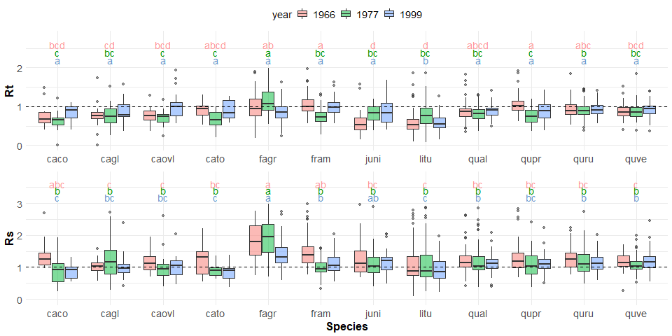

```{r, include=FALSE}
options(tinytex.verbose = TRUE)
options(knitr.table.format = "latex")
```

\blandscape
```{r Table 1, eval = TRUE, echo=FALSE, warning=FALSE}
library(knitr)
library(kableExtra)
hypothesis_table <- read.csv("tables_figures/publication/table1_hypothesis_table3.csv", stringsAsFactors = FALSE, check.names = FALSE)
kable(hypothesis_table, format = "latex", booktabs = TRUE, caption = "Table 1. Summary of hypotheses, corresponding specific predictions, and results.") %>%
  kable_styling(latex_options = c("scale_down", "hold_position"), font_size = 8.5, protect_latex = TRUE) %>%
  pack_rows("Tree size and microenvironment", 1, 6, latex_gap_space = "1em", colnum = 1, hline_before = FALSE) %>%
 pack_rows("Across the forest vertical profile, taller trees are exposed to higher evaporative demand.", 1, 4, latex_gap_space = "1em", colnum = 1, hline_before = FALSE, bold = FALSE, italic = TRUE) %>%
  pack_rows("At least within the forest setting, taller trees are less drought tolerant.", 5, 5, latex_gap_space = "1em", colnum = 1, hline_before = FALSE, bold = FALSE, italic = TRUE) %>%
  pack_rows("Small trees (lower root volume) in drier microhabitats have lower drought tolerance.", 6, 6, latex_gap_space = "1em", colnum = 1, hline_before = FALSE, bold = FALSE, italic = TRUE) %>%
  pack_rows("Species traits", 7, 11, latex_gap_space = "1em", colnum = 1, hline_before = FALSE) %>%
  pack_rows("Species' traits--particularly leaf drought tolerance traits--predict drought tolerance.", 7, 11, latex_gap_space = "1em", colnum = 1, hline_before = FALSE, bold = FALSE, italic = TRUE) %>%
  add_header_above(c(" ", " ", "tree-ring drought records" = 3, " ")) %>%
  add_header_above(c(" ", "Prediction supported?" = 4, " ")) %>%
  column_spec(2, width = "1.7cm")  %>%
  column_spec(3:5, width = "1.2cm") %>%
  column_spec(6, width = "1.8cm") 
 # kableExtra::landscape()
```

Parentheses indicate that the prediction was supported by at least one but not all of the top  models (Table S8). Dash symbols indicate that the response was not significant (Table S4), or not represented in any of the top models (Table S8).

\elandscape


\clearpage

```{r, Table 2, eval=TRUE, echo=FALSE, message=FALSE}
library(knitr)
library(kableExtra)
table2 <- read.csv("tables_figures/publication/table2_species_table_hand_formatted.csv", stringsAsFactors = FALSE, check.names = FALSE)
table2[0,3] <- paste0(table2[0,3], footnote_marker_symbol(1))
table2[8,8] <- paste0(table2[8,8], footnote_marker_symbol(2))
kable(table2, format = "latex", booktabs=TRUE, caption = "Table 2. Overview of analyzed species, listed in order of their relative contributions to woody stem productivity ($ANPP_{stem}$) in the plot, along with numbers and sizes sampled, and species traits. Variable abbreviations are as in Table 3. DBH measurements are from the most recent ForestGEO census in 2018 (live trees) or tree mortality censuses in 2016 and 2017 (trees cored dead).", escape=FALSE) %>%
  kable_styling(latex_options = c("scale_down", "hold_position"), font_size = 8.5, protect_latex = TRUE) %>%
  add_header_above(c(" "," "," ", "contemporary DBH (cm)" = 2, "species traits (mean +/- se)" = 5)) %>%
  #kable_styling(bootstrap_options = "striped", full_width = FALSE)
kableExtra::footnote(symbol = c("Numbers cored live versus dead are given in Table S1 of Helcoski et al. (2019).", "Semi-ring porosity is intermediate between ring and diffuse. We group it with diffuse-porous species for more even division of species between categories."), footnote_as_chunk = FALSE)
```


\clearpage

```{r Table 3, eval = TRUE, echo=FALSE, warning=FALSE}
library(knitr)
library(kableExtra)
table3 <- read.csv("tables_figures/publication/table3_variables_table.csv", stringsAsFactors = FALSE, check.names = FALSE)
kable(table3, format = "latex", booktabs = TRUE, caption = "Table 3. Summary of dependent and independent variables in our statistical models of drought tolerance, along with units, definitions, and sample sizes.", 
        escape=FALSE) %>%
  kable_styling(latex_options = c("scale_down", "hold_position"), font_size = 10, protect_latex = TRUE) %>%
  column_spec(4, width = "7cm") %>%
  pack_rows("Dependent variables", 1, 4, latex_gap_space = "1em", colnum = 1, hline_before = FALSE) %>%
  pack_rows("Independent variables", 5, 16, latex_gap_space = ".4em", colnum = 1, hline_before = FALSE) %>%
  pack_rows("species' traits", 10, 16, latex_gap_space = ".4em", colnum = 1, hline_before = FALSE, bold = FALSE, italic = TRUE) %>%
  kable_styling()
```

Sample sizes are after removal of outliers. Dashes for sample sizes of independent variables indicate that the variable was available for all records. Xylem porosity sample sizes are sums across all drought years.

*Sample sizes of independent variables refer to the $Rt$ model.


\newpage
### Figure Legends

**Figure 1. Climate and species-level growth responses over our study period, highlighting the three focal drougths (a) and community-wide growth resistance,$Rt$ (b), and resilience, $Rs$ (c).** Time series plot (a) shows peak growing season (May-August) climate conditions and residual chronologies for each species (see Table 3 for codes). PET and PRE data were obtained from the Climatic Research Unit high-resolution gridded dataset (CRU TS v.4.01; Harris et al. 2014). Focal droughts are indicated by dashed lines, and shading indicates the pre- and post- drought periods used in calculations of the resistance metric. Figure modified from Helcoski *et al.* (2019). Density plots (b-c) show the distribution of $Rt$ and $Rs$ values for each drought. See Fig. S6 for parallel plot for recovery ($Rc$). 

**Figure 2. Contemporary height profiles in sun exposure and growing season microclimate under non-drought conditions.** Shown are average ($\pm$ SD) of daily maxima and minima of (a) wind speed, (b) relative humidity ($RH$), and (c) air temperature ($T_{air}$) averaged over each month of the peak growing season (May-August) from 2016-2018. In these plots, heights are slightly offset for visualization purposes. Asterisks indicate significant differences between the top and bottom of the height profile. Also shown is (d) tree heights by 2018 crown position, with letters indicating significance groupings. In all plots, the dashed horizontal line indicates the 95th percentile of tree heigts in the ForestGEO plot.

**Figure 3. Drought resistance, $Rt$ (a), and resilience, $Rs$ (b), across species for the three focal droughts.** Species codes are given in Table 2. See Fig. S7 for parallel plot for recovery ($Rc$). 

**Figure 4. Visualization of best statistical models for drought resistance ($Rt$), recovery ($Rc$), and resilience ($Rs)$ for all droughts combined and for each individual drought year.** Confidence intervals were defined via bootsrapping in the  bootpredictlme4 package. Model coefficients are given in Tables S8 and S10-11.


\newpage

![**Figure 1. Climate and species-level growth responses over our study period, highlighting the three focal drougths (a) and community-wide growth resistance,$Rt$ (b), and resilience, $Rs$ (c).** Time series plot (a) shows peak growing season (May-August) climate conditions and residual chronologies for each species (see Table 3 for codes). PET and PRE data were obtained from the Climatic Research Unit high-resolution gridded dataset (CRU TS v.4.01; Harris et al. 2014). Focal droughts are indicated by dashed lines, and shading indicates the pre- and post- drought periods used in calculations of the resistance metric. Figure modified from Helcoski *et al.* (2019). Density plots (b-c) show the distribution of $Rt$ and $Rs$ values for each drought. See Fig. S6 for parallel plot for recovery ($Rc$). ](tables_figures/publication/Figure1.png)


\newpage

![**Figure 2. Contemporary height profiles in sun exposure and growing season microclimate under non-drought conditions.** Shown are average ($\pm$ SD) of daily maxima and minima of (a) wind speed, (b) relative humidity ($RH$), and (c) air temperature ($T_{air}$) averaged over each month of the peak growing season (May-August) from 2016-2018. In these plots, heights are slightly offset for visualization purposes. Asterisks indicate significant differences between the top and bottom of the height profile. Also shown is (d) tree heights by 2018 crown position, with letters indicating significance groupings. In all plots, the dashed horizontal line indicates the 95th percentile of tree heigts in the ForestGEO plot.](tables_figures/publication/Figure2_NEON_vars_height_profile.png)


\newpage





\newpage


