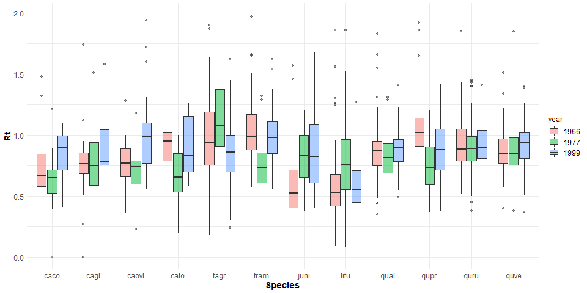

```{r, include=FALSE}
options(tinytex.verbose = TRUE)
options(knitr.table.format = "latex")
```

```{r include=FALSE}
# automatically create a bib database for R packages
knitr::write_bib(c(
  .packages(), 'bookdown', 'knitr', 'rmarkdown', 'lme4', 'AICcmodavg', 'car', 'piecewiseSEM', 'MuMIn', 'stringr', 'dplyr', 'ggplot2', 'devtools', 'rgdal', 'broom', 'sf', 'ggthemes', 'rgeos', 'RCurl', 'readxl', 'pointRes', 'dplR', 'data.table', 'tools', 'reshape2', 'kableExtra', 'raster', 'elevatr', 'dynatopmodel', 'grid', 'gridExtra', 'ggstance', 'Hmisc', 'magrittr', 'ggpubr'
), 'packages.bib')
```

\blandscape
```{r Table 1, eval = TRUE, echo=FALSE, warning=FALSE}
library(knitr)
library(kableExtra)
hypothesis_table <- read.csv("tables_figures/publication/table1_hypothesis_table.csv", stringsAsFactors = FALSE, check.names = FALSE)
kable(hypothesis_table, format = "latex", booktabs = TRUE, caption = "Table 1. Summary of hypotheses, corresponding specific predictions, and results.") %>%
  kable_styling(latex_options = c("scale_down", "hold_position"), font_size = 8.5, protect_latex = TRUE) %>%
  pack_rows("Tree size and microenvironment", 1, 4, latex_gap_space = "1em", colnum = 1, hline_before = FALSE) %>%
 pack_rows("Trees with more exposed crowns have lower drought resistance.", 1, 2, latex_gap_space = "1em", colnum = 1, hline_before = FALSE, bold = FALSE, italic = TRUE) %>%
  pack_rows("Taller trees are less drought resistant.", 3, 3, latex_gap_space = "1em", colnum = 1, hline_before = FALSE, bold = FALSE, italic = TRUE) %>%
  pack_rows("Small trees (lower root volume) in drier microhabitats have lower drought resistance.", 4, 4, latex_gap_space = "1em", colnum = 1, hline_before = FALSE, bold = FALSE, italic = TRUE) %>%
  pack_rows("Species traits", 5, 9, latex_gap_space = "1em", colnum = 1, hline_before = FALSE) %>%
  pack_rows("Species' traits--particularly leaf hydraulic traits--predict drought reistance.", 5, 9, latex_gap_space = "1em", colnum = 1, hline_before = FALSE, bold = FALSE, italic = TRUE) 
  #add_header_above(c(" ", "Prediction supported?" = 4, " ")) %>%
  #column_spec(1, width = "12cm") %>%
  #column_spec(2:5, width = "1.2cm") %>%
  #column_spec(6, width = "2cm") 
 # kableExtra::landscape()
```

Parentheses indicate that the prediction was supported by one but not all of the top  models (Table S6). Dash symbols indicate that the response was not significant (Table S4), or not represented in any of the top models (Table S6).

\elandscape

\clearpage

```{r Table 2, eval = TRUE, echo=FALSE, warning=FALSE}
library(knitr)
library(kableExtra)
table2 <- read.csv("tables_figures/publication/table2_variables_table.csv", stringsAsFactors = FALSE, check.names = FALSE)
kable(table2, format = "latex", booktabs = TRUE, caption = "Table 2. Summary of dependent and independent variables examined here, along with units, definitions, and sample sizes.", 
        escape=FALSE) %>%
  kable_styling(latex_options = c("scale_down", "hold_position"), font_size = 10, protect_latex = TRUE) %>%
  column_spec(4, width = "7cm") %>%
  pack_rows("Dependent variables", 1, 2, latex_gap_space = "1em", colnum = 1, hline_before = FALSE) %>%
  pack_rows("Independent variables", 3, 19, latex_gap_space = ".4em", colnum = 1, hline_before = FALSE) %>%
  pack_rows("tree size", 6, 7, latex_gap_space = ".4em", colnum = 1, hline_before = FALSE, bold = FALSE, italic = TRUE) %>%
  pack_rows("microhabitat", 8, 12, latex_gap_space = ".4em", colnum = 1, hline_before = FALSE, bold = FALSE, italic = TRUE) %>%
  pack_rows("species' traits", 13, 19, latex_gap_space = ".4em", colnum = 1, hline_before = FALSE, bold = FALSE, italic = TRUE) %>%
  kable_styling()
```

*Sample sizes are prior to removal of outliers. Prior to analysis, we discarded # records with $Rt$ >2 and # records with $Rt_{ARIMA}$ >2. 

\clearpage

```{r, Table 3, eval=TRUE, echo=FALSE, message=FALSE}
library(knitr)
library(kableExtra)
table3 <- read.csv("tables_figures/publication/table3_species_table.csv", stringsAsFactors = FALSE, check.names = FALSE)
table3[8,8] <- paste0(table3[8,8], footnote_marker_symbol(1))
kable(table3, format = "latex", booktabs=TRUE, caption = "Table 3. Overview of analyzed species, listed in order of their relative contributions to woody stem productivity ($ANPP_{stem}$) in the plot, along with numbers and sizes sampled, and species traits. Variable abbreviations are as in Table 2.", escape=FALSE) %>%
  kable_styling(latex_options = c("scale_down", "hold_position"), font_size = 8.5, protect_latex = TRUE) %>%
  add_header_above(c(" "," "," ", "DBH (cm)" = 2, "species traits (mean +/- sd)" = 5)) %>%
  #kable_styling(bootstrap_options = "striped", full_width = FALSE)
kableExtra::footnote(symbol = c("Semi-ring porosity is intermediate between ring and diffuse. We group it with diffuse-porous species for more even division of species between categories."), footnote_as_chunk = FALSE)
```


\newpage
### Figure Legends

**Figure 1. Height profiles in growing season climatic conditions and tree heights by crown position** Shown are averages ($\pm$ SD) of daily maxima and minima of (**a**) wind speed, (**b**) relative humidity ($RH$), and (**c**) air temperature ($T_{air}$) averaged over each month of the peak growing season (May-August) from 2016-2018. In these plots, heights are slightly offset for visualization purposes. Also shown is (**d**) 2018 tree heights by crown position (see Table 2 for codes). In all plots, the dashed horizontal line indicates the 95th percentile of tree heigts in the ForestGEO plot.

**Figure 2. Climate and species-level growth responses over our study period, highlighting the three focal drougths (a) and community-wide responses** Time series plot (**a**) shows peak growing season (May-August) climate conditions and residual chronologies for each species (see Table 3 for codes). PET and PRE data were obtained from the Climatic Research Unit high-resolution gridded dataset (CRU TS v.4.01; Harris et al. 2014). Focal droughts are indicated by dashed lines, and shading indicates the pre-drought period used in calculations of the resistance metric. Figure modified from Helcoski *et al.* (2019). Density plots (**b**) show the distribution of resistance values for each drought.

**Figure 3. Drought resistance, $Rt$, across species for the three focal droughts.** Drought are color coded as in Fig. 1. Species codes are given in Table 3.


**Figure 4. ...**

\newpage


![**Figure 1. Height profiles in growing season climatic conditions and tree heights by crown position** The top row shows averages ($\pm$ SD) of daily maxima and minima of (a) wind speed, (b) relative humidity ($RH$), and (c) air temperature ($T_{air}$) averaged over each month of the peak growing season (May-August) from 2016-2018. In these plots, heights are slightly offset for visualization purposes. Also shown is (d) 2018 tree heights by crown position (see Table 2 for codes). In all plots, the dashed horizontal line indicates the 95th percentile of tree heigts in the ForestGEO plot.](tables_figures/publication/Figure3_NEON_vars_height_profile.png){width=500px}

![**Figure 2. Climate and species-level growth responses over our study period, highlighting the three focal drougths (a) and community-wide responses** Time series plot (a) shows peak growing season (May-August) climate conditions and residual chronologies for each species (see Table 3 for codes). PET and PRE data were obtained from the Climatic Research Unit high-resolution gridded dataset (CRU TS v.4.01; Harris et al. 2014). Focal droughts are indicated by dashed lines, and shading indicates the pre-drought period used in calculations of the resistance metric. Figure modified from Helcoski *et al.* (2019). Density plots (b) show the distribution of resistance values for each drought.](tables_figures/publication/Figure1.png){width=500px}

{width=500px}


{width=500px}